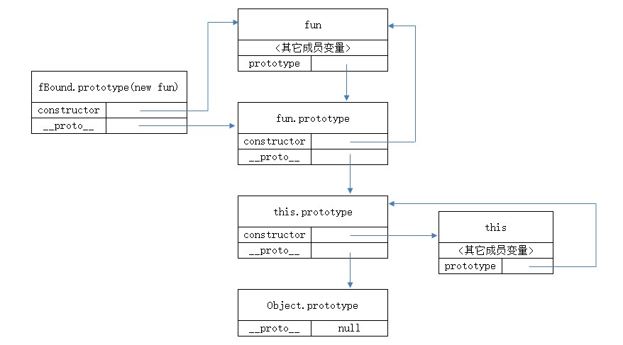

# bind实现
bind() 函数创建了一个新函数（原函数的拷贝），这个函数接受一个提供新的 this 上下文的参数，以及之后任意可选的其他参数。当这个新函数被调用时，它的 this 关键字指向第一个参数的新上下文。而第二个之后的参数会与原函数的参数组成新参数（原函数的参数在后），传递给函数。
```
var bar = function(){
console.log(this.x);
}
var foo = {
x:3
}
bar(); // undefined
var func = bar.bind(foo);
func(); // 3
```

## 初级实现
```
Function.prototype.bind = Function.prototype.bind || function (context){
    //this就是需要绑定的原函数
    var me = this;
    var argsArray = Array.prototype.slice.call(arguments);
    return function (){
        //apply()方法调用一个具有给定this值的函数，以及作为一个数组（或类似数组对象）提供的参数。
        return me.apply(context,argsArray.slice(1))
    }
}
```
**argsArray.slice(1)**,它的问题在于存在（原函数）预置参数功能丢失的功能

**Array.prototype.slice.call(arguments)**能够具有length属性的对象转换成数组
```
function test(a,b,c,d){
    var arg = Array.prototype.slice.call(arguments,1);
    alert(arg);
}

test("a","b","c","d");//b,c,d
```

## 版本二
```
Function.prototype.bind = Function.prototype.bind || function(context){
    var me = this;
    // 获取bind函数从第二个参数到最后一个参数
    var args = Array.prototype.slice.call(arguments,1);
    return function(){
        // 这个时候的arguments是指bind返回的函数传入的参数
        var innerArgs = Array.prototype.slice.call(arguments);
        var finalArgs = args.concat(innerArgs);
        // 返回一个函数，这个函数调用了原函数，并且 this 指向 bind 的第一个参数，
        // 第二个参数由 args与innerArgs组成 
        return me.apply(context,finalArgs);
    }
}
```
## 构造函数效果的模拟实现
**一个绑定函数也能使用new操作符创建对象：这种行为就像把原函数当成构造器。提供的 this 值被忽略，同时调用时的参数被提供给模拟函数。**  
也就是说当 bind 返回的函数作为构造函数的时候，bind 时指定的 this 值会失效，但传入的参数依然生效。  
```
var value = 2;

var foo = {
    value: 1
};

function bar(name, age) {
    this.habit = 'shopping';
    console.log(this.value);
    console.log(name);
    console.log(age);
}

bar.prototype.friend = 'kevin';

var bindFoo = bar.bind(foo, 'daisy');

var obj = new bindFoo('18');
// undefined
// daisy
// 18
console.log(obj.habit);
console.log(obj.friend);
// shopping
// kevin
```

### 第三版
```
Function.prototype.bind = Function.prototype.bind || function (context){
    var self = this;
    var args = Array.prototype.slice.call(arguments,1);

    var fBound = function (){
        var bindArgs = Array.prototype.slice.call(arguments);

         // 当作为构造函数时，this 指向实例，此时结果为 true，
         //将绑定函数的 this 指向该实例，可以让实例获得来自绑定函数的值

        // 以上面的是 demo 为例，如果改成 `this instanceof fBound ? null : context`，
        //实例只是一个空对象，将 null 改成 this ，实例会具有 habit 属性

        // 当作为普通函数时，this 指向 window，此时结果为 false，将绑定函数的 this 指向 context

        return self.apply(this instanceof fBound ? this : context,args.concat(bindArgs));
    }
    // 修改返回函数的 prototype 为绑定函数的 prototype，实例就可以继承绑定函数的原型中的值
    fBound.prototype = this.prototype;
    return fBound;
}
```

优化实现
```
Function.prototype.bind = Function.prototype.bind || function (context){
    var self = this;
    var args = Array.prototype.slice.call(arguments,1);

    var fNOP = function(){};

    var fBound = function (){
        var bindArgs = Array.prototype.slice.call(arguments);
        // 若通过 new 调用 bind() 之后的函数，则这时候 fBound 的 this 指向的是 fBound 实例，
        // 而下面又定义了 fBound 是 fNOP 的派生类（其 prototype 指向 fNOP 的实例），
        // 所以 this instanceof fNOP === true ，这时 this 指向了 fBound 实例，不另外绑定！
        return self.apply(this instanceof fNOP ? this : context,args.concat(bindArgs));
    }

    fNOP.prototype = this.prototype;
    fBound.prototype = new fNOP();
    return fBound;
}
```

## ES6实现
使用**不定参数**  
不定参数： 传递给函数的最后一个参数可以被标记为不定参数，当函数被调用时，不定参数之前的参数都可正常被填充，剩下的参数会被放进一个数组中，并被赋值给不定参数。而当没有剩下的参数时，不定参数会是一个空数组，而不会被填充为 undefined 。
```
//formerArgs为传递给bind函数的第二个到之后的参数
Function.prototype.bind = function (ctx,...formerArgs){
    let _this = this;

    //laterArgs为传递给原函数的参数
    return (...laterArgs) => {
        // bind 函数的不定参数在原函数参数之前，formerArgs 本身就是数组，可以直接调用数组的 concat 方法，无需借助 call 或 apply
        return _this.apply(ctx,formerArgs.concat(laterArgs));
    }
}
```

## 优化
- 当Function的原型链上没有bind函数时，才加上此函数

```
if(!Function.prototype.bind){
    // add bind() to Function.prototype
}
```
- 只有函数才能调用bind函数，其他对象不行，即判断this是否为函数

```
if(typeof this !== 'function'){
     // throw NOT_A_FUNCTION error
}
```
### 组合继承
用了 apply 来改变 this 的指向，继承了原函数的基本属性和引用属性，并且保留了可传参优点，但是新函数无法实现函数复用，每个新函数都会复制出一份新的原函数的函数，并且也无法继承到原函数通过 prototype 方式定义的方法或属性。

```
if(!Function.prototype.bind){
    Function.prototype.bind = function(ctx){
        if(typeof this !== 'function'){
            throw new TypeError("NOT_A_FUNCTION -- this is not callable");
        }

        var _this = this;
        var slice = Array.prototype.slice;
        var formerArgs = slice.call(arguments,1);
        //定义一个中间函数，用于作为继承的中间值
        var fun = function (){};
        var fBound = function (){
            let laterArgs = slice.call(arguments,0);
            return _this.apply(ctx,formerArgs.concat(laterArgs));
        }
        //先让fun的原型方法指向_this即原函数的原型方法，继承_this的属性
        fun.prototype = _this.prototype;
        // 再将 fBound 即要返回的新函数的原型方法指向 fun 的实例化对象
        // 这样，既能让 fBound 继承 _this 的属性，在修改其原型链时，又不会影响到 _this 的原型链
        fBound.prototype = new fun()
        return fBound
    }
}
```
我们引入了一个新的函数 fun，用于继承原函数的原型，并通过 new 操作符实例化出它的实例对象，供 fBound 的原型继承，至此，我们既让新函数继承了原函数的所有属性与方法，又保证了不会因为其对原型链的操作影响到原函数。  

