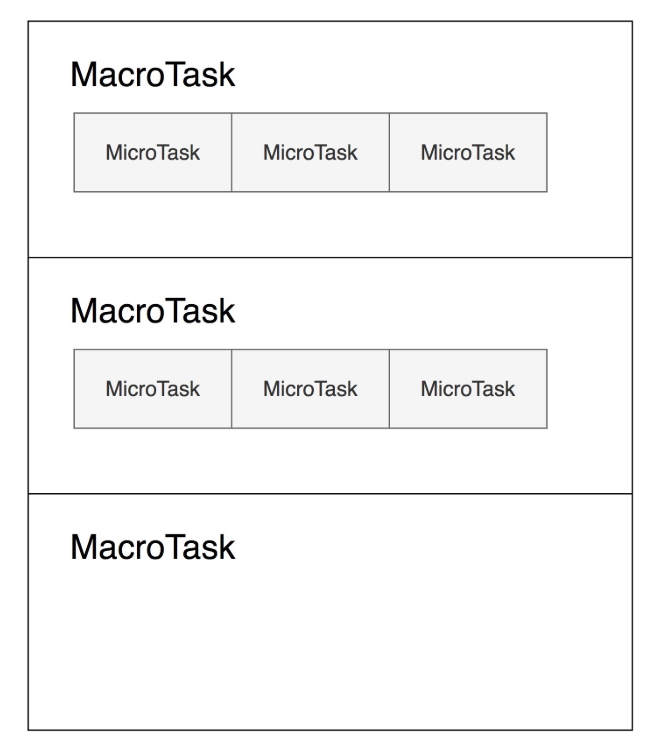

# javascript事件循环和消息队列
JS是单线程的，**每个线程的任务执行顺序都是FIFO(先进先出)**  
在JavaScript运行的环境中，有一个负责程序本身的运行，作为主线程；另一个负责主线程与其他线程的通信，被称为Event Loop 线程。  
每当主线程遇到异步的任务，把他们移入到Event Loop 线程，然后主线程继续运行，等到主线程完全运行完之后，再去Event Loop 线程拿结果。  
而每个异步任务都包含着与它相关联的信息，比如运行状态，回调函数等。
```
setTimeout(()=>{console.log("我才是第一")},0);
console.log("我才是第一");
```
1. 因为setTimeout是异步的事件，所以主线程把它调入Event Loop线程进行注册。
2. 主线程继续执行console.log("我是第一");
3. 主线程执行完毕，从Event Loop 线程读取回调函数。再执行console.log("我才是第一");;

## setTimeout和setInterval
- setTimeout(callback,0)指的是主线程中的同步任务运行完了之后立刻由Event Loop线程调入主线程。
- setInterval是每隔一段时间将回调函数放入Event Loop线程。

## micro-task(微任务)和macro-task(宏任务)
- macro-task：script(整体代码)，setTimeout,setInterval,setImmediate,I/O,UI rendering
- micro-task:process.nextTick,Promise,MutationObserver
- setTimeout/Promise等我们称之为**任务源**。而进入任务队列的是他们指定的具体执行任务(回调函数)

## 任务队列执行过程
1. Javascript引擎首先从macro-task中取出第一个任务
2. 执行完毕后，将micro-task中的所有任务取出，按顺序全部执行
3. 然后再从macro-task中取下一个
4. 执行完毕后，再次将micro-task中的全部取出
5. 循环往复，直到两个队列中的任务都取完



```
console.log("start")
var promise = new Promise((resolve)=>{
    console.log("promise start..")
    resolve("promise")
});
promise.then((val)=>console.log(val))

setTimeout(()=>{
    console.log("setTime1")
},0)

console.log("test end...")
```
第一轮
1. 整体script代码作为一个宏任务进入主线程，运行console.log("start");。
2. 然后遇到Promises直接运行console.log("promise start..")。
3. 然后遇到promise.then，存入到micro-task队列中。
4. 然后遇到setTimeout,存入到macro-task队列中。
5. 于然后运行console.log("test end...");
6. 在这一轮中，宏任务运行结束，运行micro-task队列中的 promise.then，输出promise  


第二轮
1. 取出macro-task队列中的setTimeout，运行console.log("setTime1");

```
// start
// promise start
// test end...
// promise
//setTime1
```
## 例子
```
setTimeout(()=>console.log("d"),0)
var r = new Promise(function(resolve,reject){
    resolve()
})
r.then(()=>{
    var begin = Date.now()
    while(Date.now()-begin<1000)
    console.log("c1")
    new Promise(function(resolve,reject){
        resolve()
    }).then(()=>console.log("c2"))
})
//输出 c1 c2 d
```

```
function sleep(duration){
    return new Promise(function(resolve,reject){
        console.log("b")
        setTimeout(resolve,duration)
    })
}

console.log("a")
sleep(5000).then(()=>console.log("c"))

//输出   a  b  c
```
