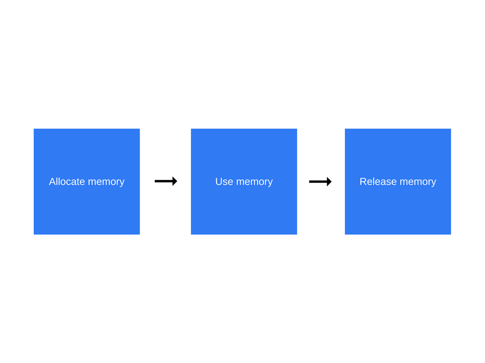
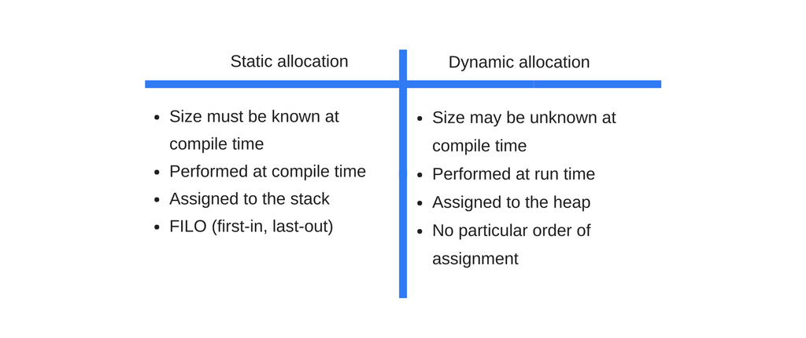

# 内存管理及如何处理 4 类常见的内存泄漏问题

## 内存生命周期
  

- 分配内存：由操作系统分配
- 使用内存：当你在代码中使用已分配的变量时，就会发生内存读写操作
- 释放内存：该操作由底层语言显示编写

## 动态内存分配


## JS中的内存使用
JS中使用分配的内存主要指的是内存读写    

可以通过为变量或者对象属性赋值，亦或是为函数传参来使用内存

## 内存引用
在内存管理上下文中，如果对象A访问了另一个对象B表示A引用了对象B(可以显式或隐式)。例如：一个JS对象有引用了它的原型(隐式引用)和它的属性值(显式引用)  

词法作用域定义了如何在嵌套函数中解析变量名。即使父函数已经返回，内部的函数仍然会包含父函数的作用域

## 标记-清除算法
三个步骤：
- 根：一般来说，根指的是代码中引用的全局变量。就JS来说，window对象即是根的全局变量。Node.js中相应变量是“global”。垃圾回收器会构建出一份所有根变量的完整列表
- 之后算法会检测所有的根变量及他们的后代变量并标记他们为激活状态(表示他们不可回收)。任何根变量所到达不了的变量(或者对象等等)都会被标记为内存垃圾
- 最后垃圾回收器会释放所有非激活状态的内存片段然后返还给操作系统


## 内存泄漏
内存泄漏即一些程序在过去时使用但处于闲置状态，却没有返回给操作系统或者可用的内存池

## 四种常见的JS内存泄漏
### 1.全局变量
当引用一个为声明的变量，会在全局对象上创建一个新的变量。  

```
function foo(arg) {
  bar = "some text";
}
```
等同于
```
function foo(arg) {
  window.bar = "some text";
}
```
this关键字不经意地创建一个全局变量
```
function foo() {
  this.var1 = "potential accidental global";
}

// 调用 foo 函数自身，this 会指向全局对象(window)而不是未定义
```

### 2.定时器及被遗忘的回调函数
```
var serverData = loadData();
setInterval(function(){
    var renderer = document.getElementById('renderer');
    if(renderer){
        renderer.innerHTML = JSON.stringify(serverData);
    }
},5000);
```
renderer 对象会在某些时候被替换或移除，这样就会导致由定时处理程序封装的代码变得冗余。当这种情况发生的时候，不管是定时处理程序还是它的依赖都不会被垃圾回收，这是由于需要先停止定时器(记住，定时器仍然处于激活状态)。这可以归结为保存和处理数据加载的 serverData 变量也不会被垃圾回收。  

最佳实践是当对象被废弃的时候，移除观察者处理程序。
```
var element = document.getElementById('launch-button');
var counter = 0;

function onClick(event) {
  counter++;
  element.innerHTML = 'text' + counter;
}

element.addEventListener('click', onClick);

// Do stuff
element.removeEventListener('click', onClick);
element.parentNode.removeChild(element);
// 现在当元素超出范围
// 即使在不能很好处理循环引用的浏览器中也会回收元素和 onClick 事件
```

### 3.闭包
```
var theThing = null

var replaceThing = function () {
  var originalThing = theThing;
  var unused = function () {
    if (originalThing) // 引用 originalThing
      console.log("hi");
  };
  theThing = {
    longStr: new Array(1000000).join('*'),
    someMethod: function () {
      console.log("message");
    }
  };
};
setInterval(replaceThing, 1000);
```
需要记住的是当一旦为同一个父作用域中的闭包创建闭包作用域的时候，该闭包作用域是共享的。

在这样的情况下，闭包 someMethod 和 unused 共享相同的作用域。unused 引用了 origintalThing。即使 unused 永不使用，也可以在 replaceThing 的作用域外使用 someMethod 函数。然后由于 someMethod 和 unused 共享相同的闭包作用域，unused 变量引用 originalThing 会强迫 unused 保持激活状态(两个闭包共享作用域)。这会阻止内存垃圾回收。

在以上例子中，闭包 someMethod 和 unused 共享作用域，而 unused 引用 origintalThing。可以在 replaceThing 作用域外通过 theThing 使用 someMethod，即使 unused 从未被使用。事实上，由于 someMethod 和 unused 共享闭包作用域，unused 引用 origintalThing 要求 unused 保持激活状态。

### 4.源自DOM引用
```
var elements = {
  button: document.getElementById('button'),
  image: document.getElementById('image')
};

function doStuff() {
  elements.image.src = 'http://example.com/image_name.png';
}

function removeImage() {
    // image 元素是 body 元素的直系后代元素
    document.body.removeChild(document.getElementById('image'));
    // 这时，我们仍然在 elements 全局对象中引用了 #button 元素
    // 换句话说，按钮元素仍然在内存中且不能够被垃圾回收器收集
}
```