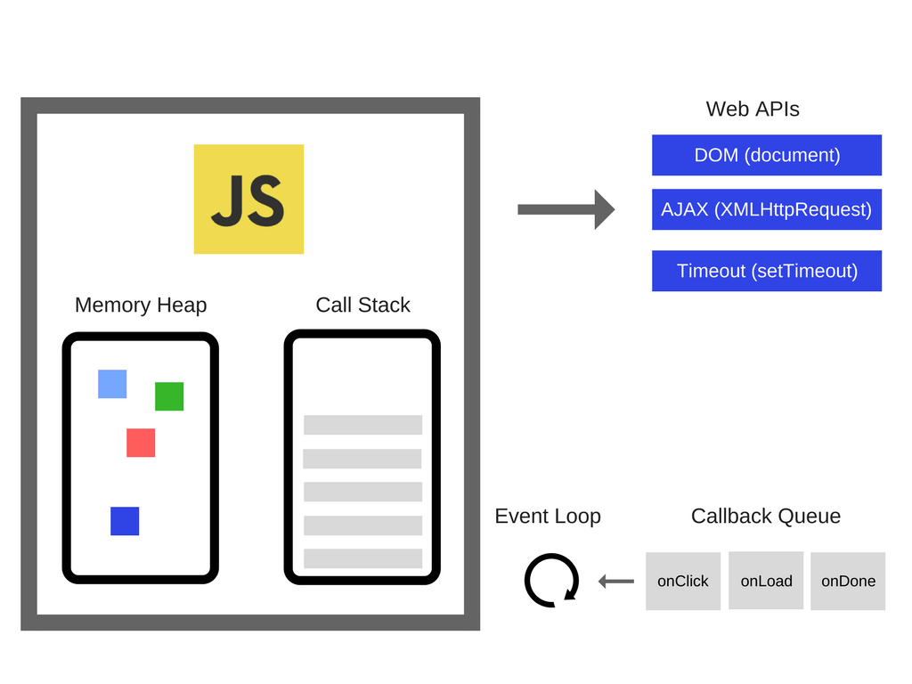
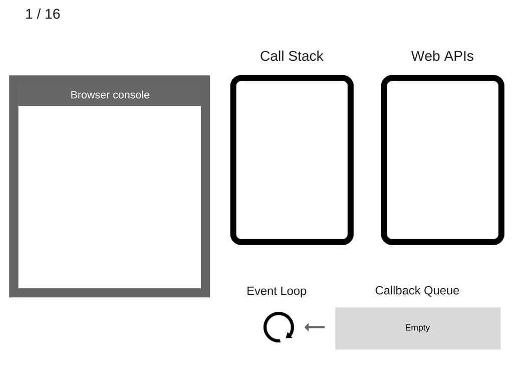
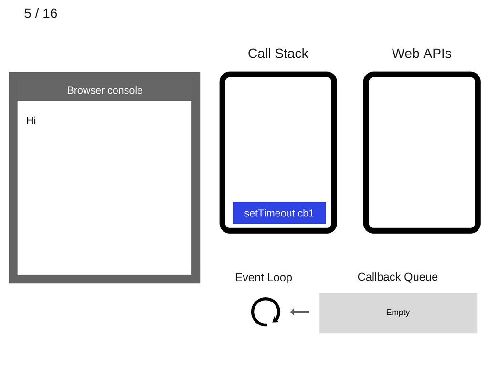
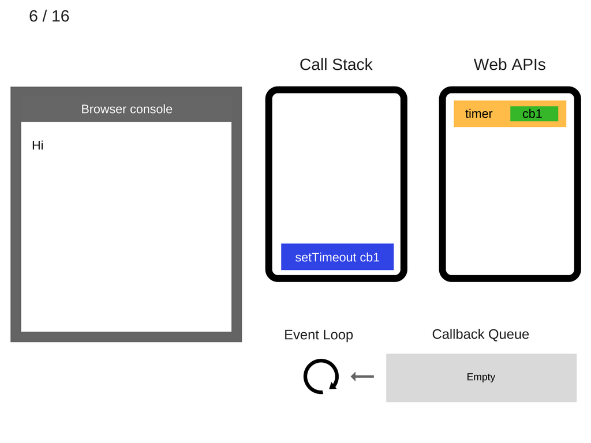
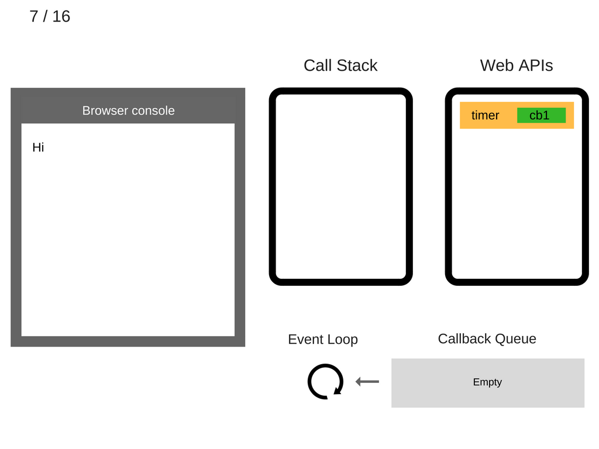
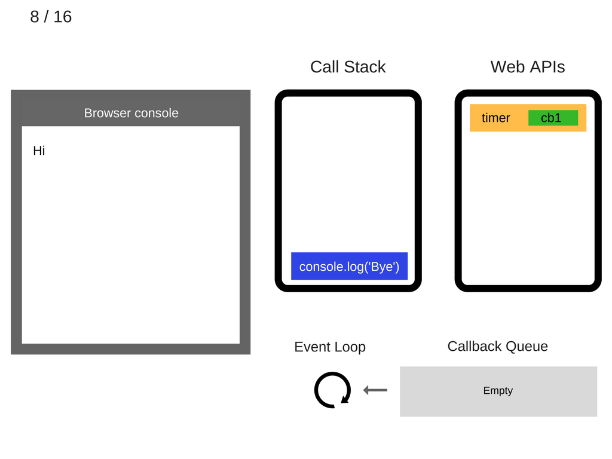
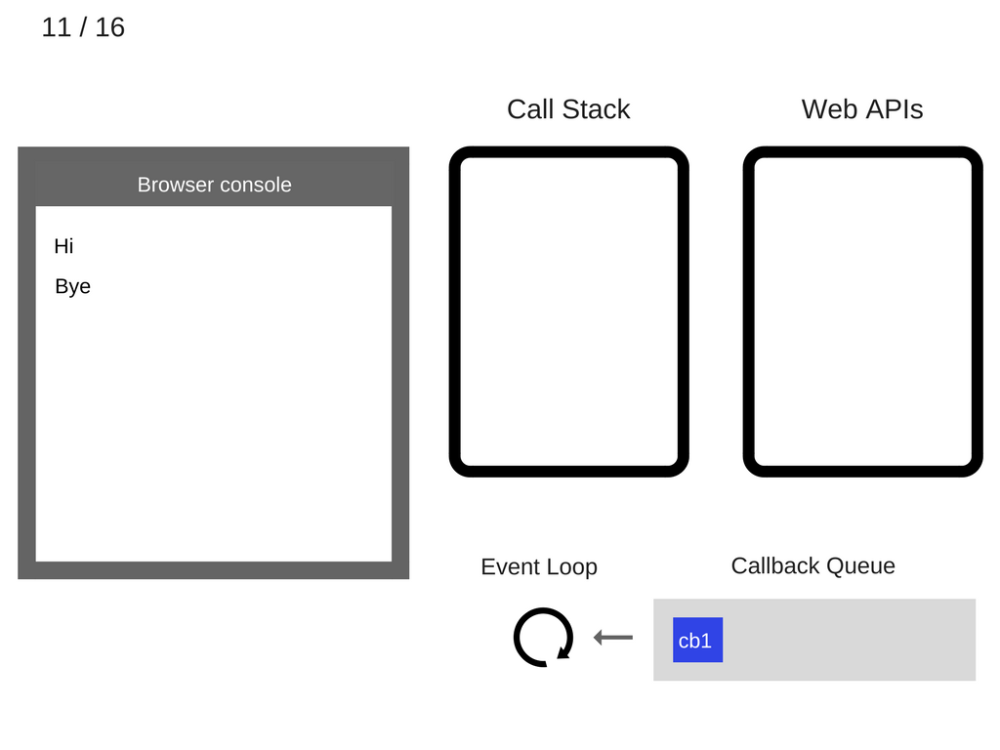
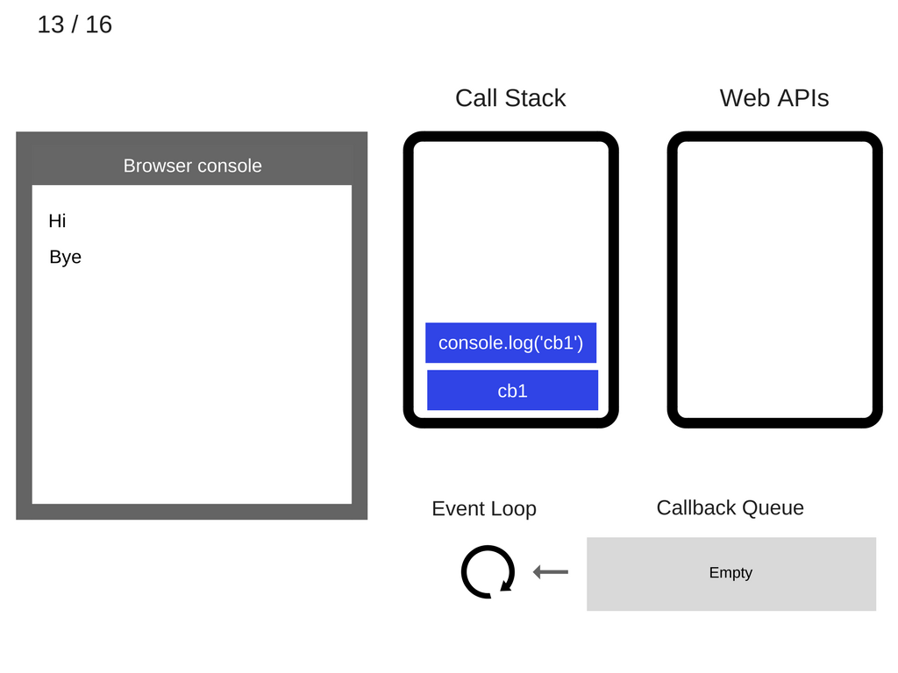
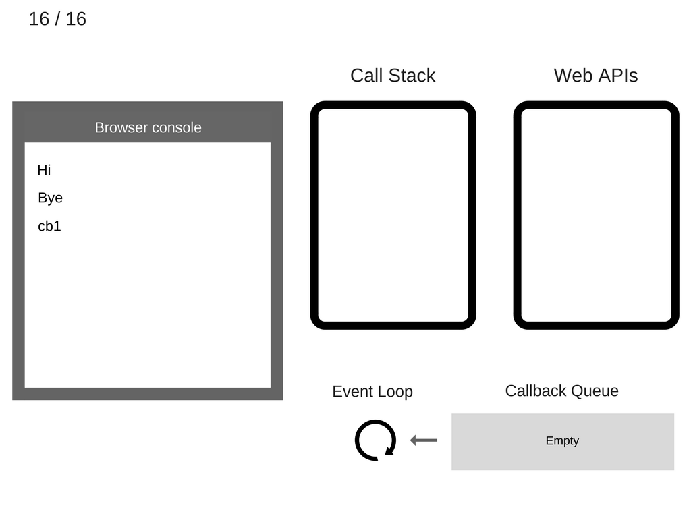

# 事件循环及异步编程的出现和 5 种更好的 async/await 编程方式

## 事件循环详解
  

事件循环只有一项简单的工作-**监测调用栈和回调队列**。如果调用栈是空的，它会从回调队列中取得第一个事件然后入栈，并有效地执行该事件。  
事件循环中的这样一次遍历被称为一个tick。每个事件就是一个回调函数  

```
console.log('Hi');
setTimeout(function cb1() { 
    console.log('cb1');
}, 5000);
console.log('Bye');
```
  
  
  
  
  

执行setTimeout(function cb1() { ... })，浏览器创建定时器作为网页API的一部分并将会为你处理倒计时  

  

setTimeout(function cb1() { ... }) 执行完毕并出栈。  

  
  
  
  

至少 5 秒之后，定时器结束运行并把 cb1 回调添加到回调队列。  

  

事件循环从回调队列中获得 cb1 函数并且将其入栈。  

  
  
  
  
  

## setTimeout(...)工作原理
需要注意的是setTimeout(...)并没有自动把回调添加到事件循环队列。它创建了一个定时器。当定时器过期，宿主环境会把回调函数添加至事件循环队列中，然后，在未来的某个tick取出并执行该事件。  

```
setTimeout(myCallback, 1000);
```
这并不意味着 1 秒之后会执行 myCallback 回调而是在 1 秒后将其添加到回调队列。然而，该队列有可能在之前就添加了其它的事件－所以回调就会被阻塞。  

### setTimeout(callback, 0) 
调用 setTimeout 把其第二个参数设置为 0 表示延迟执行回调直到调用栈被清空。  

```
console.log('Hi');
setTimeout(function() {
    console.log('callback');
}, 0);
console.log('Bye');
```
```
Hi
Bye
callback
```

## 作业队列(Job Queue)
**作业队列是附加于事件循环队列中每个tick末尾的队列**。事件循环的一个tick所产生的某些异步操作不会导致添加全新的事件到事件循环列表中，但是反而会在当前tick的作业队列末尾添加一个作业项。  

```
const bar = () => console.log('bar')
 
const baz = () => console.log('baz')
 
const foo = () => {
  console.log('foo')
  setTimeout(bar, 0)
  new Promise((resolve, reject) =>
    resolve('should be right after baz, before bar')
  ).then(resolve => console.log(resolve))
  baz()
}
 
foo()
```
```
foo
baz
should be right after baz, before bar
bar
```
