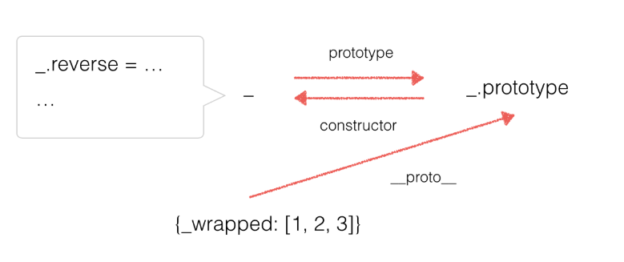

# 如何写自己的 underscore
将所有的方法添加到一个名为 _ 的对象上，然后将该对象挂载到全局对象上
```
(function(){
    //通过 this 获得全局对象
    var root = this;

    var _ = {};

    //将该对象挂载到全局对象
    root._ = _;

    //在这里添加自己的方法
    _.reverse = function(string){
        return string.split('').reverse().join('');
    }

})()

_.reverse('hello');

//'olleh'
```

## root
在严格模式下，this 返回 undefined，而不是指向 Window，对环境进行检测，然后挂载到正确的对象上。

```
var root = (typeof window == 'object' && window.window == window && window) || 
    (typeof global == 'object' && global.global == global && global);
```
> window对象的 window 属性指向这个window对象本身。将 window 属性指向该window对象本身的目的，是为了更容易引用全局对象。不然，就得在最开始写代码的时候进行手动赋值：var window = this; 。  

global 是 node 环境下的全局对象的引用, global.global === global 的话就说明是 node 环境下 

## Web Worker
> 在 Web Worker 标准中，定义了解决客户端 JavaScript 无法多线程的问题。其中定义的 “worker” 是指执行代码的并行过程。不过，Web Worker 处在一个自包含的执行环境中，无法访问 Window 对象和 Document 对象，和主线程之间的通信业只能通过异步消息传递机制来实现。  

所以 typeof window 和 typeof global 的结果都是 undefined，所以最终 root 的值为 false，将一个基本类型的值像对象一样添加属性和方法，自然是会报错的。  

Web Worker中，能通过 self 访问到 Worker 环境中的全局对象。  

而且在浏览器中，除了 window 属性，我们也可以通过 self 属性直接访问到 Winow 对象。

```
console.log(window.window === window);//true
console.log(window.self === window);//true
```
使用 self 还可以额外支持 Web Worker，我们直接将代码改成 self：

```
var root = (typeof self == 'object' && self.self == self && self) || (typeof global == 'object' && global.global == global && global);
```

## node vm
在 node 的 vm 模块中，也就是沙盒模块，runInContext 方法中，是不存在 window，也不存在 global 变量的，可以通过 this 访问到全局对象  

## 微信小程序
因为在微信小程序中，window 和 global 都是 undefined，加上又强制使用严格模式，this 为 undefined，挂载就会发生错误，所以就有人又发了一个 PR，代码变成了：  

```
var root = (typeof self == 'object' && self.self == self && self) ||
           (typeof global == 'object' && global.global == global && global) ||
           this ||
           {};
```

## 函数对象
```
var _ = {};
```
```
//函数式
_.reverse('hello');

//面向对象式
_('hello').reverse(); //'olleh'

//函数式风格
_.each([1,2,3],function(item){
    console.log(item);
});

//面向对象风格
_([1,2,3]).each(function(item){
    console.log(item);
});
```
既然以 _([1, 2, 3]) 的形式可以执行，就表明 _ 不是一个字面量对象，而是一个函数！

幸运的是，在 JavaScript 中，函数也是一种对象

```
var _ = function(){};
_.value = 1;
_.log = function(){return this.value + 1;};

console.log(_.value);//1
console.log(_.log());//2
```
如何做到 _([1, 2, 3]).each(...)呢？即 _ 函数返回一个对象，这个对象，如何调用挂在 _ 函数上的方法呢？

```
var _ = function(obj){
    if(!(this instanceof _)) return new _(obj);
    this._wrapped = obj;
};

_([1,2,3]);
```
1. 执行 this instanceof _，this 指向 window ，window instanceof _ 为 false，!操作符取反，所以执行 new _(obj)。
2. new _(obj) 中，this 指向实例对象，this instanceof _ 为 true，取反后，代码接着执行
3. 执行 this._wrapped = obj， 函数执行结束
4. 总结，_([1, 2, 3]) 返回一个对象，为 {_wrapped: [1, 2, 3]}，该对象的原型指向 _.prototype  

  

将方法挂载到 _ 函数对象上，并没有挂到函数的原型上呐，所以返回了的实例，其实是无法调用 _ 函数对象上的方法的！  

```
(function(){
    var root = (typeof self == 'object' && self.self == self && self) || (typeof global == 'object' && global.global == global && global) || this || {};

    var _ = function(obj){
        if(!(this instanceof _)) return new _(obj);
        this._wrapped = obj;
    }

    root._ = _;

    _.log = function(){
        console.log(1);
    }
})()

_().log();//_(...).log is not a function
```
需要一个方法将 _ 上的方法复制到 _.prototype 上

## _.functions
获得 _ 上的方法
 ```
 _.function = function(obj){
     var names = [];
     for(var key in obj){
         if(_.isFunction(obj[key])) names.push(key);
     }
     return names.sort();
 };
 ```
 ## mixin
 将 _ 上的方法复制到原型上

 ```
 var ArrayProto = Array.prototype;
 var push = ArrayProto.push;

 _.mixin = function(obj){
     _.each(_.function(obj),function(name){
         var func = _[name] = obj[name];
         _.prototype[name] = function(){
             var args = [this._wrapped];
             push.apply(args,arguments);
             return func.apply(_,args);
         };
     });
     return _;
 };

 _.mixin(_);
 ```

 ## 导出
 ```
 root._ = _;
 ```

 ```
 if (typeof exports != 'undefined' && !exports.nodeType){
     if(typeof module != 'undefined' && !module.nodeType && module.exports){
         exports = module.exports = _;
     }
     exports._ = _;
 }else{
     root._ = _;
 }
 ```
 根据 exports 和 module 是否存在来选择不同的导出方式  

 在 nodejs 中，**exports 是 module.exports 的一个引用**，当你使用了 module.exports = function(){}，实际上覆盖了 module.exports，但是 exports 并未发生改变，为了避免后面再修改 exports 而导致不能正确输出，就写成这样  

 ```
 exports = module.exports = _;
 ```
 demo

 ```
 //exports 是module.exports的一个引用
 module.exports.num = '1';

 console.log(exports.num);//1

 exports.num = '2';

 console.log(module.exports.num);//2
 ```

 ```
 //addOne.js
 module.exports = function(num){
     return num + 1;
 }

 export.num = '3';

 //result.js中引入addOne.js
 var addOne = require('./addOne.js');

 console.log(addOne(1));//2
 console.log(addOne.num);//undefined
 ```

 ```
 //addOne.js
 exports = module.exports = function(num){
     return num + 1;
 }

 exports.num = '3';

 //result.js中引入addOne.js
 var addOne = require('./addOne.js');

 console.log(addOne(1));//2
 console.log(addOne.num);//3
 ```
 1. module.exports初始值为一个空对象{}
 2. exports是指向module.exports的引用
 3. require()返回的是module.exports而不是exports  


```
exports = module.exports = somethings;

//等价于
module.exports = somethings
exports = module.exports
```
 module.exports 指向新的对象时，exports 断开了与 module.exports 的引用，那么通过 exports = module.exports 让 exports 重新指向 module.exports 即可。