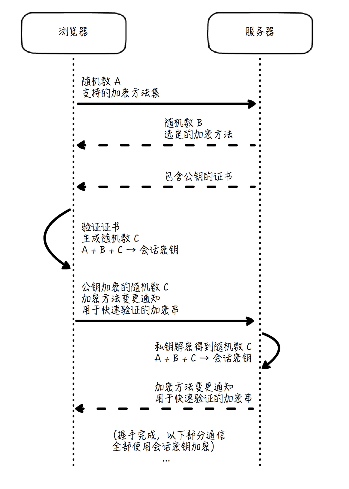

# HTTPS
> HTTP + SSL/TLS = HTTPS  

## 动手捕获TLS(Transport Layer Security)报文
  

1. Client Hello  

- 客户端产生的随机数A;
- 客户端支持的加密方法列表

2. Server Hello

- 服务端产生的随机数B
- 服务端根据客户端的支持情况确定出的加密方法组合(Cipher Suite)  

3. Certificate,Server Key Exchange,Server Hello Done  

- Certificate,证书信息，证书包含了服务端生成的公钥  

> 客户端随机数A + 服务端随机数B + 客户端随机数(Pre-master Secret)C  --> 会话密钥  

4. Client Key Exchange,Change Cipher Spec,Encrypted Handshake Message  

- Client Key Exchange,本质上它就是上面说的这个C,但使用了服务端通过证书发来的公钥加密
- Change Cipher Spec,客户端同意正式启用约好的加密方法和密钥了，后面的数据传输全部都使用密钥X来加密
- Encrypted Handshake Message,快速验证：这是客户端对于整个会话进行摘要并加密得到的串，如果经过服务端解密，和原串相等，就证明整个握手过程是成功的  

**TLS是通过非对称加密技术来保证握手过程中的可靠性(公钥加密，私钥解密)，再通过对称加密技术来保证数据传输过程中的可靠性的**  

5. Change Cipher Spec,Encrypted Handshake Message  

- Change Cipher Spec,服务端也同意要正式启用约好的加密方式和密钥，后面的数据传输全部都使用X来加密
- Encrypted Handshake Message，快速验证：这是服务端对于整个会话进行摘要并加密得到的串，如果经过客户端解密，和原串相等，就证明整个握手过程是成功的