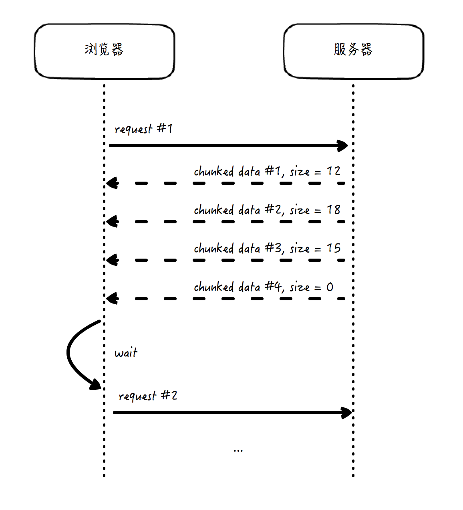

# 服务端推送技术
## Pull模型
> pull，指的是去主动发起行为获取消息，一般在客户端/服务器(C/S,Client/Server)或浏览器/服务器(B/S,Brower/Server)交互中，客户端或浏览器主动发起的网络请求数据的行为

> poll，在计算机网络的领域里，通常把它解释为“轮询”，或“周期性查询”，在pull的基础上增加了“周期性”的概念。

> push,从服务端主动发起，发送数据到客户端的行为
> - **高效性**。如果没有更新发生，就不会有任何更新消息推送的动作
> - **实时性**。事件发生后的第一时间即可触发通知操作。 

分布式系统中，更多的使用Pull  
> 服务端不需要维护客户端的列表，不需要知晓客户端的情况，不需要了解客户端查询的策略。**有助于把服务端从客户端繁重的管理工作中解放出来，而成为无状态的简单服务，变得具备幂等性(idempotent,指执行多次和执行一次的结果一样)，更容易横向扩展**

## 服务端推送技术
### 1.Comet
> 客户端发送一个普通的HTTP请求到服务端以后，服务端不像以往一样在处理后立即返回数据，而是保持住连接不释放，每当有更新事件发生，就使用分块传输的方式返回数据。  

若干次数据返回以后可以完成此次请求响应过程(**分块传输返回长度为0的块，表示传输结束**)，等待客户端下一次请求发送。  

好处：100%由HTTP协议实现  

弊端：  
- 客户端必须在服务端结束当次传输后才能向服务端发送消息
- HTTP协议限制了它在每次请求和响应中必须携带完整的头部，造成浪费  

### 2.webSocket
> 真正的双向、全双工协议，客户端和服务端都可以主动发起请求，回复响应，而且两边的传输都相互独立  

- 二进制协议，没有太大的头部开销
- 带有状态的协议
- 没有同源限制，服务端的地址可以完全和源页面地址无关
- 可以使用和HTTP一样的加密方式传输