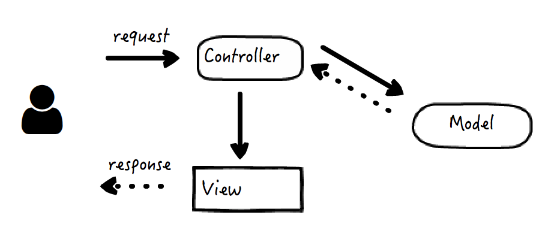
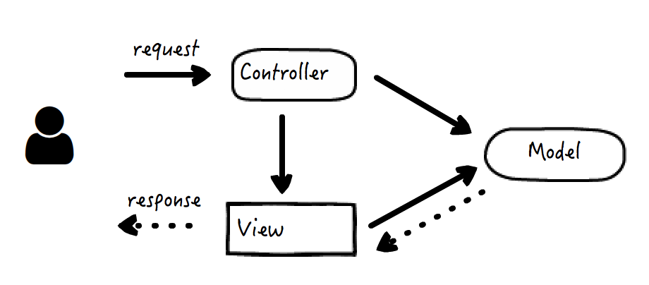
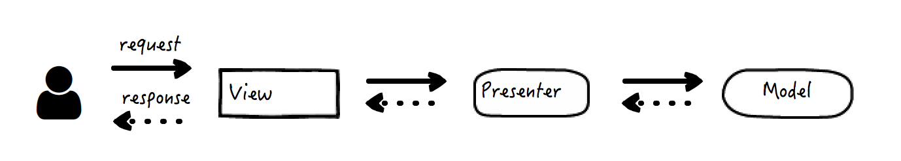
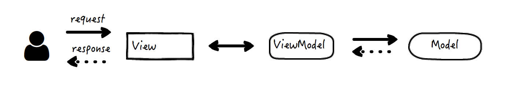

# MVC框架的发展
- 控制器(Controller):主要负责请求的处理、校验和转发
- 视图(View):将内容数据以界面的方式呈现给用户，也捕获和响应用户的操作
- 模型(Model):数据和业务逻辑真正的集散地

## 第一种
  

## 第二种

## MVC的变体
- MVP
- MVVM

### MVP
- Model：业务数据的唯一来源
- View：变成纯粹的被动视图，它被动地响应用户的操作来触发事件，并将其转交给Presenter;反过来，它的视图界面被动地由Presenter来发起更新
- Presenter变成View和Model之间的协调者(Middle-man),它是真正调度逻辑的持有者，会根据事件对Model进行状态更新，又在Model层发送改变时，相应地更新View  

### MVVM
MVVM中ViewModel实际上是一个数据对象的转换器，将从Model中取得的数据简化，转换为View可以识别的形式返回给View.  

View和ViewModel实现**双向绑定**,即View的变化会自动反馈到ViewModel中，反之亦然。  

