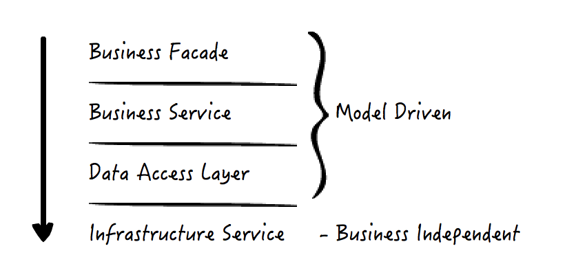

# 模型(Model)
> 模型就是当我们使用软件去解决真实世界中各种实际问题的时候，对我们关心的实际事物的抽象和简化。  

> 领域模型：更关注这个领域范围内各个模型实体之间的关系

## 贫血模型和充血模型
> 贫血模型(Anemic Domain Model),意味着模型实体在设计和实现上，不包含或包含很少的逻辑，但包含状态，而逻辑被解耦到了无状态的service中。

> 充血模型中，邻域模型实体，既包含数据，也包含逻辑，具备了更高程度的完备性和自洽性。

### 贫血模型-内部层次划分
  

**依赖关系总是“靠上面的层”依赖着“依靠下面的层”**  

1. **第一层Facade**,提供粗粒度的接口，逻辑上是对Service功能的组合。有时候由于事务需要跨多个领域模型的实体控制，适合放在这里。  
2. **第二层Service**:通常会存放仅属于单个领域模型实体的操作。
3. **第三层数据访问层**：存放数据库字段和模型对象之间的ORM(Object-Relational Mapping,对象关系映射)关系。
4. **第四层基础设施层**

## CQRS模式
**命令查询职责分离(Command Query Responsibility Segregation)**  

CQRS模式下，模型层的接口分为且只分为两种：  
- 命令(Command),它不返回任何结果，但会改变数据的状态
- 查询(Query),它返回结果，但是不会改变数据的状态
