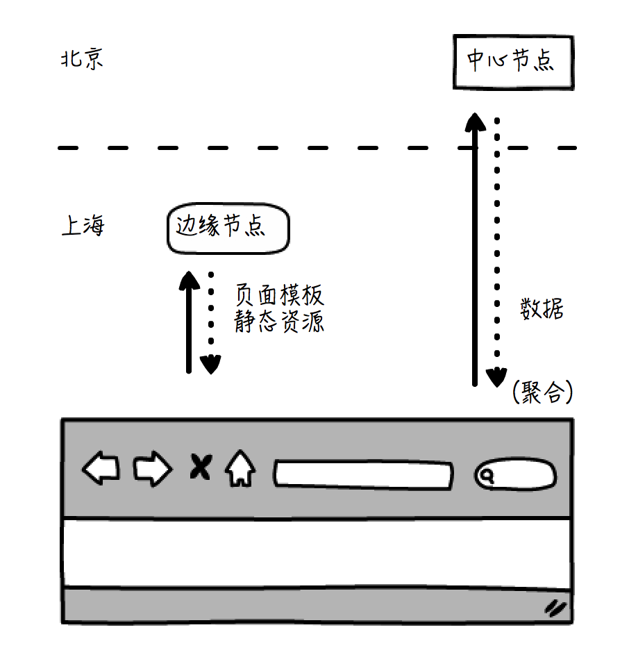
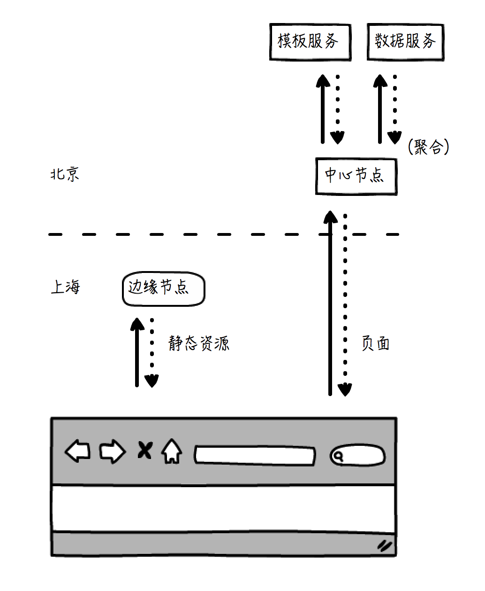
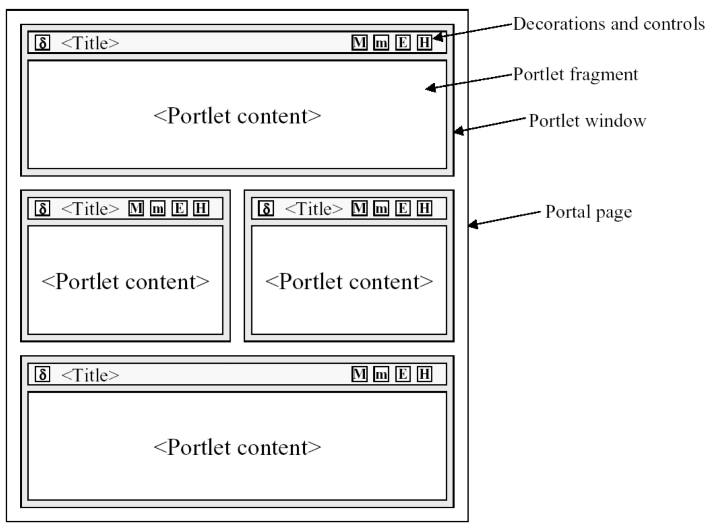

# 视图(View)
> MVC架构中的视图是指将数据有目的、按规则呈现出来的组件。

## 页面聚合技术
- **结构聚合：指的是将一个页面中不同的区域聚合起来，这体现的是分治的思想**。页面区域分别生成，最后聚合在一起，再呈现给用户。
- **数据-模板聚合：指的是聚合静态的模板和动态的数据，这体系的是解耦的思想**。

## 服务端和客户端聚合方式的比较
> 架构上，客服端聚合达成了客户端-服务端分离和模板-数据聚合这两者的统一  

  

- **模板和静态资源**(如脚本、样式、图片等)利用**CDN(内容分发网络)技术**获取
- **动态的数据**从**中心节点**获取  

> 服务端聚合，必须在服务端同时准备好模板和数据，聚合形成最终的页面，再返回给浏览器。  

  

资源上，客户端聚合将服务端聚合造成的计算压力，分散到了客户端。  

客户端聚合要求客户端具备一定的规范性和运算能力。

## 常见的聚合技术
### 1.iFrame聚合
在当前页面嵌入一个子页面

### 2.模板引擎

### 3.Portlet
本身是一种Web的组件，每个Portlet会生成一个标记段，多个Portlets生成的标记段可以最终聚集并嵌入到同一个页面上，从而形成一个完整的最终页面。  

### 4.SSI
Server Side Includes

## 模板引擎的工作机制
- 编译
- 执行