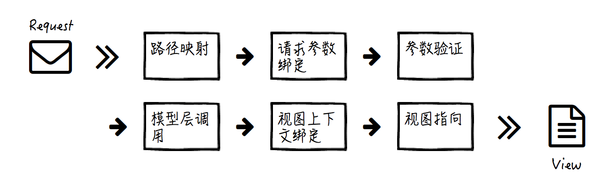

# 控制器(Controller)
控制器用于接收请求，校验参数，调用Model层获取业务数据，构造和绑定上下文，并转给View层去渲染。

## 1.路径映射和视图指向
- **入口路由**就是路径映射，根据配置的规则，以及请求URL的路径，找到具体接收和处理这个请求的**控制器逻辑**
- **出口路由**就是视图指向，根据配置的规则，以及控制器处理完毕后返回的信息，找到需要渲染的**视图页面**

## 2.请求参数绑定
1. 为了控制器而绑定请求数据  

## 3.参数验证

## 4.视图上下文绑定  

