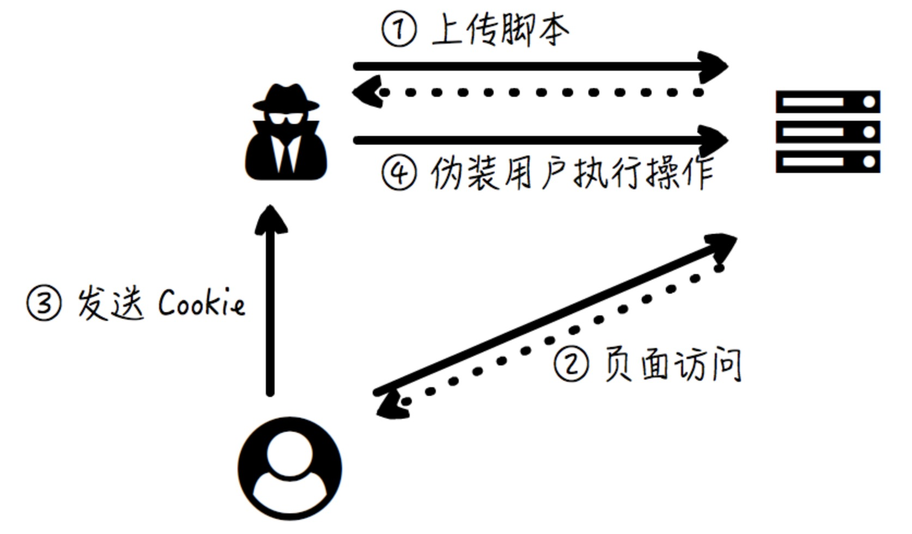
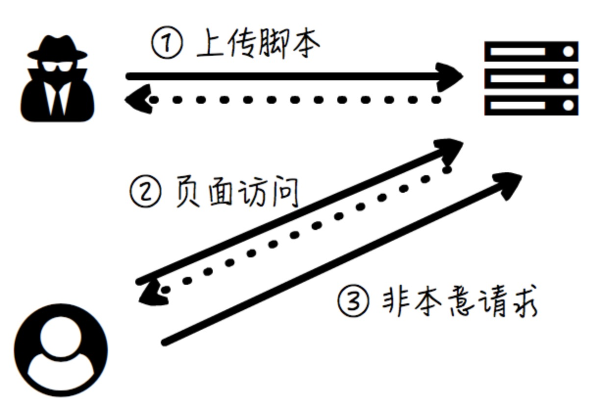

# 网站安全问题
## 鉴权和授权
- 鉴权，Authentication,值的是对于用户身份的鉴别
- 授权，Authorization,指的是允许对于特定资源的指定操作

#### 鉴权
网站的登录系统。  

**为了安全考虑，在实际应用中鉴权有时不是靠‘单因子’(Single-Factor)就够了，还会采用“多因子”(Multi-Factor)的方式。**

#### 授权
对于不同的资源，不同的用户拥有不同的权限，而授权根据权限配置，确定用户对特定的资源是否能执行特定的行为。

## 常见的Web攻击方式
### 1.XSS
XSS(Cross Site Script),跨站脚本攻击。  

**原理是攻击者通过某种方式在网页上嵌入脚本代码**  

  

#### 应对方式
1. **做好字符转义和过滤**，让用户上传的文本在展示的时候永远只是文本，而不能变成HTML和脚本
2. **控制Cookie的作用范围**，比如服务器在返回Set-Cookie头时，没设置HttpOnly这个标识，这样浏览器的脚本就无法获得Cookie了，而用户却依然可以继续使用Cookie和会话。

### 2.CSRF
> CSRF(Cross-Site Request Forgery),跨站请求伪造，指的是攻击者让用户进行非本意的操作。**在CSRF的情况下，用户的‘非其本意’的行为全部都是从受害用户的浏览器上发生的，而不是从攻击者的浏览器挟持用户会话以后发起的**  

  

```

评论内容 1

评论内容 2
```
每当用户访问这个评论展示的页面，浏览器就试图去发送logout请求来加载这张假的图片，用户‘莫名其妙’地自动登出了。  

#### 应对策略
1. **使用HTTP的Referer头**，Referer头可以携带请求的来源页面地址，这样可以根据Referer头鉴别出伪造的请求
2. **使用token**,服务端给每个表单都生成一个随机数，这个值就是token。当用户正常操作时，这个token会被带上，从而证明用户操作的合法性。

### 3.SQL注入
> SQL注入，指的是攻击者利用网站漏洞，通过构造特殊的嵌入了SQL命令的网站请求以欺骗服务器，并执行该恶意SQL命令。  

```

String sql = "DELETE FROM RECORDS WHERE ID = " + id + " AND STATUS = 'done'"
```
攻击者提交
```

DELETE FROM RECORDS WHERE ID = '123' OR 1 = 1 -- AND STATUS = 'done'
```
STATUS判断被注释，1=1恒成立，所有记录被删

#### 应对策略
1. **参数进行转义和过滤**
2. SQL的语句执行尽可能采用参数化查询的接口，而不是单纯地当做字符串来拼接。
3. 严格的权限控制

### 4.HTTP劫持
由于HTTP协议是明文通信的，所以它可以被任意篡改。  

解决方式：使用HTTPS

### 5.DNS劫持
> 用户的浏览器在通过DNS查询目标域名对应的IP地址的时候，会被引导到一个恶意网站的地址。而这个假的网站也可以有相似的页面布局，也可能有‘正规’方式申请的HTTPS证书。即**HTTPS加密通信并不能规范DNS劫持**，因此用户很可能被欺骗而不察觉。

### 6.DDoS攻击
Distributed Denial-of-Service,分布式拒绝服务。**原理**，攻击者使用若干被‘攻陷’的电脑(比如被病毒占领和控制的肉鸡)，向网络应用和服务同一时间发起请求，通过一瞬间的请求洪峰，将服务冲垮。  


> DDoS攻击的目的不是偷窃用户数据，也不是为了仿冒用户身份，而是‘无差别’阻塞网络，引发‘拒接服务’，让正常使用网站和应用的用户难以继续使用。