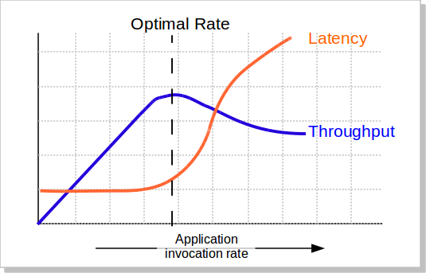

# 网站性能优化
## 性能优化与软件设计
**好的性能是设计出来的，而不是优化出来的。**  

- 产品设计角度
- 技术实现角度

## 性能指标与关注点
- 业务角度
- 资源角度

### 1.业务角度
- 延迟(latency):指**响应时间**，客户端发送请求后，到收到该请求的响应，中间需要的时间消耗。
- 吞吐量(throughput)：**系统处理请求的速率**，反映单位时间内处理请求的能力。  

  

- Latency曲线：延迟总是非递减的。一开始延迟几乎不变，到了某一个特定的值(转折点)以后，延迟突然变大。
- Throughput曲线，吞吐量总是一个先线性增大，后来增长减缓，到达峰值后逐渐减小的过程。  
- 延迟的转折点往往要略先于吞吐量的最高点出现  

如果不做流量限制，系统压力大到一定程度时，系统会“什么都做不了”  

### 2.资源角度
- 平均使用率
- 峰值