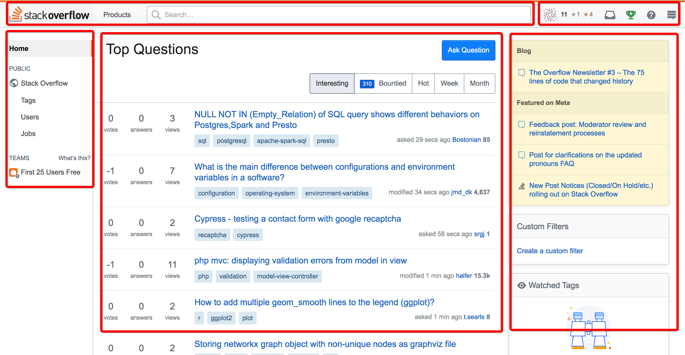
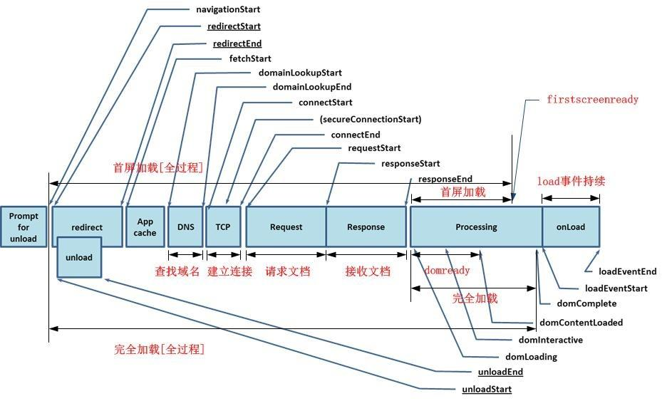

# 网站性能优化
## 产品和架构调整
### 1.同步变异步
> 如果页面聚合在服务端进行，那么渲染前等待的时间，在整个任务依赖树上面，取决于最慢的一个路径什么时候完成。  

> 如果页面聚合是在客户端进行的，那么页面每一个**子区域的渲染往往都可以以Ajax的方式独立进行**，且同时进行，而母页面则可以首先展示给用户，减少用户的等待时间。  

### 2.远程变本地
- DNS的均衡路由，不同区域的用户访问同一个域名的时候，可以被定向到不同的离自己更近的节点上。
- CDN:静态资源可以从较近的本地节点获取。

### 3.页面静态化
  

**将页面解耦成不同的部分**：  

- 从产品的角度来定义每一个部分允许的一致性窗口，比如有的数据是一小时更新一次，数据可以不用非常准确，而有的则是要实时，数据要求非常准确；
- 而技术角度，对于每一部分不同的一致性要求，依赖于缓存的特性，也就是空间换时间，可以让每个部分进行分别管理，最终聚合起来。

## 前端和网络层优化
  

### 1.减少请求次数
#### 文本资源
- CSS压缩
- JS压缩  

**压缩**：多个文件压缩成一个，目的是减少大小，减少请求树。  

**混淆**：将变量使用无意义的名称替代，减少代码实际意义的泄漏。

#### 图片资源
- CSS Sprites:雪碧图，多张图片拼成一张，这样多张图片只需加载一次
- Inline Image:将二进制的图片使用Base64算法序列化成文本，直接嵌入在原始页面

#### 缓存控制头部(Cache-Control)

### 2.减少渲染次数
合并操作，合并多个DOM操作为一次进行

### 3.减少JS阻塞
> 将大的工作分裂成多次执行(可以通过每次具备一定间隔时间的回调来实现)，每次执行后主动让出执行线程，这样每次就可以只阻塞一小会，以显著减少JS阻塞对用户造成的影响。  

> 对于一些独立的耗时操作，可以引入Web Worker分配单独运行的线程来完成。  

### 4.文本消息压缩
- gzip压缩