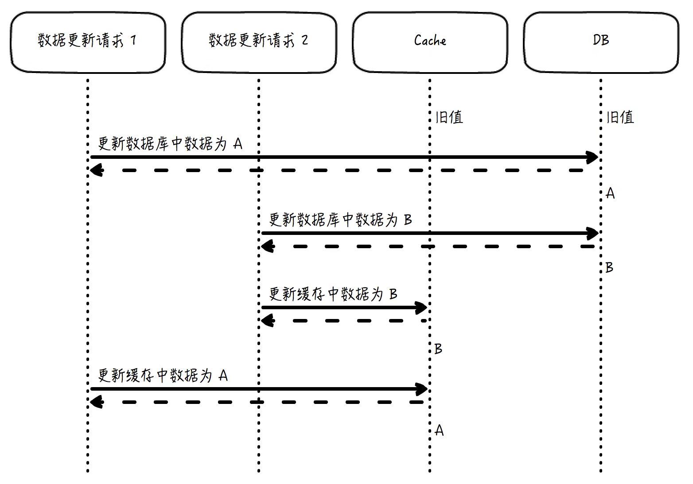
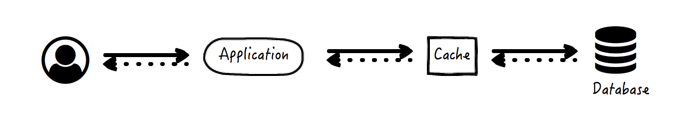

# 缓存
## 缓存的本质
> 为了节约对原始资源重复获取的开销，而将结果数据副本存放起来以供获取的方式。  

1. 缓存针对的是'资源'
2. 缓存数据必须是'重复'获取的，空间换时间
3. 为了解决‘开销’的问题
4. 缓存的存取不一定是‘更快’的  

缓存使用的动机：  
- 延迟(latency)
- 吞吐量(throughput)  

#### 从缓存的角度看，当浏览器地址栏输入URL后发生什么
1. 先查询**浏览器内部**的“**域名-IP**”缓存，如果访问过该域名，会有**映射缓存**
2. 如果没有，会查询**操作系统**是否存在这个缓存
3. 如果还没有，会查询**域名服务器(DNS,Domain Name System)**,得到对应的IP和可缓存时间  

当请求到达服务端，MVC各层都可以应用缓存模式  

- Controller层，**拦截过滤器**可以配置缓存来过滤服务
- Model层，几乎所有的数据库ORM框架都提供缓存能力
- View层，页面模板都支持缓存标签，页面中的部分内容，不需要每次都执行渲染操作  

## 缓存应用模式

### 1.Cache-Aside
#### 数据获取策略
- 应用先去查看缓存是否有所需数据
- 如果有，应用直接将缓存数据返回请求方
- 如果没有，执行原始逻辑，例如查询数据库得到结果数据
- 应用将结果数据写入缓存  

#### 数据读取异常情况
- 如果数据库读取异常，直接返回失败，没有数据不一致的情况发生
- 如果数据库读取成功，但是缓存写入失败，那么下一次同一数据的访问还将继续尝试写入，因此这是也没有不一致的情况发生

#### 数据更新策略
- 应用先更新数据库
- 应用再令缓存失效  

**必须先更新数据库，而不是先令缓存失效**  

  

**数据库更新以后需要令缓存失效，而不是更新缓存为数据库的最新值**  

### 2.Read-Through
缓存系统变成了数据库的代理，二者成为一个整体，应用的请求访问只能看到缓存的返回数据，而数据库系统对它是透明的  

  

- 应用向缓存要求数据
- 如果缓存中有数据，返回给应用，应用再将数据返回
- 如果没有，缓存查询数据库，并将结果写入自己
- 缓存将数据返回给应用

### 3.Write-Through

### 4.Write-Back