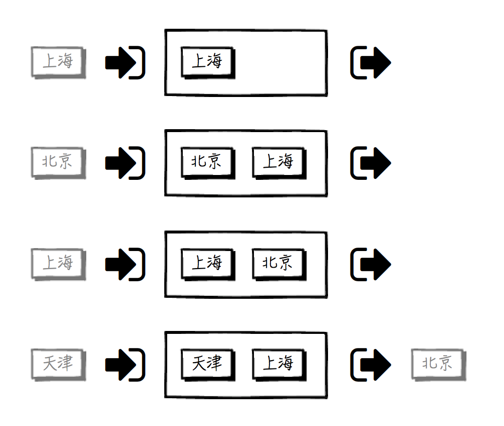

# 缓存
## 缓存使用的问题
### 1.缓存穿透
> **缓存穿透，指的是在某些情况下，大量对于同一个数据的访问，经过了缓存屏障，但是缓存却未能起到应有的保护作用。**举例来说，对于某一个key的查询，如果数据库里没有这个数据，那么缓存中也没有数据的存放，每次请求到来都会去查询数据库，缓存根本起不到应有的作用。  

缓解方法：  
- 在缓存中对这个key存放一个空结果
- 使用布隆过滤器  

数据库查询过程较慢，导致了大量请求同时到达，全部穿透缓存，致使数据库挂掉：  

- **流量控制**，限制同一数据的访问，必须等到前一个完成之后，下一个才进行。
- **缓存预热**，在大批量请求到来以前，先主动将该缓存填充好。

### 2.缓存雪崩
> 原本起屏障作用的缓存，如果在一定的时间段内，对于大量的请求访问失效，即失去了屏障作用，造成它后方的系统压力过大，引起系统过载、宕机等问题，就叫做缓存雪崩。  

#### 解决方法
- 限流
- 预热：在请求访问前，先主动往内存中加载一定的热点数据。

### 3.缓存容量失控
> 通过时间因素来限制空间大小，远不如通过队列长度来限制空间大小来得可靠。这个变化范围取决于请求的上限，而不是在缓存系统自己的掌控中。

### 4.LRU的致命缺陷
> LRU(Least Recently Used),最少最近使用算法。  

> 原理是：维护一个限定最大容量的队列，队列头部总是放置最近访问的元素(包括新加入的元素)，而在超过容量限制时总是从队尾淘汰元素。  

  

#### 问题
用户访问一些错误信息，会破坏LRU队列中最近访问数据的真实性。

#### 优化
- 在一个‘低级’队列中维护访问次数低于k的元素
- 将两级队列变成更多级

