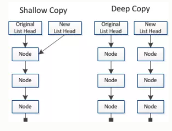

## 内存分类
* 栈: 全局变量/局部变量
* 堆: 对象
## var a = xxx, a内存中到底保存的是什么?
* xxx是基本数据, 保存的就是这个数据
* xxx是对象, 保存的是对象的地址值
* xxx是一个变量, 保存的xxx的内存内容(可能是基本数据, 也可能是地址值)
## 关于引用变量赋值问题
* 2个引用变量指向同一个对象, 通过一个变量修改对象内部数据, 另一个变量看到的是修改之后的数据
* 2个引用变量指向同一个对象, 让其中一个引用变量指向另一个对象, 另一引用变量依然指向前一个对象
```
var obj1 = {name: 'Tom'}
  var obj2 = obj1
  obj2.age = 12
  console.log(obj1.age)  // 12
  function fn (obj) {
    obj.name = 'A'
  }
  fn(obj1)
  console.log(obj2.name) //A


  var a = {age: 12}
  var b = a
  a = {name: 'BOB', age: 13}
  b.age = 14
  console.log(b.age, a.name, a.age) // 14 Bob 13

  function fn2 (obj) {
    obj = {age: 15}
  }
  fn2(a)

  console.log(a.age)
```
## 深拷贝和浅拷贝

### 1.浅拷贝
浅拷贝只复制指向某个对象的指针，而不复制对象本身，新旧对象还是共享同一块内存。 
#### 实现方式 
- 1.简单的引用复制
```
function shallowClone(copyObj) {
  var obj = {};
  for ( var i in copyObj) {
    obj[i] = copyObj[i];
  }
  return obj;
}
var x = {
  a: 1,
  b: { f: { g: 1 } },
  c: [ 1, 2, 3 ]
};
var y = shallowClone(x);
console.log(y.b.f === x.b.f);     // true
```
- 2.Object.assign()实现
Object.assign() 方法可以把任意多个的源对象自身的可枚举属性拷贝给目标对象，然后返回目标对象。但是 Object.assign() 进行的是浅拷贝，拷贝的是对象的属性的引用，而不是对象本身。
```
var obj = { a: {a: "hello", b: 21} };

var initalObj = Object.assign({}, obj);

initalObj.a.a = "changed";

console.log(obj.a.a); //  "changed"
```  
注意：当object只有一层的时候，是深拷贝.
```
var obj1 = { a: 10, b: 20, c: 30 };
var obj2 = Object.assign({}, obj1);
obj2.b = 100;
console.log(obj1);
// { a: 10, b: 20, c: 30 } <-- 沒被改到
console.log(obj2);
// { a: 10, b: 100, c: 30 }
```
### 2.深拷贝
深拷贝会另外创造一个一模一样的对象，新对象跟原对象不共享内存，修改新对象不会改到原对象。
#### 实现方式
- 1.转成 JSON 再转回来
```
var obj1 = { body: { a: 10 } };
var obj2 = JSON.parse(JSON.stringify(obj1));
obj2.body.a = 20;
console.log(obj1);
// { body: { a: 10 } } <-- 沒被改到
console.log(obj2);
// { body: { a: 20 } }
console.log(obj1 === obj2);
// false
console.log(obj1.body === obj2.body);
// false
```
用JSON.stringify把对象转成字符串，再用JSON.parse把字符串转成新的对象。