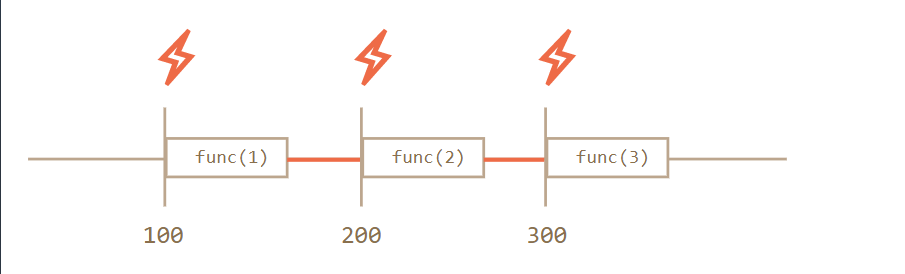
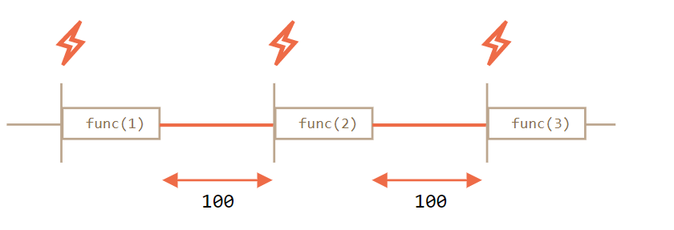

# 递归版setTimeout
## 周期性调度的两种方式
- setInterval
- 递归版的setTimeout

```
let timerId = setInterval(()=>console.log('tick'),2000);
```

```
let timerId = setTimeout(function tick(){
    console.log('tick');
    timerId = setTimeout(tick,2000);
},2000);
```
采用这种方式可以根据当前执行结果来安排下一次调用。  

#### 实现一个服务，每间隔 5 秒向服务器请求数据，如果服务器过载了，那么就要降低请求频率，比如将间隔增加到 10, 20, 40 秒等。
```
let delay = 5000;

let timerId = setTimeout(function request(){
    //send request

    if(request failed due to server overload){
        //下一次执行的间隔是当前的两倍
        delay *= 2;
    }

    timerId = setTimeout(request,delay);
},delay);
```
**递归版 setTimeout 能保证每次执行间的延时都是准确的，setInterval 却不能够。**  

### 两者差异
```
let i = 1;
setInterval(function(){
    func(i);
},100);
```

```
let i = 1;
setTimeout(function run(){
    func(i);
    setTimeout(run,100);
},100);
```

  

> setInterval内部的调度器会每隔100毫秒执行一次func(i),**使用setInterval时，func函数的实际调用间隔要比代码给出的间隔时间要短**,因为func的执行时间抵消掉了一部分间隔时间  

  

> **递归的setTimeout就能确保延时的固定**，因为下一次调用是在前一次调用完成时再调度的。  


### 垃圾回收
> 当一个函数传入setInterval/setTimeout时，内部会为其创建一个引用，保存在调度器中。这个即使这个函数没有被引用，也能防止垃圾回收器(GC)将其回收  

```
//在调度器调用这个函数之前，这个函数将一直存在于内存中
setTimeout(function(){...},100);
```

> 对于setInterval，传入的函数也是存在于内存中，直到clearInterval被调用。  

> 如果函数引用了外部变量(闭包)，那么只要这个函数还存活着，外部变量也会随之存活，这样就可能会占用多于方法自身所需要的内存。所以，如果某个函数不需要再调度，即使是个很小的函数，最好也将其取消。  

## setTimeout(...,0)
- 将耗费CPU的任务分割成多块，这样脚本运行不会进入“挂起”状态
- 进程繁忙时也能让浏览器抽身做其他事件(例如绘制进度条)

### 浏览器内，嵌套定时器运行的最小延时
> 在浏览器环境下，嵌套定时器的运行频率是受限制的。根据 HTML5 标准 所言：“经过 5 重嵌套之后，定时器运行间隔强制要求至少达到 4 毫秒”。  

```
let start = Date.now();
let times = [];

setTimeout(function run(){
    times.push(Date.now() - start);//保存上次调用的延时

    if(start + 100 < Date.now()){
        console.log(times);//100毫秒后，显示延时信息
    }else{
        setTimeout(run,0);//没超过100毫秒则再进行调度
    }
}，0);
```