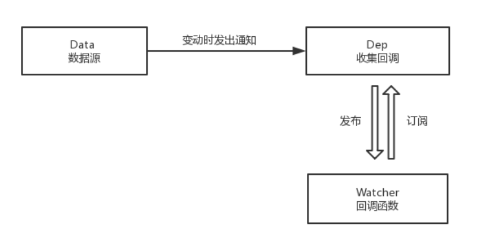

# 响应式框架基本原理
数据在变化过程时，不再需要开发者去手动更新视图，而视图会根据变化的数据“自动”进行更新。  
- 收集视图依赖了哪些数据
- 感知被依赖数据的变化
- 数据变动时，自动“通知”需要更新的视图部分，并进行更新  

对应技术概念  
- 依赖收集
- 数据劫持/数据代理
- 发布订阅模式

## 数据劫持与代理
通过Object.defineProperty实现，这个方法可以定义数据的getter和setter    
Object.defineProperty() 方法会直接在一个对象上定义一个新属性，或者修改一个对象的现有属性， 并返回这个对象。
```
let o = {
    a:1
}

let value = o['a'];

//设置o.a的属性描述对象
Object.defineProperty(o,'a',{
    enumerable:true,
    configurable:true,
    //设置o.a的getter，每次访问o.a时执行
    get(){
        console.log('a属性已经被访问到了');
        return value;
    },
    set(newValue){
        //设置o.a的setter，每次修改o.a时执行
        console.log('a 属性被修改了，新值为:', newValue, ',旧值为：', value);
        value = newValue;
    }
})

o.a;  // 输出：a 属性被访问到了！
o.a = 2;  // 输出：a 属性被修改了，新值为: 2 ,旧值为： 1
```
## 监听数组变化
**Object.defineProperty 方法一次只能定义一个键值的属性描述对象。**
```
let o = {
    a:1
}

function watch(obj,key,callback){
    let value = obj[key];
    Object.defineProperty(obj,key,{
        enumerable:true,
        configurable:true,
        get(){
            return value;
        },
        set(newValue){
            if(newValue === value){
                return
            }else{
                let oldValue = value;
                value = newValue;
                // setter 中触发回调函数，并将新值与旧值作为参数传入
                callback(newValue,oldValue);
            }
        }
    })
}

//『使数据响应化』和『添加回调函数』两个操作现在是耦合在一起的
watch(o,'a',(newValue,oldValue)=>{
     // 使 o.a 响应化
     console.log('属性被修改了，新值为:', newValue, ',旧值为：', oldValue)
})

o.a = 2   // 输出： 属性被修改了，新值为: 2 ,旧值为： 1
o.a = 3   // 输出： 属性被修改了，新值为: 3 ,旧值为： 2
```

### 递归遍历整个对象
为了让整个对象响应化，我们需要遍历对象中的所有键并为其应用 Object.defineProperty 方法。对于键值为对象的情况，递归进去处理。同时，为了让 『使数据响应化』和『添加回调函数』两个操作解耦，我们引入 Dep 和 Watcher 类，使用订阅/发布模式向响应式数据注册回调函数。  
  

```
// Dep 类，保存数据源的所有订阅，并在接收到数据源的变动通知后，触发所有订阅
class Dep {
    constructor(){
        this.subs = [];
    }

    addSub(sub){
        //添加订阅
        this.subs.push(sub);
    }

    notify(newValue,oldValue){
        this.subs.forEach(sub=>{
            //触发订阅
            sub.update(newValue,oldValue);
        })
    }
}

const globalDep = new Dep();

// Watcher 类，每个 Watcher 为一个订阅源
class Watcher{
    constructor(callback){
        this.callback = callback;
    }

    update(newValue,oldValue){
        //被触发后执行回调
        this.callback(newValue,oldValue);
    }
}

//使一个对象响应化
function observify(value){
    if(!isObject(value)){
        return
    }
    Object.keys(value).forEach((key)=>{
        //遍历每个键使其响应化
        defineReactive(value,key,value[key]);
    })
}

function isObject(value){
    return typeof value === 'object' && value !== null;
}

//为对象的一个键应用 Object.defineProperty
function defineReactive(obj,key,value){
    observify(value);//递归
    Object.defineProperty(obj,key,{
        enumerable:true,
        configurable:true,
        get(){
            return value;
        },
        set:(newValue)=>{
            if(newValue === value){
                return
            }else{
                let oldValue = value;
                value = newValue;
                observify(newValue);
                globalDep.notify(newValue,oldValue);//变动时通知Dep
            }
        }
    })
}

let o = {
  a: 1,
  c: {
    d: 1
  }
}
//『使数据响应化』和『添加回调函数』两个操作已被解耦，解耦后可以方便的多次添加订阅
// 使数据响应化
observify(o)
// 添加订阅
globalDep.addSub(new Watcher((newValue, oldValue) => {
  console.log('发生改变！新值：', newValue, "，旧值：", oldValue)
}))
o.a = 2  // 输出：发生改变！新值： 2 ，旧值： 1
o.c.d = 4  // 输出：发生改变！新值： 4 ，旧值： 1
// 可以再添加一个订阅
globalDep.addSub(new Watcher((newValue, oldValue) => {
  console.log('新订阅')
}))
o.a = 3 // 输出：发生改变！新值： 3 ，旧值： 2
        // 输出：新订阅
```
### 数组的特殊响应化处理
操作数组时往往使用 push、pop、shift 等函数来操作——很遗憾，调用这些函数修改数组内容并不会触发 setter。  
为了能监测到这些函数操作带来的变动，我们需要『偷梁换柱』：用自制的变异函数替代这些原生函数。首先使用 Object.create 创建一个原型为 Array.prototype 的对象，拿到 Array 实例方法；然后在该对象上定义同名的变异函数，shadow 掉原生函数；随后将要响应化的数组的原型指向该对象，欺骗数组使用变异函数。  

```
//数组响应化
function observifyArray(arr){
    //需要变异的函数名列表
    const aryMethods =   ['push', 'pop', 'shift', 'unshift', 'splice', 'sort', 'reverse'];

    // 创建一个 __proto__ 到 Array.prototype 的 arrayAugmentations 对象
    //Object.create()方法创建一个新对象，使用现有的对象来提供新创建的对象的__proto__。
    let arrayAugmentations = Object.create(Array.prototype);

    // 在 arrayAugmentations 对象上将需要变异的函数重写
    aryMethods.forEach(method => {
        arrayAugmentations[method] = function(...arg){
            // 执行默认操作
            Array.prototype[method].apply(this,arg);

            // 重写后的函数会先执行默认操作，随后通知 Dep
            globalDep.notify();
        }
    })
    // 将要监测的数组的原型对象设置为 arrayAugmentations 对象，这样执行 push 等方法时就会执行我们替换后的变异方法啦
    //Object.setPrototypeOf() 方法设置一个指定的对象的原型 ( 即, 内部[[Prototype]]属性）到另一个对象或 null。
    Object.setPrototypeOf(arr,arrayAugmentations);
}

// 修改上文中的 observify 函数，加入 observifyArray
function observify(value){
    if(!isObject(value)){
        return
    }
    // 由于性能问题，我们不再对数组的每个 key 执行 Object.defineReactive
    if(Array.isArray(value)){
        observifyArray(value);
        for(let i=0;i<value.length;i++){
            observify(value[i]);
        }
    }else{
        Object.keys(value).forEach((key)=>{
            defineReactive(value,key,value[key]); //遍历每个键使其响应化
        })
    }
}

... 其他部分引用 #2.1 示例
let o = {
  a: [1, 2, 3]
}
observify(o)
globalDep.addSub(new Watcher((newValue, oldValue) => {
  console.log('发生改变！新值：', newValue, "，旧值：", oldValue)
}))
o.a.push(4) // 输出：发生改变！新值： (4) [1, 2, 3, 4] ，旧值： (3) [1, 2, 3]
```