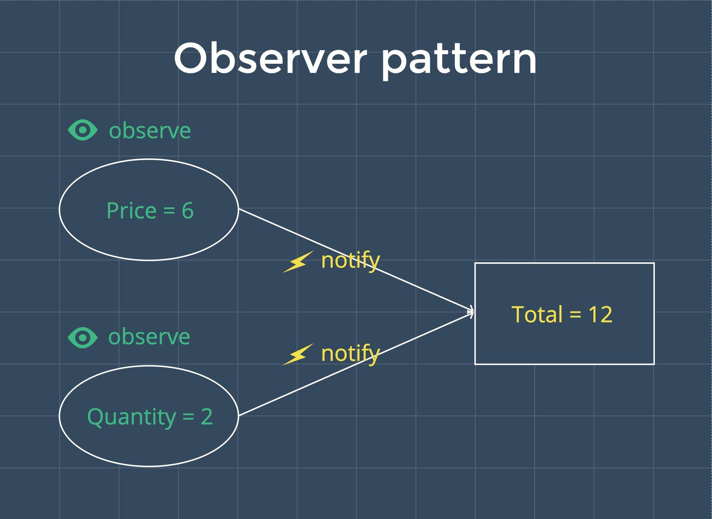

# 使用 Proxy 构建响应式系统
> Proxy 可以理解成，在目标对象之前架设一层“拦截”，外界对该对象的访问，都必须先通过这层拦截，因此提供了一种机制，可以对外界的访问进行过滤和改写。  

```
let p = new Proxy(target,handler);
```
- target用Proxy包装的目标对象(可以是任何类型的对象，包括原生数组，函数，甚至另一个代理)
- handler:一个对象，其属性是当执行一个操作时定义代理的行为的函数  

```
let handler = {
    get:function(target,name){
        return name in target ? target[name] : 37;
    }
};

let p = new Proxy({},handler);

p.a = 1;
p.b = undefined;
    
console.log(p.a, p.b);    // 1, undefined
    
console.log('c' in p, p.c);    // false, 37
```

## 使用观察者模式
> 观察者模式，它定义对象间的一种一对多的依赖关系，当一个对象的状态发生改变时，所有依赖于它的对象都将得到通知。  

  

### 创建依赖类
把观察者模式抽象为一个依赖类
```
//代表依赖类
class Dep{
    constructor(){
        this.subscribers = [];//把所有目标收集到订阅里
    }

    // 当有可观察目标时，添加到订阅里
    addSub(sub){
        if(sub && !this.subscribers.includes(sub)){
            // 只添加未添加过的订阅
            this.subscribers.push(sub);
        }
    }

    // 当被观察的属性发生变动时通知所有依赖于它的对象
    notify(){
        // 重新执行所有订阅过的目标方法
        this.subscribers.forEach(fn=>fn());
    }
}
```
使变量 price 和 quantify 变得可观察
```
//使变量变为一个可观察的对象的属性
const dataObj = {
    price:6,
    quantity:2
}
let total = 0;
let target = null;

//代表依赖类
class Dep{
    //...
}

const dep = new Dep();

data = new Proxy(dataObj,{
    get(obj,key){
        dep.addSub(target);//将目标添加到订阅中
        return obj[key];
    },
    set(obj,key,newVal){
        obj[key] = newVal;//将新的值赋值给旧的值，引起值的变化
        dep.notify();//被观察的属性值发生变化，即通知所有依赖于它的对象
    }
})

total = data.price*data.quantity;

console.log(total)  // 12
data.price = 10
console.log(total)  // 12

target = () => {
    total = data.price*data.quantity;
}

target()
target = null
    
console.log(total)  // 20
```

### 使用Proxy实现观察者模式

```
//将依赖类与Proxy封装为observer，输入一个普通对象，输出为被观察的对象
const observer = dataObj => {
    const dep = new Dep();

    return new Proxy(dataObj,{
        get(obj,key){
            dep.addSub(target);//将目标添加到订阅中
            return obj[key];
        },
        set(obj,key,newVal){
            obj[key] = newVal;//将新的值赋值给旧的值，引起值的变化
            dep.notify();//被观察的属性值发生变化，即通知所有依赖于它的对象
        }
    })
}

const data = observer(dataObj);
```
### 创建watcher
每次我们还要重新执行我们的目标 target ，让 total 值发生变化。这块儿逻辑我们可以抽象为一个 watcher ，让它帮我们做一些重复做的业务逻辑。
```
const watcher = fn => {
    target = fn;
    target();
    target = null;
}

watcher(()=>{
    total = data.price*data.quantity;
})
```
最终代码优化为
```
// 使变量变为一个可观察的对象的属性
const dataObj = {
  price: 6,
  quantity: 2
}
let total = 0
let target = null
    
// 代表依赖类
class Dep {
  ...
}
    
// 使用 Proxy 实现了观察者模式
const observer = dataObj => {
  ...
}
    
const data = observer(dataObj)
    
// 高阶函数，重复执行订阅方法
const watcher = fn => {
  ...
}
    
watcher(() => {
  total = data.price * data.quantity
})
    
console.log(total)  // 12
data.price = 30
console.log(total) // 60

```