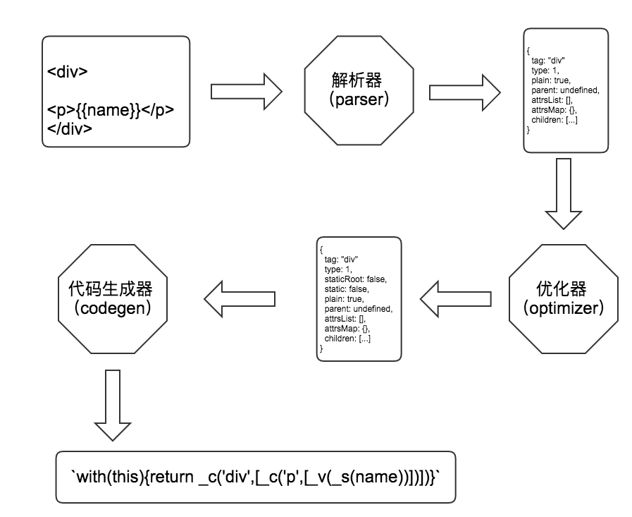

# 模板编译原理
- 1.将模板字符串转换成element ASTs(解析器)
- 2.对AST进行静态节点标记，主要用来做虚拟DOM的渲染优化(优化器)
- 3.使用element ASTs生成render函数代码字符串(代码生成器)

## 代码生成器
使用本文开头举的例子中的模板生成后的 AST 来生成 render 后是这样的：
```
{
  render: `with(this){return _c('div',[_c('p',[_v(_s(name))])])}`
}
```
格式化后是这样的：
```
with(this){
  return _c(
    'div',
    [
      _c(
        'p',
        [
          _v(_s(name))
        ]
      )
    ]
  )
}
```
_c 对应的是 createElement，它的作用是创建一个元素。  
1. 第一个参数是一个HTML标签名
2. 第二个参数是元素上使用的属性所对应的数据对象，可选项
3. 第三个参数是 children  


拼这个字符串
```
function genElement (el: ASTElement, state: CodegenState) {
  const data = el.plain ? undefined : genData(el, state)
  const children = el.inlineTemplate ? null : genChildren(el, state, true)
	
  let code = `_c('${el.tag}'${
    data ? `,${data}` : '' // data
  }${
    children ? `,${children}` : '' // children
  })`
  
  return code
}
```
上面这段代码的主要逻辑就是用 genData 和 genChildren 获取 data 和 children，然后拼到 _c 中去，拼完后把拼好的 "_c(tagName, data, children)" 返回。  

```
function genData (el: ASTElement, state: CodegenState): string {
  let data = '{'
  // key
  if (el.key) {
    data += `key:${el.key},`
  }
  // ref
  if (el.ref) {
    data += `ref:${el.ref},`
  }
  if (el.refInFor) {
    data += `refInFor:true,`
  }
  // pre
  if (el.pre) {
    data += `pre:true,`
  }
  // ... 类似的还有很多种情况
  data = data.replace(/,$/, '') + '}'
  return data
}
```
```
function genChildren (
  el: ASTElement,
  state: CodegenState
): string | void {
  const children = el.children
  if (children.length) {
    return `[${children.map(c => genNode(c, state)).join(',')}]`
  }
}

function genNode (node: ASTNode, state: CodegenState): string {
  if (node.type === 1) {
    return genElement(node, state)
  } if (node.type === 3 && node.isComment) {
    return genComment(node)
  } else {
    return genText(node)
  }
}
```
生成 children 的过程其实就是循环 AST 中当前节点的 children，然后把每一项在重新按不同的节点类型去执行 genElement genComment genText。如果 genElement 中又有 children 在循环生成，如此反复递归，最后一圈跑完之后能拿到一个完整的 render 函数代码字符串，就是类似下面这个样子。  
```
"_c('div',[_c('p',[_v(_s(name))])])"
```
最后把生成的 code 装到 with 里。
```
export function generate (
  ast: ASTElement | void,
  options: CompilerOptions
): CodegenResult {
  const state = new CodegenState(options)
  // 如果ast为空，则创建一个空div
  const code = ast ? genElement(ast, state) : '_c("div")'
  return {
    render: `with(this){return ${code}}`
  }
}
```


  

解析器（parser）的原理是一小段一小段的去截取字符串，然后维护一个 stack 用来保存DOM深度，每截取到一段标签的开始就 push 到 stack 中，当所有字符串都截取完之后也就解析出了一个完整的 AST。

优化器（optimizer）的原理是用递归的方式将所有节点打标记，表示是否是一个 静态节点，然后再次递归一遍把 静态根节点 也标记出来。

代码生成器（code generator）的原理也是通过递归去拼一个函数执行代码的字符串，递归的过程根据不同的节点类型调用不同的生成方法，如果发现是一颗元素节点就拼一个 _c(tagName, data, children) 的函数调用字符串，然后 data 和 children 也是使用 AST 中的属性去拼字符串。

如果 children 中还有 children 则递归去拼。

最后拼出一个完整的 render 函数代码。