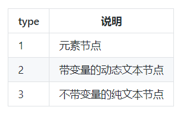

# 模板编译原理
- 1.将模板字符串转换成element ASTs(解析器)
- 2.对AST进行静态节点标记，主要用来做虚拟DOM的渲染优化(优化器)
- 3.使用element ASTs生成render函数代码字符串(代码生成器) 

## 优化器
优化器的目标是找出那些静态节点并打上标记，而静态节点指的是 DOM 不需要发生变化的节点，例如：
```
<p>我是静态节点，我不需要发生变化</p>
```

好处：
- 每次重新渲染的时候不需要为静态节点创建新节点
- 在Virtual DOM中patching的过程可以被跳过

实现原理分两步：  
- 用递归的方式将所有节点添加static属性，标识是不是静态节点
- 标记所有静态根节点  

子节点全是静态节点的节点就是静态根节点

### 如何将所有节点标记static属性
- 先根据自身是不是静态节点做一个标记node.static = isStatic(node)
- 然后在循环children,如果children中出现了哪怕一个节点不是静态节点，再将当前节点的标记修改成false:node.static = false

### 如何判断一个节点是不是静态节点
```
function isStatic (node: ASTNode): boolean {
  if (node.type === 2) { // expression
    return false
  }
  if (node.type === 3) { // text
    return true
  }
  return !!(node.pre || (
    !node.hasBindings && // no dynamic bindings
    !node.if && !node.for && // not v-if or v-for or v-else
    !isBuiltInTag(node.tag) && // not a built-in
    isPlatformReservedTag(node.tag) && // not a component
    !isDirectChildOfTemplateFor(node) &&
    Object.keys(node).every(isStaticKey)
  ))
}
```


### 如何标记所有节点
判断**元素节点**是不是**静态节点**不能光看它自身是不是静态节点，如果它的**子节点**不是静态节点，那就算它自身符合上面讲的静态节点的条件，它也不是静态节点。
```
for(let i=0,l=node.children.length;i<l;i++){
    const child = node.children[i];
    markStatic(child);
    if(!child.static){
        node.static = false;
    }
}
```

### 如何标记静态根节点
标记静态根节点其实也是递归的过程。
```
function markStaticRoots (node: ASTNode, isInFor: boolean) {
  if (node.type === 1) {
    // For a node to qualify as a static root, it should have children that
    // are not just static text. Otherwise the cost of hoisting out will
    // outweigh the benefits and it's better off to just always render it fresh.
    if (node.static && node.children.length && !(
      node.children.length === 1 &&
      node.children[0].type === 3
    )) {
      node.staticRoot = true
      return
    } else {
      node.staticRoot = false
    }
    if (node.children) {
      for (let i = 0, l = node.children.length; i < l; i++) {
        markStaticRoots(node.children[i], isInFor || !!node.for)
      }
    }
  }
}
```
当前节点是静态节点，并且有子节点，并且子节点不是单个静态文本节点这种情况会将当前节点标记为根静态节点

上面我们标记 静态节点 的时候有一段逻辑是只有所有 子节点 都是 静态节点，当前节点才是真正的 静态节点。

所以这里我们如果发现一个节点是 静态节点，那就能证明它的所有 子节点 也都是静态节点，而我们要标记的是 静态根节点，所以如果一个静态节点只包含了一个文本节点那就不会被标记为 静态根节点。