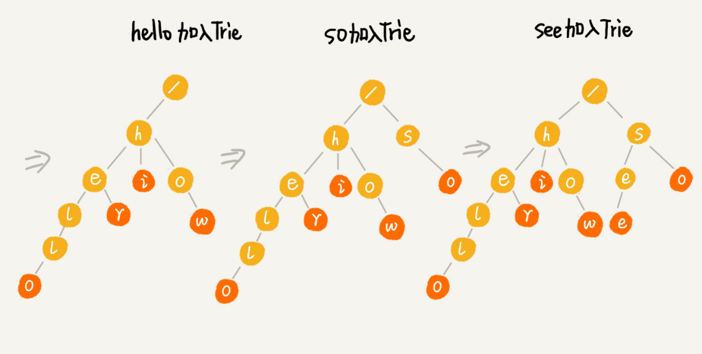

# Trie树
**Trie树的本质，就是利用字符串之间的公共前缀，将重复的前缀合并在一起**  

  

根节点不包含任何信息，每个节点表示一个字符串中的字符，从根节点到红色节点的一条路径表示一个字符串(红色节点并不都是叶子节点)  

  

  

## 实现和遍历

```
class PrefixTreeNode{
    constructor(value){
        //存储子节点
        this.children = {};
        this.isEnd = null;
        this.value = value;
    }
}

class PrefixTree extends PrefixTreeNode{
    constructor(){
        super(null);
    }

    //addWord:创建一个字典树节点
    addWord(str){
        const addWordHelper = (node,str) => {
            //当前node不含当前str开头的目标
            if(!node.children[str[0]]){
                //以当前str开头的第一个字母创建一个PrefixTreeNode实例
                node.children[str[0]] == new PrefixTreeNode(str[0]);
                if(str.length === 1){
                    node.children[str[0]].isEnd = true;
                }
                else if(str.length > 1){
                    addWordHelper(node.children[str[0]],str.slice(1));
                }
            }
        }
        addWordHelper(this,str);
    }

    //predictWord:给定一个字符串，返回字典树中以该字符串开头的所有单词
    predictWord(str){
        let getRemainingTree = function(str,tree){
            let node = tree;
            while(str){
                node = node.children[str[0]];
                str = str.substr(1);
            }
            return node;
        }

        //该数组维护所有以str开头的单词
        let allWords = [];

        let allWordsHelper = function(stringSoFar,tree){
            for(let k in tree.children){
                const child = tree.children[k];
                let newString = stringSoFar + child.value;
                if(child.endWord){
                    allWords.push(newString);
                }
                allWordsHelper(newString,child);
            }
        }
        let remainingTree = getRemainingTree(str,this);

        if(remainingTree){
            allWordsHelper(str,remainingTree);
        }
        return allWords;
    }
}
```