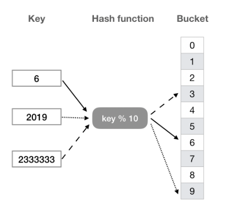

# 散列表(哈希表)
散列表是一种以 key-value 形式存储数据的数据结构  

  

- 桶（bucket），用来直接存放或间接指向一个数据
- 桶数组（bucket array）由桶组成的数组
- 散列函数（hash function）将 key 转换为桶数组下标的函数

## 实现
```
//单向链表节点
class ForwardListNode{
    constructor(key,value){
        this.key = key;
        this.value = value;
        this.next = null;
    }
}

class Hashtable{
    constructor(bucketSize = 97){
        this._bucketSize = bucketSize;
        this._size = 0;
        this._buckets = new Array(this._bucketSize);
    }

    hash(key){
        let h = 0;
        for(let n=key.length,i=0;i!=n;i++){
            h = (h<<5 | h>>27);
            h += key[i].charCodeAt();
        }
        return (h>>>0)%this._bucketSize;
    }

    //Modifiers
    put(key,value){
        let index = this.hash(key);
        let node = new ForwardListNode(key,value);

        if (!this._buckets[index]) {
        // 如果桶是空的，则直接把新节点放入桶中即可
        this._buckets[index] = node
        } else {
        // 如果桶不为空，则在链表头插入新节点
        node.next = this._buckets[index]
        this._buckets[index] = node
        }
        this._size++
        return index
    }

    delete(key) {
    let index = this.hash(key)
    if (!this._buckets[index]) {
      return false
    }

    // 添加一个虚拟头节点，方便后面的删除操作
    let dummy = new ForwardListNode(null, null)
    dummy.next = this._buckets[index]
    let cur = dummy.next, pre = dummy
    while (cur) {
      if (cur.key === key) {
        // 从链表删除该节点
        pre.next = cur.next
        cur = pre.next
        this._size--
      } else {
        pre =  cur
        cur = cur.next
      }
    }
    this._buckets[index] = dummy.next
    return true
  }

  // Lookup
  find(key){
    let index = this.hash(key);
    // 如果对应的 bucket 为空，说明不存在此 key
    if (!this._buckets[index]) {
      return null
    }

    // 遍历对应桶的链表
    let p = this._buckets[index]
    while (p) {
      // 找到 key
      if (p.key === key) {
        return p.value
      }
      p = p.next
    }
    return null
  } 

  // Capacity
  size() {
      return this._size
  }

  isEmpty() {
      return this._size == 0
  }
}
```