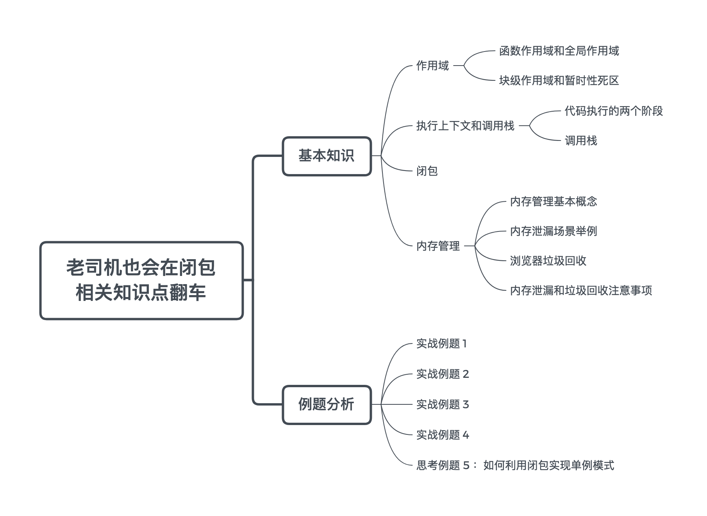

# 闭包


## 暂时性死区
在块作用域内，let声明的变量被提升，但变量只是创建被提升，初始化并没有被提升，在初始化之前使用变量，就会形成一个暂时性死区。  


## 执行上下文和调用栈
```
function bar() {
    console.log('bar1')
}

var bar = function () {
    console.log('bar2')
}

bar()
```
输出：bar2
```
var bar = function () {
    console.log('bar2')
}

function bar() {
    console.log('bar1')
}

bar()
```
输出：bar2  

在预编译阶段变量bar进行声明，但是不会赋值；函数bar则进行创建并提升。在代码执行时，变量bar才会进行(表达式)赋值，指内容是函数体为console.log('bar2')的函数，输出结果bar2

## 闭包
**函数嵌套函数时，内层函数引用了外层函数作用域下的变量，并且内层函数在全局环境下可访问，就形成了闭包**

### 利用闭包实现单例模式
**保证一个类只有一个实例，并提供一个访问它的全局访问点**  

使用闭包可以保持对实例的引用，不被垃圾回收机制回收  

```
function Person(){
    this.name = 'zxt';
}

const getSingleInstance = (function(){
    var singleInstance;
    return function(){
        if(singleInstance){
            return singleInstance;
        }
        return singleInstance = new Person();
    }
})()

const instance1 = new getSingleInstance()
const instance2 = new getSingleInstance()
```