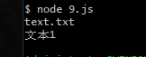

# 一步一步手写promise
```
let p = new Promise(function (resolve,reject){
    console.log('start');
    resolve('data1');
})

p.then(
    (v)=>{
        console.log('success:'+v);
    },
    (v)=>{
        console.log('error:'+v);
    }
)

console.log('end');

//start
//end
//success:data1
```
1. new Promise时，传递一个参数，这个参数是函数，又被称为执行器函数(executor),且执行器会被立即调用，也就是上面结果中start最先输出的原因
2. 每一个promise实例都有方法then,then中有两个参数，这两个参数也是函数，当执行器调用resolve后，then中第一个参数函数会执行。当执行器调用reject后，then中第二个参数函数会执行

## 手写MyPromise构造函数
1. 构造函数的参数，在new的过程中会立即执行  
   ```
   //因为会立即执行这个执行器函数
   function MyPromise(executor){
       executor(resolve,reject);
   }
   ```

2. new出来的实例具有then方法
   ```
   MyPromise.prototype.then = function(onFulfilled,onRejected){

   }
   ```

3. new出来的实例具有默认状态，执行器执行resolve或者reject，修改状态
   ```
   function MyPromise(executor){
       let self = this;
       self.status = 'pending';//默认promise状态是pending
       function resolve(value){
           self.status = 'resolved';//成功状态
       }
       function reject(reason){
           self.status = 'rejected';//失败状态
       }

       executor(resolve,reject);
   }
   ```

4. 当执行器调用resolve后，then中第一个参数函数(成功回调)会执行，当执行器调用reject后，then中第二个参数函数(失败回调)会执行
   ```
   MyPromise.prototype.then = function (onFulfilled,onRejected){
       let self = this;
       if(self.status === 'resolved'){
           onFulfilled();
       }
       if(self.status === 'rejected'){
           onRejected();
       }
   }
   ```

5. 保证promise实例状态一旦更改不能再次改变，只有在pending时候才可以改变状态
   ```
   function Promise(executor){
       let self = this;
       self.status = 'pending';//默认promise状态是pending
       function resolve(value){
           //保证状态一旦更改，不能再次修改
           if(self.status === 'pending'){
               self.value = value;
               self.status = 'resolved';//成功状态
           }
       }
       function reject(reason){
           if(self.status === 'pending'){
               self.reason = reason;
               self.status = 'rejected';//失败状态
           }
       }
       executor(resolve,reject);
   }
   ```

6. 执行器执行resolve方法传的值，传递给then中第一个参数函数中
   ```
   function MyPromise(executor){
       let self = this;
       self.value = undefined;
       self.reason = undefined;
       self.status = 'pending';//默认promise状态是pending
       function resolve(value){
           //保证状态一旦变更，不能再次修改
           if(self.status === 'pending'){
               self.value = value;
               self.status = 'resolved';//成功状态
           }
       }
       function reject(reason){
           if(self.status === 'pending'){
               self.reason = reason;
               self.status = 'rejected';//失败状态
           }
       }
       executor(resolve,reject);//因为会立即执行这个执行器函数
   }

   MyPromise.prototype.then = function(onFulfilled,onRejected){
       let self = this;
       if(self.status === 'resolved'){
           onFulfilled(self.value);
       }
       if(self.status === 'rejected'){
           onRejected(self.reason);
       }
   }

   //使用这个MyPromise
   let p = new MyPromise(function (resolve,reject){
       console.log('start');
       resolve('data2');
   })

   p.then(
       (v)=>{
           console.log('success'+v);
       },
       (v)=>{
           console.log('error'+v);
       }
   )
   console.log('end');
   ```

## 添加异步处理和实现一个实例多次调用then方法
原生异步处理
```
let p = new Promise(function (resolve,reject){
    console.log('start');
    setTimeout(function (){
        resolve('data1');
    },2000)
})

p.then(
    (v)=>{
        console.log('success:'+v);
    },
    (v)=>{
        console.log('error:'+v);
    }
)

console.log('end');

//start
//end
//success:data1
```
多次调用then
```
let p = new Promise(function (resolve,reject){
    console.log('start');
    setTimeout(function(){
        resolve('data1');
    },2000)
})

p.then(
    (v)=>{
        console.log('success:'+v);
    },
    (v)=>{
        console.log('error:'+v);
    }
)

p.then(
    (v)=>{
        console.log('success:'+v);
    },
    (v)=>{
        console.log('error:'+v);
    }
)

console.log('end');

//start
//end
//success:data1
//success:data1
```
执行器方法中，有异步函数的情况时，p.then执行就会把对应的两个参数保存起来，在执行器中的resolve执行时候或者reject执行时再调用

```
function MyPromise(executor){
    let self = this;
    self.value = undefined;
    self.reason = undefined;
    //默认promise状态是pending
    self.status = 'pending';
    //用来保存then方法中，第一个参数
    self.onResolvedCallbacks = [];
    //用来保存then方法中，第二个参数
    self.onRejectedCallbacks = [];
    function resolve(value){
        //保证状态一旦变更，不能再次修改
        if(self.status === 'pending'){
            self.value = value;
            self.status = 'resolved';//成功状态
            self.onResolvedCallbacks.forEach(fn=>{
                fn();
            })
        }
    }
    function reject(reason){
        if(self.status === 'pending'){
            self.reason = reason;
            self.status = 'rejected';//失败状态
            self.onRejectedCallbacks.forEach(fn=>{
                fn();
            })
        }
    }
    executor(resolve,reject);//因为会立即执行这个执行器函数
}

MyPromise.prototype.then = function(onFulfilled,onRejected){
    let self = this;
    if(self.status === 'resolved'){
        onFulfilled(self.value);
    }
    if(self.status === 'rejected'){
        onRejected(self.reason);
    }
    if(self.status === 'pending'){
        //订阅
        self.onResolvedCallbacks.push(function(){
            onFulfilled(self.value);
        })
        self.onRejectedCallbacks.push(function(){
            onRejected(self.reason);
        })
    }
}

//测试
let p = new MyPromise(function (resolve,reject){
    console.log('start');
    setTimeout(function(){
        resolve('data1');
    },2000)
})

p.then(
    (v)=>{
        console.log('success:'+v);
    },
    (v)=>{
        console.log('error:'+v);
    }
)

p.then(
    (v)=>{
        console.log('success:'+v);
    },
    (v)=>{
        console.log('error:'+v);
    }
)

console.log('end');

//start
//end
//success:data1
//success:data1
```

## 实现MyPromise的链式调用
### 实际场景的promise化
> 有如下场景，第一次读取的是文件名字，拿到文件名字后，再去读这个名字文件的内容。很显然这是两次异步操作，并且第二次的异步操作依赖第一次的异步操作结果。  

```
// 简要说明 创建一个js文件 与这个文件同级的 name.txt, text.txt 
// 其中name.txt内容是text.txt， 而text.txt的内容是 文本1
// node 运行这个js文件

let fs = require('fs');

fs.readFile('./name.txt','utf8',function (err,data){
    console.log(data);
    fs.readFile(data,'utf8',function (err,data){
        console.log(data);
    })
})
```
  

### promise化
1. 封装一个函数，函数返回promise实例
   ```
   function readFile(url){
       return new Promise((resolve,reject)=>{

       })
   }
   ```

2. 这个函数执行就会返回promise实例，也就是有then方法可以使用
   ```
   readFile('./name.txt').then(
       ()=>{},
       ()=>{}
   )
   ```

3. 完善执行器函数，并且记住执行器函数是同步运行的，即new时候，执行器就执行了  
   ```
   let fs = require('fs');

   function readFile(url){
       return new Promise((resolve,reject)=>{
           fs.readFile(url,'utf8',function (err,data){
               if(err)reject(err);
               resolve(data);
           })
       })
   }

   readFile('./name.txt').then(
       (data)=>{console.log(data)},
       (err)=>{console.log(err)}
   )
   ```

4. 不使用链式调用
   ```
   readFile('./name.txt').then(
       (data)=>{
           console.log(data);
           readFile(data).then(
               (data)=>{console.log(data);},
               (err)=>{console.log(err);}
           )
       },
       (err)=>{console.log(err);}
   )
   ```

5. 使用链式调用
   ```
   readFile('./name.txt').then(
       (data)=>{
           console.log(data);
           return readFile(data);
       },
       (err)=>{console.log(err);}
   ).then(
       (data)=>{console.log(data);},
       (err)=>{console.log(err);}
   )
   ```