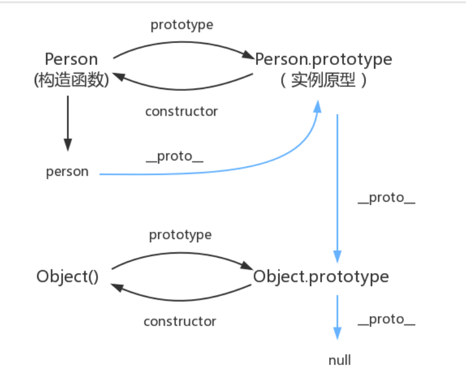

# 面向对象和原型

## 实现new
new关键字的作用：  
- 首先创建一个空对象，这个对象将作为执行new构造函数()之后，返回的对象实例
- 将上面创建的空对象的原型(\__proto__),指向构造函数的prototype属性
- 将这个空对象赋值给构造函数内部的this,并执行构造函数逻辑
- 根据构造函数执行逻辑，返回第一步创建的对象或者构造函数的显示返回值

预计使用方式
```
function Person(name){
    this.name = name;
}

const person = new newFunc(Person,'lucas');

console.log(person);
//{name:"lucas"}
```
实现
```
function newFunc(...args){
    //取出args数组第一个参数，即目标构造函数
    //shift() 方法从数组中删除第一个元素，并返回该元素的值。此方法更改数组的长度。
    const constructor = args.shift();

    //创建一个空对象，且这个空对象继承构造函数的prototype属性
    //即实现obj.__proto__ === constructor.prototype
    const obj = Object.create(constructor.prototype);

    //执行构造函数，得到构造函数返回结果
    //注意这里我们使用apply,将构造函数内的this指向obj
    const result = constructor.apply(obj,args);

    //如果构造函数执行后，返回结果是对象类型，就直接返回，否则返回obj对象
    return (typeof result==='object' && result!=null) ? result : obj;
}
```

## 实现继承

```
function inherit(Child,Parent){
    //继承原型上的属性
    Child.prototype = Object.create(Parent.prototype);

    //修复constructor
    Child.prototype.constructor = Child;

    //存储超类
    //super关键字用于访问和调用一个对象的父对象上的函数。
    Child.super = Parent;

    //静态属性继承
    //Object.setPrototypeOf() 方法设置一个指定的对象的原型 ( 即, 内部[[Prototype]]属性）到另一个对象或null。
    if(Object.setPrototypeOf){
        Object.setPrototypeOf(Child,Parent);
    }else if(Child.__proto__){
        Child.__proto__ = Parent;
    }else{
         // 兼容 IE10 等陈旧浏览器
        // 将 Parent 上的静态属性和方法拷贝一份到 Child 上，不会覆盖 Child 上的方法
        for(var k in Parent){
            if(Parent.hasOwnPrototype(k) && !(k in Child)){
                Child[k] = Parent[k];
            }
        }
    }
}
```

## 继承Date
**JavaScript 的日期对象只能通过 JavaScript Date 作为构造函数来实例化得到。**
```
function DateConstructor(){
    var dateObj = new (Function.prototype.bind.apply(Date,[Date].concat(Array.prototype.slice.call(arguments))))();

    Object.setPrototypeOf(dateObj,DateConstructor.prototype);

    dateObj.foo = 'bar';
    return dateObj;
}

Object.setPrototypeOf(DateConstructor.prototype,Date.prototype);

DateConstructor.prototype.getMyTime = function getTime(){
    return this.getTime();
}

let date = new DateConstructor();
console.log(date.getMyTime());
```
直接使用 extends 关键字
```
class DateConstructor extends Date {
    constructor(){
        super();
        this.foo = 'bar';
    }

    getMyTime(){
        return this.getTime();
    }
}

let date = new DateConstructor();
```

## ES6实现继承剖析
ES6的class是ES5原型的语法糖
```
class Person{
    constructor(){
        this.type = 'person';
    }
}

class Student extends Person{
    constructor(){
        super()
    }
}

var student1 = new Student();
student1.type;//"person"
student1 instanceof Student; //true
student1 instanceof Person;  //true
//hasOwnProperty() 方法会返回一个布尔值，指示对象自身属性中是否具有指定的属性（也就是，是否有指定的键）
student1.hasOwnProperty('type');//true
```
### Babel编译
```
class Person {
    constructor(){
        this.type = 'person'
    }
}
```
被编译为
```
var Person = function Person(){
    _classCallCheck(this,Person);
    this.type = 'person';
};
```
```
class Student extends Person {
    constructor(){
        super()
    }
}
```
编译结果：
```
// 实现定义 Student 构造函数，它是一个自执行函数，接受父类构造函数为参数
var Student = (function (_Person){
    //实现对父类原型链属性的继承
    _inherits(Student,_Person);

    //将会返回这个函数作为完整的Student构造函数
    function Student(){
        //使用检测
        _classCallCheck(this,Student);
        //_get的返回值可以先理解为父类构造函数
        _get(Object.getPrototypeOf(Student.prototype),'constructor',this).call(this);
    }
    return Student;
})(Person);

// _x为Student.prototype.__proto__
// _x2为'constructor'
// _x3为this
var _get = function get(_x,_x2,_x3){
    var _again = true;
    _function:while(_again){
        var object = _x,
            property = _x2,
            receiver = _x3;
        _again = false;
        // Student.prototype.__proto__为null的处理
        if(object === null)object=Function.prototype;
        // 以下是为了完整复制父类原型链上的属性，包括属性特性的描述符
        //Object.getOwnPropertyDescriptor() 方法返回指定对象上一个自有属性对应的属性描述符。（自有属性指的是直接赋予该对象的属性，不需要从原型链上进行查找的属性）
        var desc = Object.getOwnPropertyDescriptor(object,prototype);
        if(desc === undefined){
            var parent = Object.getPrototypeOf(object);
            if(parent === null){
                return undefined;
            }else{
                _x = parent;
                _x2 = property;
                _x3 = receiver;
                _again = true;
                desc = parent = undefined;
                continue _function;
            }
        }else if('value' in desc){
            return desc.value;
        }else{
            var getter = desc.get;
            if(getter === undefined){
                return undefined;
            }
            return getter.call(receiver);
        }
    }
};

function _inherits(subClass, superClass) {
    // superClass 需要为函数类型，否则会报错
    if (typeof superClass !== 'function' && superClass !== null) {
        throw new TypeError('Super expression must either be null or a function, not ' + typeof superClass);
    }
    // Object.create 第二个参数是为了修复子类的 constructor
    subClass.prototype = Object.create(superClass && superClass.prototype, {
        constructor: {
            value: subClass,
            enumerable: false,
            writable: true,
            configurable: true
        }
    });
    // Object.setPrototypeOf 是否存在做了一个判断，否则使用 __proto__
    if (superClass) Object.setPrototypeOf ? Object.setPrototypeOf(subClass, superClass) : subClass.__proto__ = superClass;
}
```