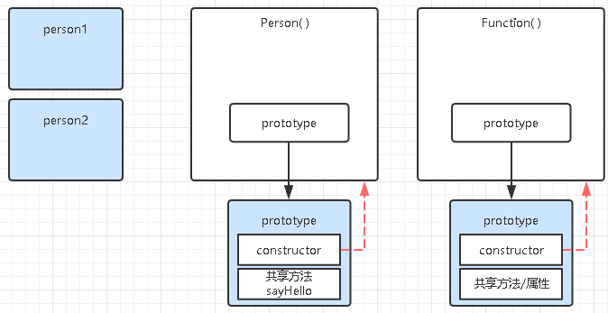

# 一、函数即对象
```
function Person(){...}
console.log(Person.constructor) //[Function:Funtion]

console.log(Function.constructor);//[Function:Function]

console.log(Object.constructor);//[Function:Funtion]
```
1. Person虽被声明为一个函数，但它同样可以通过  
2.  Person.constructor输出内容。输出内容说明Function函数是Person函数[普通声明的函数]的构造函数。  
3.  Function函数同时是自己的构造函数。Function函数同样是Object这类内置对象的构造函数。  

**在JS里，函数就是Function函数的实例对象。也就是我们说的函数即对象。**

# 二、constructor
```
function Person(){}
var person1 = new Person();
var person2 = new Person();
```

  

> constructor属性其实就是一个拿来保存自己构造函数引用的属性  

  

> 默认constructor实际上是被当作**共享属性**放在它们的原型对象中。
