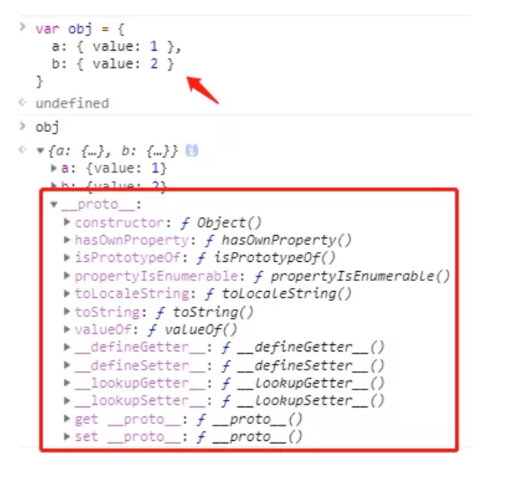
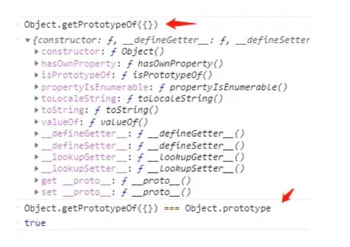
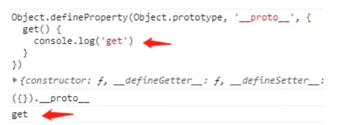
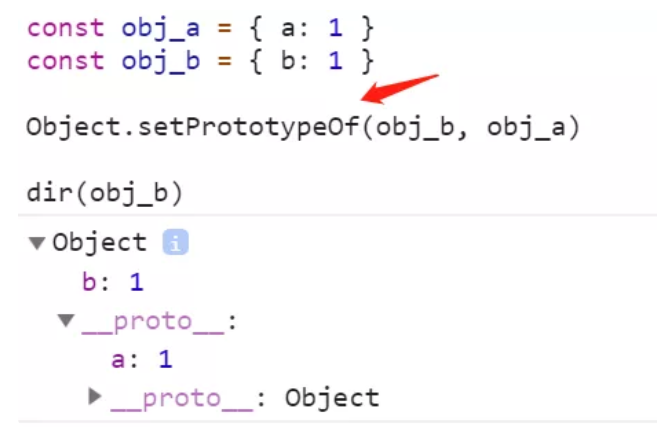
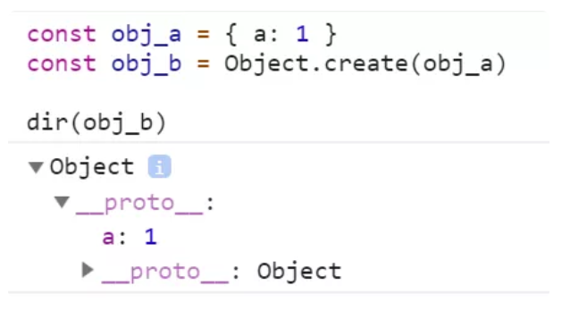
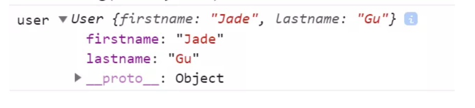
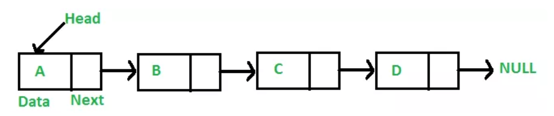
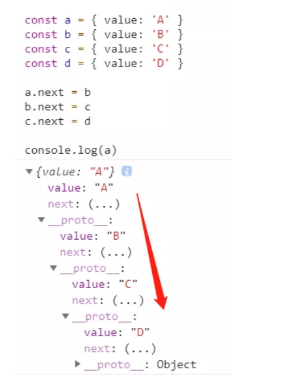

# 深入理解 JavaScript 原型
## 1、ES2019 规范里描述的 Prototype
### 1.1、prototype的定义
在规范里，prototype 被定义为：给其它对象提供共享属性的**对象**。  

prototype 描述的是两个对象之间的某种关系（其中一个，为另一个提供属性访问权限）。它是类似 father 父亲一样的称谓，而不是具有超能力的异常对象。

所有对象，都可以作为另一个对象的 prototype 来用。

#### 1.1.1、所有object对象都有一个隐式引用
规范中明确描述了所有对象，都有一个隐式引用，它被称之为这个对象的 prototype 原型。  
  

 obj 被隐式地挂载了另一个对象的引用，置于 \__proto__ 属性中。  

   

 ECMAScript 规范说 prototype 应当是一个隐式引用:  
 - 通过Object.getPrototypeOf(obj)间接访问指定对象的prototype对象
 - 通过Object.setPrototypeOf(obj,anotherObj)间接设置指定对象的prototype对象
 - 可以通过obj.\__proto__直接访问原型，通过obj.\__proto__ = anotherObj直接设置原型  

__proto__属性不能被for in遍历出来，也不能被Object.keys(obj)查找出来  
访问对象的obj.\__proto__属性，默认走的是Object.prototype对象上__proto__属性的get/set方法  
  

通过覆盖 Object.prototype.\__proto__ 我们可以看到，访问普通对象的 \__proto__ 触发了 Object.prototype 上的 \__proto__ 的 get 方法。

因此，普通对象创建时，只需要将它内部的隐式引用指向 Object.prototype 对象，就能兼容 \__proto__ 属性访问行为，不需要将原型隐式挂载到对象的 \__proto__ 属性。

#### 1.1.3、prototype chain原型链
构成了对象的原型的原型的原型的链条，直到某个对象的隐式引用为 null，整个链条终止。

### 1.2、对象的创建和关联原型
#### 1.2.1、两类原型继承方式
所谓的**原型继承**，就是指设置某个对象为另一个对象的原型(塞进该对象的隐式引用位置)  

在 JavaScript 中，有两类原型继承的方式：显式继承和隐式继承

#### 1.2.1.1、显式原型继承
所谓的显式原型继承，就是指我们亲自将某个对象设置为另一个对象的原型。  

  

通过调用 Object.setPrototypeOf 方法，我们将 obja 设置为 objb 的原型。  

  

通过 Object.create 方法，直接继承另一个对象。  

Object.setPropertyOf 和 Object.create 的差别在于：  
- Object.setPropertyOf，给我两个对象，我把其中一个设置为另一个的原型。
- Object.create，给我一个对象，它将作为我创建的新对象的原型。  

#### 1.2.2 内置的构造函数和语法糖
JavaScript 的主流继承方式，选择了隐式原型继承，它提供了几个内置的 constructor 函数，如 Object, Array, Boolean, String, Number 等  

当我们使用对象字面量创建一个新对象时，它有两层隐式行为。  
- 隐式的通过new Object()去创建对象
- 隐式的进行原型继承

### function
#### 2.1、从隐式原型继承中剥离出 Object.create 方法
```
const create = (proto)=>{
    let Noop = function(){};
    Noop.prototype = proto;
    return new Noop();
}
```
实现了一个简单的 Object.create 方法，它可以根据给定对象，创建以该对象为原型的新对象（Object.create 有第二个参数，按下不表）。  

#### 2.2、用显式原型继承的方式完成 constructor 初始化过程
```
const createInstance = (Constructor,...args) => {
    let instance = Object.create(Constructor.prototype);
    Constructor.call(instance,...args);
    return instance;
}

function User(firstname,lastname){
    this.firstname = firstname;
    this.lastname = lastname;
}

const user = createInstance(User,'Jade','Gu');

console.log('user',user);
```
  

先将 Constructor.prototype 作为原型，创建一个空对象，然后通过 Constructor.call 将构造函数内部的 this 指向 instance 变量，将 args 传入。在构造函数内部完成属性初始化的过程。

### 3.2、从 class 角度理解 prototype
- 基于 class 的继承，继承的是行为和结构，但没有继承数据
- 基于 prototype 的继承，可以继承数据、结构和行为三者。  

在 JS 里的，class 是用 prototype 所模拟的，为了迎合 class 的基本行为。prototype 继承数据的能力被屏蔽了。

## 从数据结构和算法的角度理解 prototype 和 class
**JS 原型其实是一个隐式的单向链表。**  

  

```
Object.defineProperty(Object.prototype,'next',{
    get(){
        let next = Object.getPrototypeOf(this);
        if(next === Object.prototype)return null;
        return next;
    },
    set(value){
        return Object.setPrototypeOf(this,value);
    }
})
```
我们使用之前介绍过的访问器属性，像定义 \__proto__ 一样，定义 next。这样显得更加像链表，尽管 obj.\__proto__ 和 obj.next 访问的是同一个对象，但 next 无疑更符合链表的语义。并且，我们屏蔽了通过 next 访问到 Object.prototype，直接返回 null 表示没有 next 元素了。  

  

然后创建 4 个对象，通过赋值 next（背后调用 Object.setPrototypeOf 函数），将它们依次链接起来。