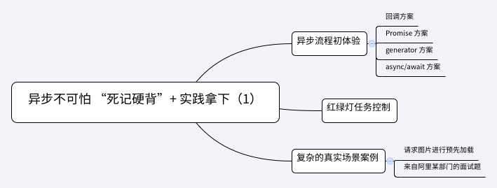

# 异步
  

```
移动页面上元素 target（document.querySelectorAll('#man')[0]）

先从原点出发，向左移动 20px，之后再向上移动 50px，最后再次向左移动 30px，请把运动动画实现出来。
```

## 回调方案
```
const target = document.querySelectorAll('#man')[0];
target.style.cssText = `
    position:absolute;
    left:0px;
    top:0px
`

const walk = (direction,distance,callback)=>{
    setTimeout(()=>{
        let currentLeft = parseInt(target.style.left,10);
        let currentTop = parseInt(target.style.top,10);

        const shouldFinish = (direction === 'left' && currentLeft === -distance) || (direction === 'top' && currentTop === -distance)

        if(shouldFinish){
            //任务执行结束，执行下一个回调
            callback && callback()
        }else{
            if(direction === 'left'){
                currentLeft--;
                target.style.left = `${currentLeft}px`
            }else if(direction === 'top'){
                currentTop--;
                target.style.top = `${currentTop}px`
            }
            walk(direction,distance,callback);
        }
    },20)
}

walk('left', 20, () => {
    walk('top', 50, () => {
        walk('left', 30, Function.prototype)
    })
})
```

## Promise方案
```
const target = document.querySelectorAll('#man')[0];
target.style.cssText = `
    position:absolute;
    left:0px;
    top:0px
`

const walk = (direction,distance)=>
    new Promise((resolve,reject)=>{
        const innerWalk = () => {
            setTimeout(()=>{
                let currentLeft = parseInt(target.style.left, 10)
                let currentTop = parseInt(target.style.top, 10)

                const shouldFinish = (direction === 'left' && currentLeft === -distance) || (direction === 'top' && currentTop === -distance)

                if (shouldFinish) {
                    // 任务执行结束
                    resolve()
                }
                else {
                    if (direction === 'left') {
                        currentLeft--
                        target.style.left = `${currentLeft}px`
                    }
                    else if (direction === 'top') {
                        currentTop--
                        target.style.top = `${currentTop}px`
                    }

                    innerWalk()
                }
            },20)
        }
        innerWalk()
    })

walk('left',20).then(()=>walk('top',50)).then(()=>walk('left',30))
```

## generator方案
```
const target = document.querySelectorAll('#man')[0]
target.style.cssText = `
    position: absolute;
    left: 0px;
    top: 0px
`

const walk = (direction, distance) => 
    new Promise((resolve, reject) => {
        const innerWalk = () => {
            setTimeout(() => {
                let currentLeft = parseInt(target.style.left, 10)
                let currentTop = parseInt(target.style.top, 10)

                const shouldFinish = (direction === 'left' && currentLeft === -distance) || (direction === 'top' && currentTop === -distance)

                if (shouldFinish) {
                    // 任务执行结束
                    resolve()
                }
                else {
                    if (direction === 'left') {
                        currentLeft--
                        target.style.left = `${currentLeft}px`
                    }
                    else if (direction === 'top') {
                        currentTop--
                        target.style.top = `${currentTop}px`
                    }

                    innerWalk()
                }
            }, 20)
        }
        innerWalk()
    })

function *taskGenerator(){
    yield walk('left',20)
    yield walk('top',50)
    yield walk('left',30)
}

const gen = taskGenerator()

//左偏移20
gen.next()
//上偏移50
gen.next()
//左偏30
gen.next()
```

## async/await方案
```
const target = document.querySelectorAll('#man')[0]
target.style.cssText = `
    position: absolute;
    left: 0px;
    top: 0px
`

const walk = (direction, distance) => 
    new Promise((resolve, reject) => {
        const innerWalk = () => {
            setTimeout(() => {
                let currentLeft = parseInt(target.style.left, 10)
                let currentTop = parseInt(target.style.top, 10)

                const shouldFinish = (direction === 'left' && currentLeft === -distance) || (direction === 'top' && currentTop === -distance)

                if (shouldFinish) {
                    // 任务执行结束
                    resolve()
                }
                else {
                    if (direction === 'left') {
                        currentLeft--
                        target.style.left = `${currentLeft}px`
                    }
                    else if (direction === 'top') {
                        currentTop--
                        target.style.top = `${currentTop}px`
                    }

                    innerWalk()
                }
            }, 20)
        }
        innerWalk()
    })

const task = async function(){
    await walk('left',20)
    await walk('top',50)
    await walk('left',30)
}
```
**async/await就是generator的语法糖，它能够自动执行生成器函数，更加方便地实现异步流程**