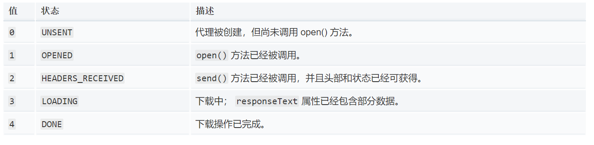

# Promise封装Ajax
```
var url = 'https://hq.tigerbrokers.com/fundamental/finance_calendar/getType/2017-02-26/2017-06-10';

//封装一个get请求的方法
function getJSON(url){
    return new Promise(function(resolve,reject){
        var XHR = new XMLHttpRequest();
        XHR.open('GET',url,true);
        XHR.send();

        XHR.onreadystatechange = function(){
            if(XHR.readyState == 4){
                if(XHR.status == 200){
                    try{
                        var response = JSON.parse(XHR.responseText);
                        resolve(response);
                    }catch(e){
                        reject(e);
                    }
                }else{
                    reject(new Error(XHR.statusText));
                }
            }
        }
    })
}

getJSON(url).then(resp => console.log(resp));
```
XMLHttpRequest.readyState 属性返回一个 XMLHttpRequest  代理当前所处的状态。一个 XHR 代理总是处于下列状态中的一个：  

  

## Promise.all
Promise.all接收一个Promise对象组成的数组作为参数，当这个数组所有的Promise对象状态都变成resolved或者rejected的时候，它才会去调用then方法  

```
var url = 'https://hq.tigerbrokers.com/fundamental/finance_calendar/getType/2017-02-26/2017-06-10';
var url1 = 'https://hq.tigerbrokers.com/fundamental/finance_calendar/getType/2017-03-26/2017-06-10';

function renderAll(){
    return Promise.all([getJSON(url),getJSON(url1)]);
}

renderAll().then(function(value){
    console.log(value);
})
```

## Promise.race
Promise.race都是以一个Promise对象组成的数组作为参数，不同的是，只要当数组中的其中一个Promsie状态变成resolved或者rejected时，就可以调用.then方法了。

```
function renderRace(){
    return Promise.race([getJSON(url),getJSON(url1)]);
}

renderRace().then(function(value){
    console.log(value);
})
```