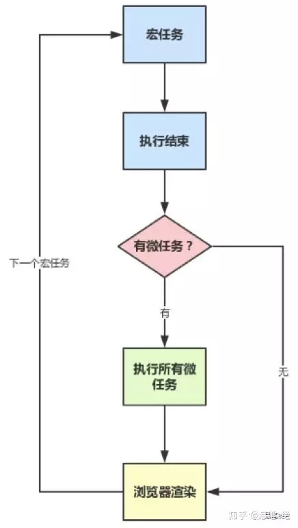

# 宏任务和微任务
```
console.log("script start");

setTimeout(function(){
    console.log('setTimeout');
},0);

Promise.resolve().then(function(){
    console.log('promise1');
}).then(function(){
    console.log('promise2');
});

console.log('script end')
```
输出
```
script start
script end
promise1
promise2
setTimeout
```
## 宏任务(task)
浏览器为了能够使JS内部task与DOM任务能够有序的执行，会在一个task执行结束后，在下一个task执行开始前，对页面进行重新渲染(task->渲染->task->...)  
鼠标点击会触发一个事件回调，需要执行一个宏任务，然后解析HTML。  
setTimeout的作用是等待给定的时间后为它的回调产生一个新的宏任务。
## 微任务(Microtasks)
微任务通常来说就是需要在当前task执行结束后立即执行的任务。  
只要执行栈中没有其他的js代码正在执行且每个宏任务执行完，微任务队列会立即执行。如果在微任务执行期间微任务队列加入了新的微任务，会将新的微任务加入队列尾部，之后也会被执行。  
一个promise一旦有了结果(指promise导了fulfilled或rejected状态),它就会为它的回调产生一个微任务。  
所以对一个已经有了结果的promise调用.then(yey,nay)会立即产生一个微任务。  
'promise1','promise2'会打印在'setTimeout'之前是因为所有微任务总会在下一个宏任务之前全部执行完毕。  
**如果js执行栈空了，立即执行微任务**
  
    
  
## 划分
- 宏任务：包括整体代码script,setTimeout,setInterval
- 微任务：Promise,process.nextTick

## 例子
```
setTimeout(()=>console.log('setTimeout-1'),0)

async function todo1(params){
    console.log('todo1-await-above')
    await Promise.resolve(99)
    console.log('todo1-await-under')
}

todo1()

new Promise((resolve,reject)=>{
    console.log('promise-1')
    resolve()
}).then(data=>{
    console.log('promise-then-1')
})

console.log('end')
```
- 这段代码作为宏任务，进入主线程
- 先遇到setTimeout,等待0ms后，将其回调函数注入到宏任务Event Queue
- 接下来遇到todo1函数，没调用，就当看不到
- 调用todo1函数
- 遇到console.log('todo1-await-above')立即执行并输出
- 遇到await promise将等待promise执行结束后再继续执行，这里将执行权交给todo1函数外部继续执行
- 遇到new Promise立即执行console.log('promise-1')并输出，之后执行resolve(),将then的回调函数注入微任务Event Queue
- 遇到console.log('end'),立即执行并输出
- 注意代码还有console.log('todo1-await-under')没有执行，在这里执行并放到微任务Event Queue
- 整体代码\<script>作为第一轮的宏任务执行结束，接下来按照先进先出原则，执行微任务队列事件
- 执行并输出promise-then-1
- 执行并输出todo-await-under
- 检查宏任务队列，这时还有setTimeout回调函数需要执行
- 执行并输出setTimeout-1
- 最后再次检查微任务队列，没有了。再检查宏任务队列，也没有了。
- 到此结束。

```
输出：
todo1-await-above
promise-1
end

promise-then-1
todo1-await-under

setTimeout-1
```
修改后的例子
```
setTimeout(()=>console.log('setTimeout-1'))

async function todo1 (params) {
	console.log('todo1-await-above')
	// await Promise.resolve(99)
	await 123  // 改变啦
	console.log('todo1-await-under')
}

todo1()

new Promise((resolve, reject) => {
	console.log('promise-1')
	resolve()
}).then(data => {
	console.log('promise-then-1')
})

console.log('end')
```
上面这段代码做了稍微的改动，将todo1函数中的await Promise.resolve(99)更改为await 123

- 老规矩，这段代码作为宏任务，进入主线程
- 先遇到 setTimeout ， 等待 0 ms 后，将其回调函数注入到宏任务Event Queue
- 接下来遇到 todo1 函数，没调用，就当看不到 :bowtie:
- 调用 todo1 函数
- 遇到 console.log('todo1-await-above') 立即执行并输出
- 遇到 await 123 因为这里await一个具体值，状态是明确的，所以继续向下执行，将console.log('todo1-await-under')放到微任务队列
- 遇到 new Promise 立即执行 console.log('promise-1') 并输出，之后执行 resolve()，将 then 的回调函数注入到微任务Event Queue
- 遇到 console.log('end') ，立即执行并输出
- 好了，整体代码\<script>作为第一轮的宏任务执行结束，接下来按照先进先出原则，先执行微任务队列事件。
- 执行并输出todo1-await-under
- 执行并输出promise-then-1
- 检查宏任务队列，这时还有setTimeout回调函数需要执行
- 执行并输出setTimeout-1
- 最后再次检查微任务队列，没有啦。再检查宏任务队列，也没啦。
- 到此结束！

```
// 输出：
// todo1-await-above
// promise-1
// end

// todo1-await-under
// promise-then-1

// setTimeout-1
```