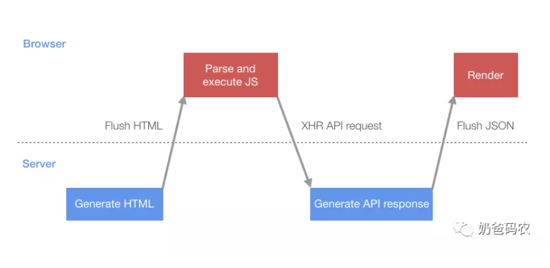
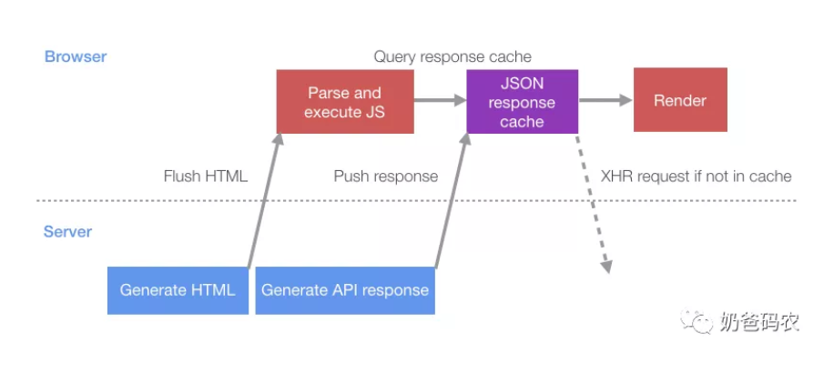

# 数据推送
### 如何使浏览器在从服务器接收到任何HTML之前请求某些内容？
early flush,heading flushing,progressive HTML结合以下两点：
- HTTP分块传输编码
- 浏览器中渐进式HTML渲染

### 分块传输编码
它允许将HTTP网络响应分解为多个“块”，这些“块”可以**流式传输**到浏览器。然后，浏览器在这些块到达最终完成的响应时将它们缝合在一起。  

它允许我们在页面的每个部分完成时将HTML页面的内容流式传输到浏览器，而不必等待整个响应。  

这意味着我们可以立即将HTML头刷新到浏览器(称为"early flush"),因为它不需要太多的服务器端处理。这允许浏览器在服务器忙于在页面其余部分中生成动态数据时开始下载脚本和样式表。  

## 单页应用程序启动的传统情况
  

- 将包含呈现页面所需的JS的初始化HTML刷新到浏览器
- 脚本解析执行后，执行XHR查询，该查询将获取引导页面所需的初始数据  

### 优化措施
1. 创建一个JSON缓存来存储服务器响应  

```
//脚本块充当缓存并列出了服务器将添加到此缓存中的查询
<script type="text/javascript">
  // the server will write out the paths of any API calls it plans to
  // run server-side so the client knows to wait for the server, rather
  // than doing its own XHR request for the data
  window.__data = {
    '/my/api/path': {
        waiting: [],
    }
  };

  window.__dataLoaded = function(path, data) {
    const cacheEntry = window.__data[path];
    if (cacheEntry) {
      cacheEntry.data = data;
      for (var i = 0;i < cacheEntry.waiting.length; ++i) {
        cacheEntry.waiting[i].resolve(cacheEntry.data);
      }
      cacheEntry.waiting = [];
    }
  };
</script>
```
将HTML刷新到浏览器后，服务器可以自行执行API查询，并在完成查询后，将JSON数据作为包含数据的脚本标签刷新到页面。当浏览器接收并解析此HTML响应块时，它将数据插入JSON缓存中。  

**浏览器在接收到响应块时将逐渐进行渲染（即，它们将在流式传输时执行完整的脚本块）。**

```
<script type="text/javascript">
  window.__dataLoaded('/my/api/path', {
    // API json response, wrapped in the function call to
    // add it to the JSON cache...
  });
</script>
```
当客户端脚本准备好请求其数据时，而不是发出XHR请求，它首先检查JSON缓存。如果存在响应（或挂起），则它会立即响应，或者等待挂起的响应。

```
function queryAPI(path) {
  const cacheEntry = window.__data[path];
  if (!cacheEntry) {
    // issue a normal XHR API request
    return fetch(path);
  } else if (cacheEntry.data) {
    // the server has pushed us the data already
    return Promise.resolve(cacheEntry.data);
  } else {
    // the server is still pushing the data
    // so we'll put ourselves in the queue to
    // be notified when its ready
    const waiting = {};
    cacheEntry.waiting.push(waiting);
    return new Promise((resolve) => {
      waiting.resolve = resolve;
    });
  }
}
```
