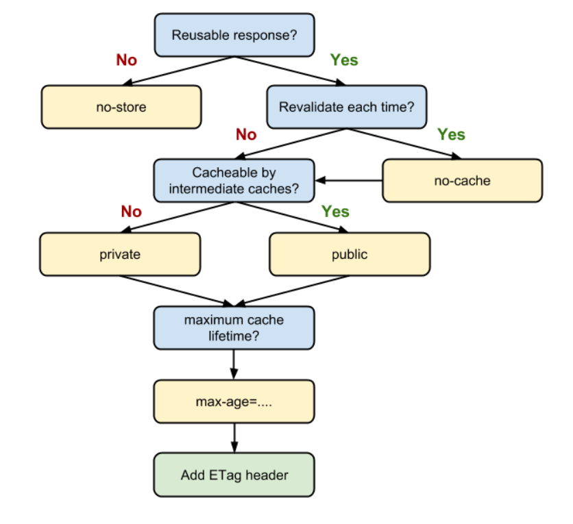

# 浏览器缓存机制介绍与缓存策略剖析
> 通过网络获取内容既速度缓慢又开销巨大。较大的响应需要在客户端与服务器之间进行多次往返通信，这会延迟浏览器获得和处理内容的时间，还会增加访问者的流量费用。因此，缓存并重复利用之前获取的资源的能力成为性能优化的一个关键方面。

## 浏览器缓存机制
1. Memory Cache
2. Service Worker Cache
3. HTTP Cache
4. Push Cache

## HTTP缓存机制
- 强缓存(优先级较高)
- 协商缓存

### 强缓存
强缓存是利用 http 头中的 Expires 和 Cache-Control 两个字段来控制的。强缓存中，当请求再次发出时，浏览器会根据其中的 expires 和 cache-control 判断目标资源是否“命中”强缓存，若命中则直接从缓存中获取资源，不会再与服务端发生通信。  

Cache-Control 相对于 expires 更加准确，它的优先级也更高。当 Cache-Control 与 expires 同时出现时，我们以 Cache-Control 为准

#### Cache-Control应用分析
```
cache-control:max-age=3600,s-maxage=31536000
```
s-maxage 优先级高于 max-age，两者同时出现时，优先考虑 s-maxage。如果 s-maxage 未过期，则向代理服务器请求其缓存内容。

#### public与private
如果我们为资源设置了 public，那么它既可以被浏览器缓存，也可以被代理服务器缓存；如果我们设置了 private，则该资源只能被浏览器缓存。private 为默认值。

#### no-store与no-cache
- no-cache 绕开了浏览器：我们为资源设置了 no-cache 后，每一次发起请求都不会再去询问浏览器的缓存情况，而是直接向服务端去确认该资源是否过期（即走我们下文即将讲解的协商缓存的路线）。
- no-store:不使用任何缓存策略。在 no-cache 的基础上，它连服务端的缓存确认也绕开了，只允许你直接向服务端发送请求、并下载完整的响应。

### 协商缓存
协商缓存机制下，浏览器需要向服务器去询问缓存的相关信息，进而判断是重新发起请求、下载完整的响应，还是从本地获取缓存的资源。

如果服务端提示缓存资源未改动（Not Modified），资源会被重定向到浏览器缓存，这种情况下网络请求对应的状态码是 304

#### 协商缓存的实现：从 Last-Modified 到 Etag
浏览器向服务器发送If-Modified-Since的时间戳字段，服务器对比该时间戳和资源在服务器上的最后修改时间是否一致，然后在Response Headers中添加新的Last-Modified值，将信息发送回来。  

Etag 是由服务器为每个资源生成的**唯一的标识字符串**，这个标识字符串是基于文件内容编码的，只要文件内容不同，它们对应的 Etag 就是不同的，反之亦然。因此 Etag 能够精准地感知文件的变化。  

Etag 在感知文件变化上比 Last-Modified 更加准确，优先级也更高。当 Etag 和 Last-Modified 同时存在时，以 Etag 为准。

## HTTP缓存决策指南
  

当我们的资源内容不可复用时，直接为 Cache-Control 设置 no-store，拒绝一切形式的缓存；否则考虑是否每次都需要向服务器进行缓存有效确认，如果需要，那么设 Cache-Control 的值为 no-cache；否则考虑该资源是否可以被代理服务器缓存，根据其结果决定是设置为 private 还是 public；然后考虑该资源的过期时间，设置对应的 max-age 和 s-maxage 值；最后，配置协商缓存需要用到的 Etag、Last-Modified 等参数。


## MemoryCache
MemoryCache，是指存在内存中的缓存。从优先级上来说，它是浏览器最先尝试去命中的一种缓存。从效率上来说，它是响应速度最快的一种缓存。  

资源存不存内存，浏览器秉承的是“节约原则”。我们发现，Base64 格式的图片，几乎永远可以被塞进 memory cache，这可以视作浏览器为节省渲染开销的“自保行为”；此外，体积不大的 JS、CSS 文件，也有较大地被写入内存的几率——相比之下，较大的 JS、CSS 文件就没有这个待遇了，内存资源是有限的，它们往往被直接甩进磁盘。


## Service Worker Cache
Service Worker 是一种独立于主线程之外的 Javascript 线程。它脱离于浏览器窗体，因此无法直接访问 DOM。这样独立的个性使得 Service Worker 的“个人行为”无法干扰页面的性能，这个“幕后工作者”可以帮我们实现离线缓存、消息推送和网络代理等功能。我们借助 Service worker 实现的离线缓存就称为 Service Worker Cache。

Service Worker 的生命周期包括 install、active、working 三个阶段。一旦 Service Worker 被 install，它将始终存在，只会在 active 与 working 之间切换，除非我们主动终止它。这是它可以用来实现离线存储的重要先决条件。  

Server Worker 对协议是有要求的，必须以 https 协议为前提。


## Push Cache
- Push Cache 是缓存的最后一道防线。浏览器只有在 Memory Cache、HTTP Cache 和 Service Worker Cache 均未命中的情况下才会去询问 Push Cache。
- Push Cache 是一种存在于会话阶段的缓存，当 session 终止时，缓存也随之释放。
- 不同的页面只要共享了同一个 HTTP2 连接，那么它们就可以共享同一个 Push Cache。