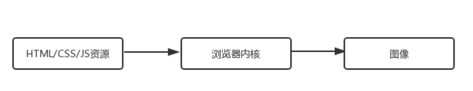

# 浏览器背后的运行机制
## 浏览器渲染过程
渲染引擎根据HTML文件描述构建相应的数学模型，调用浏览器各个零部件，从而将网页资源代码转换为图像结果。  

  

各个功能模块：  
- HTML解释器：将HTML文档经过词法分析输出DOM树
- CSS解释器：解析CSS文档，生成样式规则
- 图层布局计算模块：布局计算每个对象的精确位置和大小
- 视图绘制模块：进行具体节点的图像绘制，将像素渲染到屏幕上
- JS引擎：编译执行JS代码

## 浏览器渲染过程解析
  


## CSS的阻塞
浏览器在构建CSSOM的过程中，**不会渲染任何已经处理的内容**  

> CSS是阻塞渲染的资源。需要将它尽早、尽快地下载到客户端，以便缩短首次渲染的时间  

- 尽早(将CSS放在head标签里)
- 尽快(启用CDN实现静态资源加载速度的优化)  


## JS的阻塞
JS 的作用在于修改，本质上都是对 DOM 和 CSSDOM 进行修改。因此 JS 的执行会阻止 CSSOM，在我们不作显式声明的情况下，它也会阻塞 DOM。  

```
<!DOCTYPE html>
<html lang="en">
<head>
  <meta charset="UTF-8">
  <meta name="viewport" content="width=device-width, initial-scale=1.0">
  <meta http-equiv="X-UA-Compatible" content="ie=edge">
  <title>JS阻塞测试</title>
  <style>
    #container {
      background-color: yellow;
      width: 100px;
      height: 100px;
    }
  </style>
  <script>
    // 尝试获取container元素
    var container = document.getElementById("container")
    console.log('container', container)
  </script>
</head>
<body>
  <div id="container"></div>
  <script>
    // 尝试获取container元素
    var container = document.getElementById("container")
    console.log('container', container)
    // 输出container元素此刻的背景色
    console.log('container bgColor', getComputedStyle(container).backgroundColor)
  </script>
  <style>
    #container {
      background-color: blue;
    }
  </style>
</body>
</html>

```
  

第一次尝试获取 id 为 container 的 DOM 失败，这说明 JS 执行时阻塞了 DOM，后续的 DOM 无法构建；第二次才成功，这说明脚本块只能找到在它前面构建好的元素。这两者结合起来，“阻塞 DOM”得到了验证。再看第三个 console，尝试获取 CSS 样式，获取到的是在 JS 代码执行前的背景色（yellow），而非后续设定的新样式（blue），说明 CSSOM 也被阻塞了。那么在阻塞的背后，到底发生了什么呢？  

**JS 引擎是独立于渲染引擎存在的**。我们的 JS 代码在文档的何处插入，就在何处执行。当 HTML 解析器遇到一个 script 标签时，它会暂停渲染过程，将控制权交给 JS 引擎。JS 引擎对内联的 JS 代码会直接执行，对外部 JS 文件还要先获取到脚本、再进行执行。等 JS 引擎运行完毕，浏览器又会把控制权还给渲染引擎，继续 CSSOM 和 DOM 的构建。 因此与其说是 JS 把 CSS 和 HTML 阻塞了，不如说是 JS 引擎抢走了渲染引擎的控制权。 

## Js的三种加载方式
- 正常模式

```
<script src="index.js"></script>
```
这种情况下 JS 会阻塞浏览器，浏览器必须等待 index.js 加载和执行完毕才能去做其它事情。  

- async模式

```
<script async src="index.js"></script>
```
async 模式下，JS 不会阻塞浏览器做任何其它的事情。它的加载是异步的，当它加载结束，JS 脚本会立即执行。  

- defer模式

```
<script defer src="index.js"></script>
```  

defer 模式下，JS 的加载是异步的，执行是被推迟的。等整个文档解析完成、DOMContentLoaded 事件即将被触发时，被标记了 defer 的 JS 文件才会开始依次执行。  

从应用的角度来说，一般当我们的脚本与 DOM 元素和其它脚本之间的依赖关系不强时，我们会选用 async；当脚本依赖于 DOM 元素和其它脚本的执行结果时，我们会选用 defer。