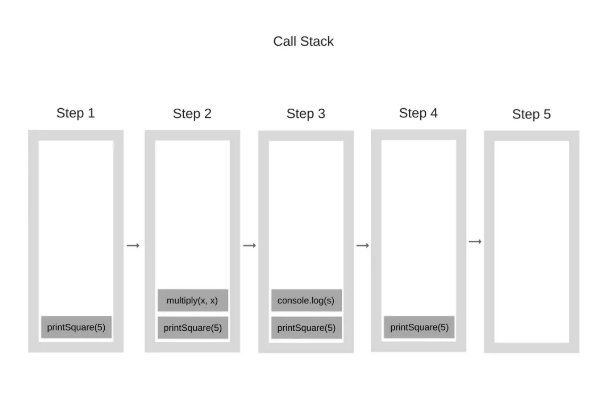
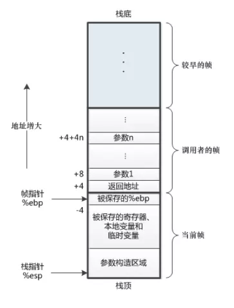

# 尾调用优化(Tail Call Optimization)
尾调用意味着可以在不增加调用栈的情况，在某个函数的最后一步调用另一个函数
```
function f(x){
    return g(x);
}
```
1. 尾调用优化只在严格模式下开启，非严格模式是无效的
2. 只有不再用到外层函数的内部变量，内层函数的调用栈才会取代外层函数的调用栈  

```
function a(){
    var aa = 1;
    let b = val => aa + val;//使用了外层函数的参数aa
    return b(2);//无法进行尾调用优化
}
```
3. 最后一步调用函数才是尾调用

```
//这两种情况不是尾调用
//情况一
function f(x){
    let y = g(x);
    return y;
}

//情况二
function f(x){
    return g(x)+1;
}
```

```
function f(x){
  return g(x); // 最后一步调用另一个函数并且使用return
}
function f(x){
  g(x); // 没有return 不算尾调用 因为不知道后面还有没有操作
  // return undefined; // 隐式的return
}
```

## 调用栈
1. 调用栈是一种栈结构的数据，它是由调用帧组成的
2. 调用栈记录了函数的执行顺序和函数内部变量等信息  

### 机制
程序运行到一个函数，它就会将其添加到调用栈中，当从这个函数返回的时候，就会将这个函数从调用栈中删除掉  

```
// 调用栈中的执行步骤用数字表示
printSquare(5); // 1 添加
function printSquare(x) {
    var s = multiply(x, x); // 2 添加 => 3 运行完成，内部没有再调用其他函数，删掉
    console.log(s); // 4 添加 => 5 删掉
    // 运行完成 删掉printSquare
}
function multiply(x, y) {
    return x * y;
}
```
  

### 调用帧
每个进入到调用栈中的函数，都会分配到一个单独的栈空间，称为“调用帧”  


## 调用栈优化内存
尾调用用来**删除外层无用的调用帧**，只保留内层函数的调用帧，来节省浏览器的内存  

```
a() // 1 添加a到调用栈
function a(){
    return b(); // 在调用栈中删除a 添加b
}
function b(){
    return c() // 删除b 添加c
}
```

## 用尾调用来优化递归
正常的递归阶乘
```
function factorial(n){
    if(n===1)return 1;
    return n*factorial(n-1);
}

factorial(5);//120
```
尾递归,只保存一个调用记录，复杂度为O(1)
```
function factorial(n,total){
    if(n===1)return total;
    return factorial(n-1,n*total);
}

factorial(5,1);//120
```
```
function tailFactorial(n,total){
    if(n===1)return total;
    return tailFactorial(n-1,n*total);
}

function factorial(n){
    return tailFactorial(n,1);
}

factorial(5);//120
```
柯里化
```
function currying(fn,n){
    return function(m){
        return fn.call(this,m,n);
    };
}

function tailFactorial(n,total){
    if(n===1)return total;
    return tailFactorial(n-1,n*total);
}

const factorial = currying(tailFactorial,1);

factorial(5);//120
```
ES6
```
function factorial(n,total=1){
    if(n===1)return total;
    return factorial(n-1,n*total);
}

factorial(5);//120
```