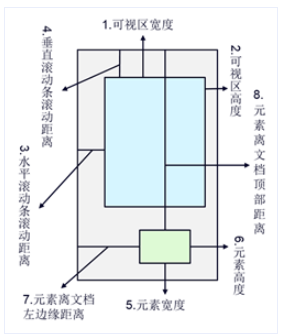

# 图片懒加载(lazyload)的实现
针对图片类网站或展示图片过多的部分页面，为减轻服务器压力、提高加载速度、优化用户体验，需要对暂未出现在可视区域内的图片先不做加载，之后监听滚动事件，待图片滚至可视区域再加载。  

## 原理
将img的src指向默认loading或干脆不设置，同时令data-src(命名自定义)指向实际src。  
当载入页面时，先把可视区域内的img标签的data-src属性值赋给src,然后监听滚动事件，把用户即将看到的图片加载，这样便实现了懒加载   

图片需要设置宽高

## 视口的宽高与滚动高度


## 实现
### 一、简约版
```
<!DOCTYPE html>
<html lang="en">
<head>
  <meta charset="UTF-8">
  <meta name="viewport" content="width=device-width, initial-scale=1.0">
  <meta http-equiv="X-UA-Compatible" content="ie=edge">
  <title>Lazy-Load</title>
  <style>
    .img {
      width: 200px;
      height:200px;
      background-color: gray;
    }
    .pic {
      // 必要的img样式
    }
  </style>
</head>
<body>
  <div class="container">
    <div class="img">
      // 注意我们并没有为它引入真实的src
      
    </div>
    <div class="img">
      
    </div>
    <div class="img">
      
    </div>
    <div class="img">
      
    </div>
    <div class="img">
      
    </div>
     <div class="img">
      
    </div>
     <div class="img">
      
    </div>
     <div class="img">
      
    </div>
     <div class="img">
      
    </div>
     <div class="img">
      
    </div>
  </div>
</body>
</html>
```
js文件
```
//获取所有的图片标签
const imgs = document.getElementsByTagName('img');
//获取可视区域的高度
const viewHeight = window.innerHeight || document.documentElement.clientHeight;
//num用于统计当前显示到了哪一张图片，避免每次都从第一张图片开始检查是否露出
let num = 0;
function lazyload(){
    for(let i=num;i<imgs.length;i++){
        //用可视区域高度减去元素顶部可视区域顶部的高度
        let distance = viewHeight - imgs[i].getBoundingClientRect().top;
        //如果可视区域高度大于等于元素顶部距离可视区域顶部的高度，说明元素露出
        if(distance >= 0){
            //给元素写入真实的src,展示图片
            imgs[i].src = imgs[i].getAttribute('data-src');
            //前i张图片已经加载完毕，下次从第i+1张开始检查是否露出
            num = i+1;
        }
    }
}

//监听scroll事件
window.addEventListener('scroll',lazyload,false);
```
当前可视区域的高度， 在和现代浏览器及 IE9 以上的浏览器中，可以用 window.innerHeight 属性获取。在低版本 IE 的标准模式中，可以用 document.documentElement.clientHeight 获取，这里我们兼容两种情况：
```
const viewHeight = window.innerHeight || document.documentElement.clientHeight 
```

## 版本二：使用函数节流
```
(function(){
    let imgList = [],  //页面所有img元素数组
        delay,    //setTimeout对象
        time = 250,  //延迟载入时间
        offset = 0,  //设置图片距离视口多远则立即加载的偏移量
        _selector;  //默认为`.lazyload`

    function _isShow(el){ //判断img是否已经进入视口
        let coords = el.getBoundingClientRect();
        return ((coords.top >= 0 && coords.left >= 0 && coords.top) <= (window.innerHeight || document.documentElement.clientHeight) + parseInt(offset));
    }

    function _load(){  //img加载
        for(let i=0,len = imgList.length;i<len;i++){
            if(_isShow(imgList[i])){
                imgList[i].src = imgList[i].getAttribute('data-src');
                imgList.splice(i,1);
            }
        }
    }

    function _delay(){  //函数节流
        clearTimeout(delay);
        delay = setTimeout(()=>{
            _load();
        },time);
    }

    function lazyLoad(selector){
        _selector = selector || '.lazyload';
        let nodes = document.querySelectorAll(selector);
        imgList = Array.apply(null,nodes);
        _delay(); //避免首次加载未触发scroll事件，主动触发一次加载函数
        window.addEventListener('scroll',_delay,false);
    }

    lazyLoad('.lazyload');
})();
```
1. 判断图片是否进入视口_isShow  

通过调用getBoundingClientRect()方法，获得一组包含元素用于描述其边框相对于视口左部及顶部位置的只读属性——left、top、right与bottom，再与浏览器视口宽高对比即可判断元素是否已进入视口，offset为自定义偏差值，按实际需求确定。

top：元素上边框与浏览器视口顶部间距
left：元素左边框与浏览器视口左侧间距
right：元素右边框与浏览器视口左侧间距
bottom：元素底边框与浏览器视口顶部间距  

2. 图片加载_load  

循环输出每个imgList中保存的图片对象，由_isShow函数判断是否需要加载图片，需要则立即从img的data-src属性中取得链接并赋值给src.完成上述动作后，splice()方法从数组中剔除该img对象引用，避免下次循环重复判断。  

3. 声明节流函数_delay  
     
在类似scroll、resize事件中执行大量DOM操作或计算时，函数会被高频触发，导致性能下降，影响用户体验。
原理：每次执行_delay函数前先清除上一次setTimeout生成的引用，阻止上一次的函数调用（如果尚未执行），然后创建一个新的setTimeout，在time保存的时间间隔后调用函数。  

4. 监听scroll事件，执行节流函数  

使用document.querySelectorAll()方法获取需要实现懒加载的图片列表。
注意这里得到的只是一个nodeList，需要用Array.apply将nodes转变成一个数组保存至imgList中。