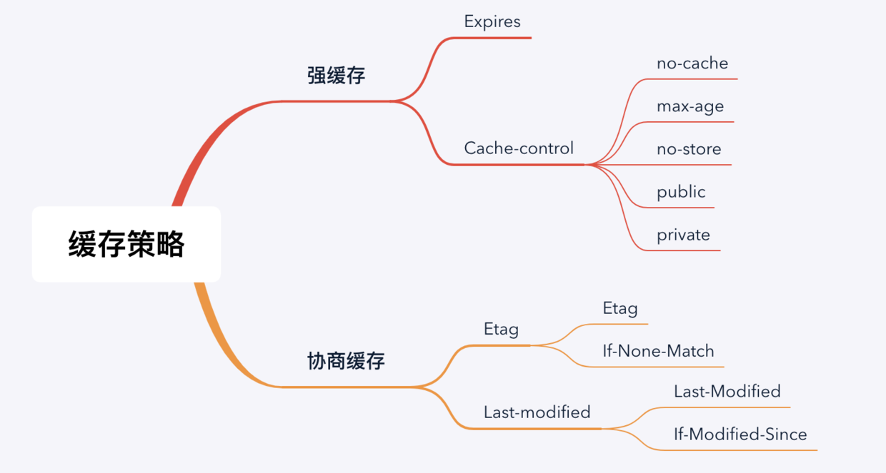
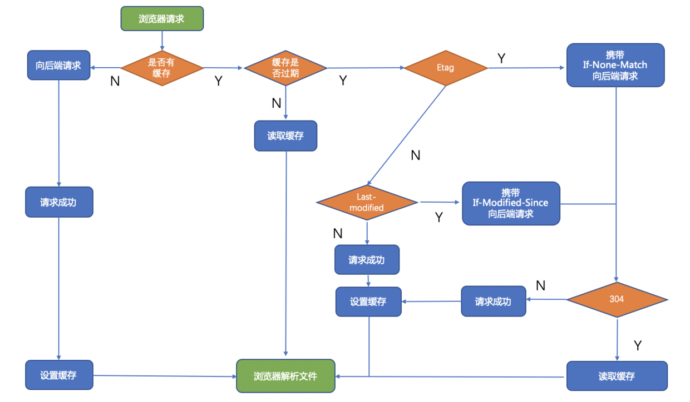

# 缓存的概念与分类
- 数据库缓存
- (代理)服务器缓存
- CDN缓存
- 浏览器缓存  

> HTTP 缓存（或 Web 缓存）是用于临时存储（缓存）Web文档（如 HTML 页面和图像），以减少服务器延迟的一种信息技术。HTTP 缓存系统会保存下通过这套系统的文档的副本；如果满足某些条件，则可以由缓存满足后续请求。HTTP 缓存系统既可以指设备，也可以指计算机程序。  


> 当您访问chrome中的URL时，页面上的HTML和其他资产（如图像）将本地存储在内存和磁盘缓存中。Chrome将首先使用内存缓存，因为它的速度快得多，但它也会将页面存储在磁盘缓存中，以防您退出浏览器或它崩溃，因为磁盘缓存是持久的。  

  

## 强缓存
**强缓存是指客户端在第一次请求后，有效时间内不会再去请求服务器，而是直接使用缓存数据**  

- HTTP1.0使用**Expires**对应未来的时间戳  

```
Expires:Tue,13 May 2020 09:33:34 GMT
```
 Expires 信息告诉浏览器：在 2020.05.13 号之前,可以直接使用该文本的缓存副本

 - HTTP1.1服务端使用**Cache-control**
   - private:表示私有缓存，不能被共有缓存代理服务器缓存，不能在用户间共享，可被用户的浏览器缓存
   - public:表示共有缓存，可被代理服务器缓存，比如CDN,允许多用户间共享
   - max-age:值以秒为单位，表示缓存的内存会在该值后过期
   - no-cache:需要使用协商缓存
   - no-store:所有内容都不会被缓存
   - must-revalidate:告诉浏览器，你必须再次验证检查信息是否过期，返回的代号就不是200而是304了

```
//Response Headers
Cache-Control:private, max-age=0, must-revalidate
```

**HTTP 规定，如果 Cache-control 的 max-age 和 Expires 同时出现，那么 max-age 的优先级更高，他会默认覆盖掉 expires。**

## 协商缓存
**强缓存判断的实质上缓存资源是否超出某个时间或者某个时间段**  

> 协商缓存过程：在浏览器端，当对某个资源的请求没有命中强缓存时，浏览器就会发一个请求到服务器，验证协商缓存是否命中，如果协商缓存命中，请求响应返回的HTTP状态为304

- 浏览器第一次请求资源，服务端在返回资源的响应头中加入**Last-Modified**字段，这个字段表示这个资源在服务器上的最近修改时间

```
Last-Modified: Tue, 12 Jan 2019 09:08:53 GMT
```

- 浏览器收到响应，并记录Last-Modified这个响应头的值为T
- 当浏览器再次向服务端请求该资源时，请求头加上**If-Modified-Since**的header,这个If-Modified-Since的值正是上一次请求该资源时，后端返回响应头值T
- 服务端再次收到请求，根据请求头 If-Modified-Since 的值 T，判断相关资源是否在 T 时间后有变化；如果没有变化则返回 304 Not Modified，且并不返回资源内容，浏览器使用资源缓存值；如果有变化，则正常返回资源内容，且更新 Last-Modified响应头内容


#### 【ETag、If-None-Match】这一对 header 主导的协商缓存过程：
- 浏览器第一次请求资源，服务端在返回资源的响应头中加入 Etag，Etag 能够弥补 Last-Modified 的问题，因为 Etag 的生成过程类似文件 hash 值，Etag 是一个字符串，不同文件内容对应不同的 Etag 值

```
//response Headers
ETag:"751F63A30AB5F98F855D1D90D217B356"
```

- 浏览器收到响应，记录 Etag 这个响应头的值为 E
- 浏览器再次跟服务器请求这个资源时，在请求头上加上 If-None-Match，值为 Etag 这个响应头的值 E
- 服务端再次收到请求，根据请求头 If-None-Match 的值 E，根据资源生成一个新的 ETag，对比 E 和新的 Etag：如果两值相同，则说明资源没有变化，返回 304 Not Modified，同时携带着新的 ETag 响应头；如果两值不同，就正常返回资源内容，这时也更新ETag响应头
- 浏览器收到 304 的响应后，就会从缓存中加载资源

