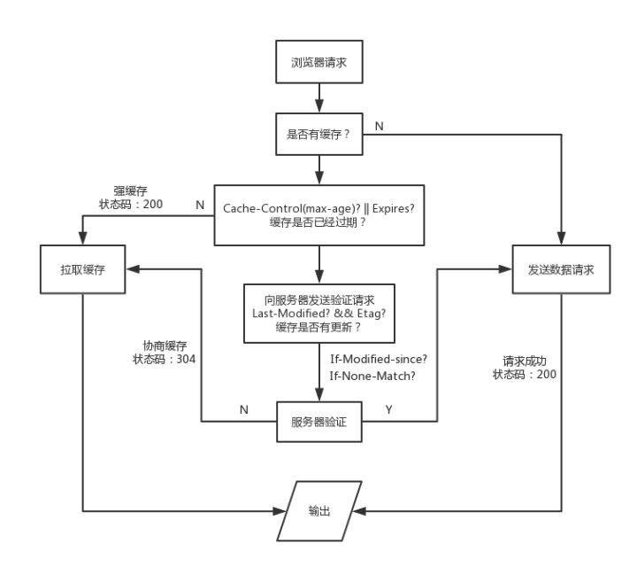

# 网站性能优化实战——从12.67s到1.06s的故事
- 网络传输性能
- 页面渲染性能
- JS阻塞性能

## 1.网络传输性能优化
浏览器得到用户请求后：  
**重定向--拉取缓存--DNS查询--建立TCP链接--发起请求--接收响应--处理HTML元素--元素加载完成**

### 1.1.浏览器缓存
  

#### Etag字段
**控制缓存的存放位置**，服务器响应头中如果有Etag字段，浏览器会将本次**缓存写入硬盘**  

浏览器默认的缓存放在内存中，内存里的缓存会因为进程的结束或浏览器的关闭而被清除，硬盘中的会长期保留。  

network面板中各请求的size项：  
- from memory cache:缓存来自内存
- from disk cache:缓存来自硬盘  

```
etag on;//开启etag验证
expires 7d;//设置缓存过期时间为7天
```
> 浏览器在处理用户请求时，如果命中强缓存，浏览器会直接拉取本地缓存，不会与服务器发生任何通信，如果我们在服务器端更新了文件，并不会被浏览器得知，就无法替换失效的缓存。所以我们在构建阶段，需要为我们的静态资源添加**md5 hash后缀**，避免资源更新而引起的前后端文件无法同步的问题。

### 1.2.资源打包压缩
#### webpack配置
1. JS压缩

```
new webpack.optimize.UglifyJsPlugin()
```

2. HTML压缩

```
new HtmlWebpackPlugin({
    template:__dirname + '/views/index.html',// new 一个这个插件的实例，并传入相关的参数
    filename:'../index.html',
    minify:{
        removeComments: true,
        collapseWhitespace: true,
        removeRedundantAttributes: true,
        useShortDoctype: true,
        removeEmptyAttributes: true,
        removeStyleLinkTypeAttributes: true,
        keepClosingSlash: true,
        minifyJS: true,
        minifyCSS: true,
        minifyURLs: true,
    },
    chunksSortMode:'dependency'
})
```

3. 提取公共资源

4. 提取css并压缩

5. ModuleConcatenationPlugin

**不要对图片进行Gzip压缩**

### 1.3.图片资源优化
1. 不要在HTML里压缩图像
2. 使用雪碧图
3. 使用字体图标(iconfont)
4. 使用webP--体积小

### 1.4.网络传输性能检测工具--Page Speed

### 1.5.使用CDN
- 便于CDN业务独立，能够独立配置缓存
- 抛开无用cookie，减少带宽占用
- DNS Prefetch

## 2.页面渲染性能优化
### 2.1.浏览器渲染进程(Webkit)


### 2.2.DOM渲染层与GPU硬件加速
布局由CPU处理，绘制由GPU完成  

chrome开发者工具菜单→more tools→Layers（开启渲染层功能模块）

chrome开发者工具菜单→more tools→rendering（开启渲染性能监测工具）  

> 把容易触发重排重绘的元素单独触发渲染层，让它与那些‘静态’元素隔离，让GPU分担更多的渲染工作，通常把这样的措施成为硬件加速，或GPU加速。

### 2.3.重排与重绘
使用chrome devtools中的performance版块来测量页面重排重绘所占据的时间  

①蓝色部分：HTML解析和网络通信占用的时间

②黄色部分：JavaScript语句执行所占用时间

③紫色部分：重排占用时间

④绿色部分：重绘占用时间

### 2.4.优化策略
1. 通过切换class或者使用元素的style.csstext属性去批量操作元素样式

```
var head= document.getElementById("head");
head.style.cssText="width:200px;height:70px;display:bolck";
```

2. DOM元素离线更新
   1. DocumentFragment 
   2. display:none

3. visibility:hidden,减少重绘
4. 图片在渲染前指定大小：因为img元素是内联元素，所以在加载图片后会改变宽高，严重的情况会导致整个页面重排，所以最好在渲染前指向其大小，或者让其脱离文档流

## 4.负载均衡
### 4.1.Node.js处理IO密集型请求
> node的核心是**事件驱动**，通过Event Loop去异步处理用户请求，相比于传统的后端服务，它们都是将用户的每个请求分配一个进程进行处理。   

**事件驱动的优势**：在高并发IO时，不会造成阻塞。


### 4.2.pm2实现Node.js“多线程”

### nginx搭建反向代理