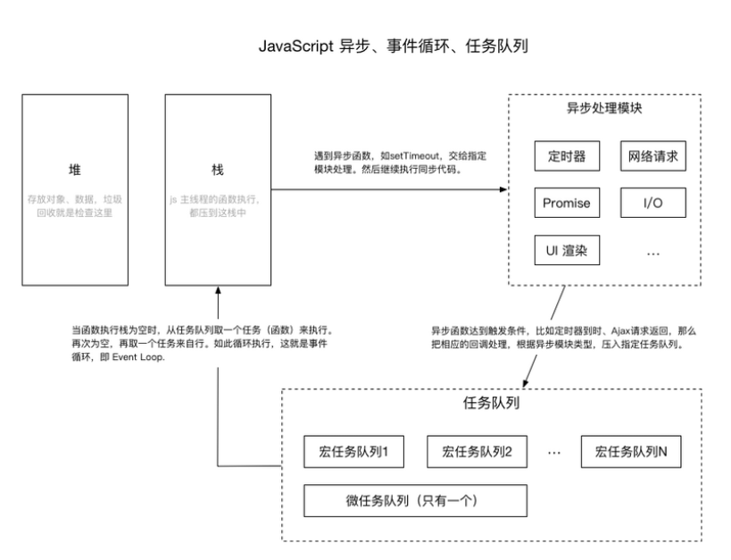
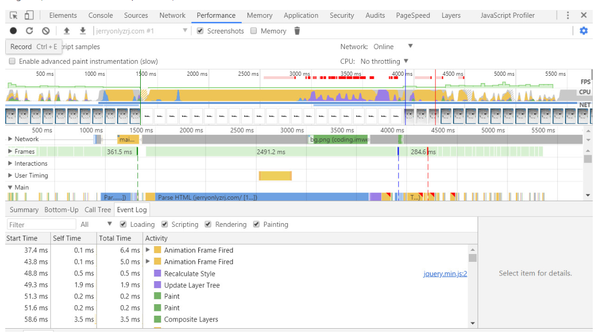
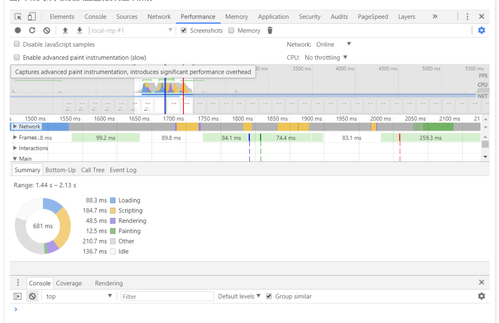
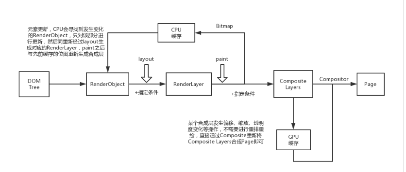

# 从Webkit内部渲染机制出发，谈网站渲染性能优化
## 浏览器架构
**Chromium浏览器**  

- **Browser进程**:这是浏览器的主进程，负责浏览器界面的显示、各个页面的管理。每次我们打开浏览器，都会启动一个Browser进程，结束该进程就会关闭我们的浏览器。
- **Renderer进程**:这是网页的渲染进程，负责页面的渲染工作，一般来说，一个页面都会对应一个Renderer进程，不过也有例外。
- **GPU进程**:如果页面启动了硬件加速，浏览器就会开启一个GPU进程，但是最多只能有一个，当且仅当GPU硬件加速打开的时候才会被创建。

#### 进程的特征
- Browser进程和页面的渲染是分开的，这保证了页面渲染导致的崩溃不会导致浏览器主界面的崩溃。
- 每个页面都是独立的进程，这样就保证了页面之间不会相互影响。
- GPU进程也是独立的。

#### Event Loop实现异步操作

## HTML网页结构及渲染机制浅析
打开chrome开发者工具中的performance版块，录制一小段页面渲染，并将输出结果切换至Event Log版块，大家就可以清晰地看见网站渲染经历的过程：  

  

在Activity字段中我们可以看到，我们的页面经历了重新计算样式→更新Layer树→绘制→合成合成层的过程，结合我们的Summary版块中的环形图，我们可以大致把页面渲染分为三个阶段：  

  

- 第一阶段，**资源加载及脚本执行阶段**：在Summary图中我们可以看到，页面在渲染时蓝色的Loading（资源请求）部分和黄色的Scripting（脚本执行）部分占用了大量的时间，可能是因为我们请求的资源体积较多，执行的脚本复杂度较大，我们可以依据网络传输性能优化的相关内容对这一阶段进行优化。
- 第二阶段，**页面布局阶段**：在Summary图中，紫色的Rendering部分指的就是我们的layout页面布局阶段，在Event Log版块之所以没有看到layout activity，是因为我启动了硬件加速，使得页面在重新渲染时不会发生重排。之所以把layout单独提取出来，是因为它是一个很特别的过程，它会影响RenderLayers的生成，也会大量消耗CPU资源。
- 第三阶段，**页面绘制阶段**：其中就包括了最后的Painting和Composite Layers的所有过程。

## 浏览器渲染方式
- CPU:软件渲染
- GPU:硬件渲染

## 硬件渲染
> 如果页面只是某个合成层发生了位置的偏移、缩放、透明度变化等操作，那么GPU会取代CPU去处理重新绘制的工作，因为GPU要做的只是把更新的合成层进行相应的变换并送入Compositor重新合成即可。  

## JS性能监测
- Benchmark.js
- JsPerf