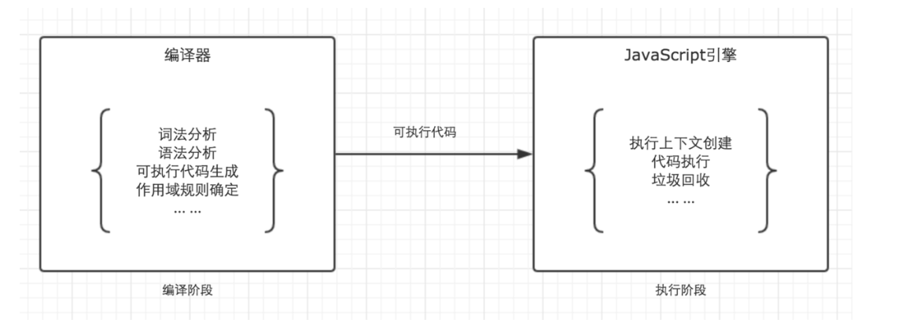

# 变量对象(Variable Object)
变量对象的**创建**：  
1. 建立arguments对象，检查当前上下文中的参数，建立该对象下的属性与属性值
2. 检查当前上下文的函数声明，也就是使用function关键字声明的函数。在变量对象中以函数名建立一个属性，属性值为指向该函数所在内存地址的引用。如果函数名的属性已经存在，那么该属性将会被新的引用所覆盖
3. 检查当前上下文中的变量声明，每找到一个变量声明，就在变量对象中以变量名建立一个属性，属性值为undefined。如果该变量名的属性已经存在，**为了防止同名的函数被修改为undefined,则会直接跳过，原属性值不会被修改**  

```
function foo(){
    console.log('function foo');
}
var foo = 20;

console.log(foo);//20
```
因为上面的三条规则仅仅适用于变量对象的创建过程。也就是执行上下文的创建过程。而foo = 20是在执行上下文的执行过程中运行的，输出结果自然会是20。
```
console.log(foo);//function foo
function foo(){
    console.log('function foo');
}
var foo = 20;
```
```
// 上栗的执行顺序为

// 首先将所有函数声明放入变量对象中
function foo() { console.log('function foo') }

// 其次将所有变量声明放入变量对象中，但是因为foo已经存在同名函数，因此此时会跳过undefined的赋值
// var foo = undefined;

// 然后开始执行阶段代码的执行
console.log(foo); // function foo
foo = 20;
```


## 作用域和执行上下文是完全不同的概念
> JS代码的整个执行过程，分为两个阶段，代码编辑阶段与代码执行阶段。编辑阶段由编辑器完成，将代码翻译成可执行代码，这个阶段作用域规则会确定。执行阶段由引擎完成，主要任务是执行可执行代码，执行上下文在这个阶段创建。  

