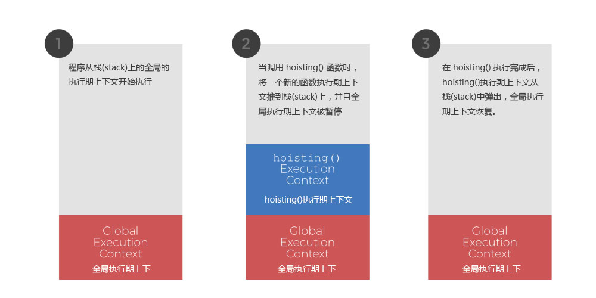
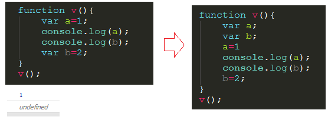
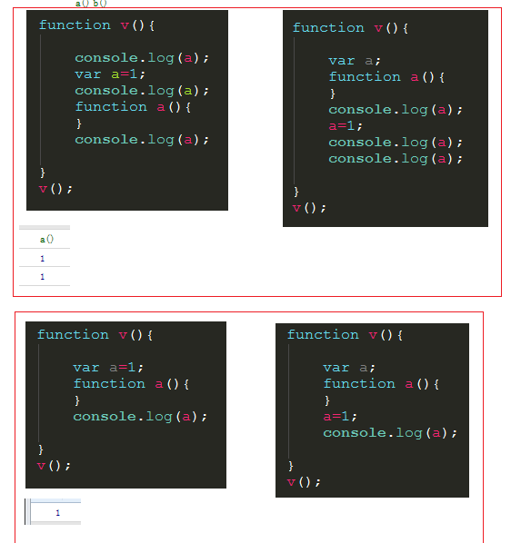
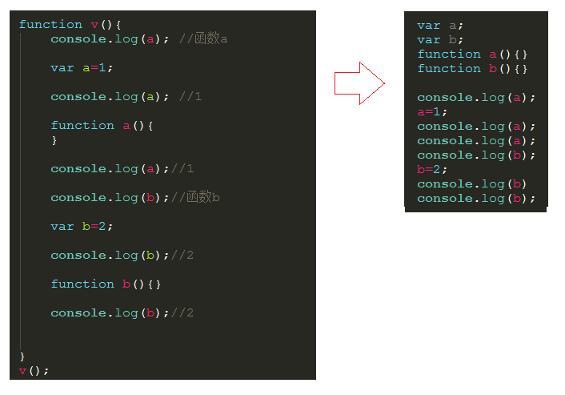

## 变量声明提升
* 通过var定义(声明)的变量, 在定义语句之前就可以访问到
* 值: undefined
```
console.log(notyetdeclared);
// 打印 'undefined'
 
var notyetdeclared = 'now it is declared';
 
hoisting();
 
function hoisting(){
  console.log(notyetdeclared);
  // 打印 'undefined'
  
  var notyetdeclared = 'declared differently';
  
  console.log(notyetdeclared);
  // 打印 'declared differently'
}
```

js会先把所有变量都声明好了之后，然后才进行赋值，并不是声明一个变量就赋值，再声明一个再赋值。js所谓变量提升，提升就是为了事先声明变量。  

## 函数声明提升
* 通过function声明的函数, 在之前就可以直接调用
* 值: 函数定义(对象)
```
fn2() //可调用  函数提升

function fn2() {
    console.log('fn2()')
  }
```
函数只有声明式函数才会被提升，字面量函数不会被提升。
## 函数和变量都提升时，谁提到前面谁提到后面
在作用域中，不管变量和函数写在什么位置，所有变量会被整体提升到作用域顶部，所有函数也会被整体提升到作用域顶部，但是函数整体在变量整体的后面。  

从这个例子中可以看到，变量和函数都整体提升后，函数整体在变量的后面。变量提升之后，但其赋值还是留在原本的位置等js运行到了之后动态赋值，而函数提升之后直接相当于在代码里抽空了。  

## 实例
```
function foo(){
  console.log('foo1');
}

foo();//foo2

function foo(){
  console.log('foo2');
}

foo();  //foo2
```
```
//若函数是作为函数声明进行定义的，则可以在函数声明之前访问函数
assert (typeof fun === "function","fun is a function even though its definition isn't reached yet!");

//若函数是通过函数表达式或箭头函数进行定义的，则不可以在函数定义前访问函数
assert (typeof myFunExp === "undefined","But we cannot access function expressions");
assert (typeof myArrow === "undefined","Nor arrow functions");

//作为函数声明进行定义
function fun(){}

//myFunExp指向函数表达式，myArrow指向箭头函数
var myFunExp = function(){};
var myArrow = (x)=>x;
```
# 函数重载
```
//fun指向一个函数
assert(typeof fun === "function","We access the function");

//定义变量fun并赋值为数字3
var fun = 3;

//fun指向一个数字
assert(typeof fun === "number","Now we access the number");

//函数声明
function fun(){}

//fun仍然指向数字
assert(typeof fun === "number","Still a number");
```