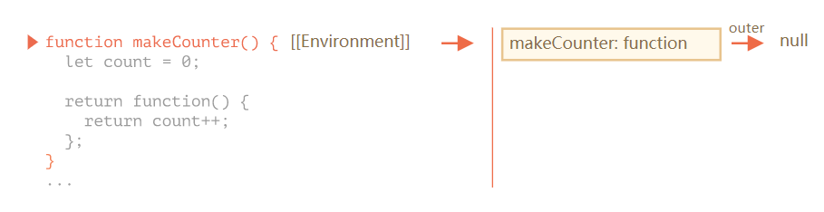
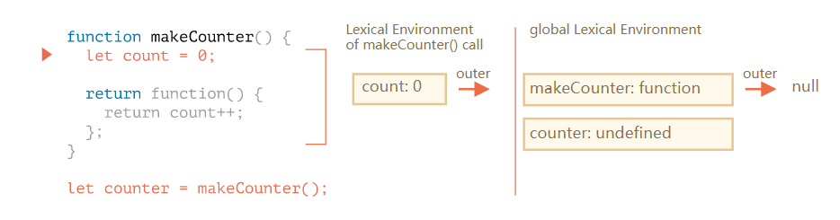
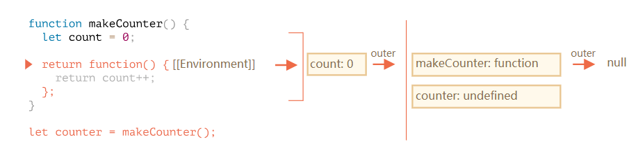
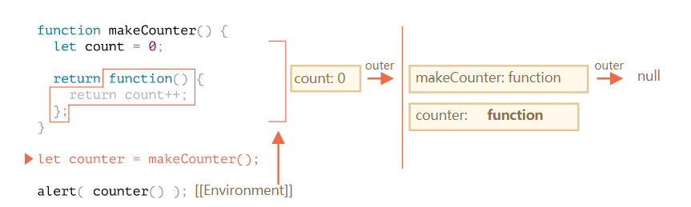
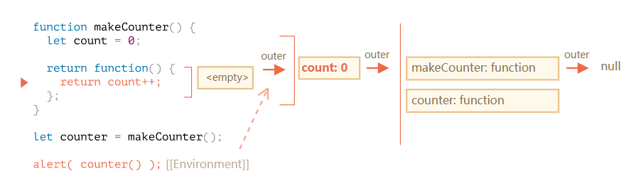
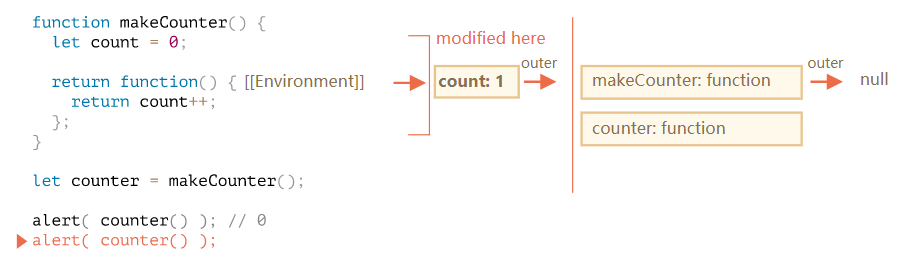
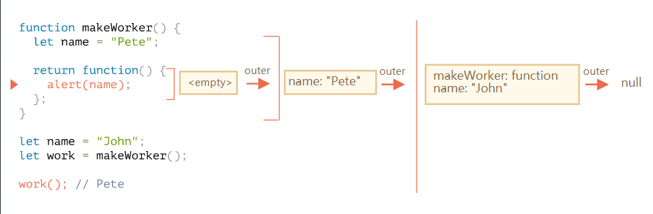

# 闭包
## 词法环境
在 JavaScript 中，每个运行的函数、代码块或整个程序，都有一个称为 词法环境（Lexical Environment） 的关联对象。  

1. **环境记录(Environment Record)**---一个把所有局部变量作为其属性（包括一些额外信息，比如 this 值）的对象。  
2. **外部词法环境（outer lexical environment）** 的引用 —— 通常是嵌套当前代码（当前花括号之外）之外代码的词法环境。  

『变量』只是环境记录这个特殊内部对象的属性。『访问或修改变量』意味着『访问或改变词法环境的一个属性』。

## 环境详情
1. 在脚本开始时，只存在全局词法环境  

  

> 所有的函数在诞生时都会根据创建它的词法环境获得**隐藏的[[Environment]]属性**  
> makeCounter创建于全局词法环境，那么[[Environment]]中有这个引用  

2. 代码执行，makeCounter()被执行  

  

**在makeCounter()执行时，包含其变量和参数的词法环境被创建**

#### 词法环境中存储的东西
- 环境记录，它保存着局部变量
- 外部词法环境的引用，它被设置为函数的[[Environment]]属性  

3. 在makeCounter()的执行中，创建了一个小的嵌套函数   

> 不管是使用函数声明或函数表达式创建的函数，所有的函数都有[Environment]]属性 ，该属性引用着所创建的词法环境。  

  

4. 随着执行的进行，makeCounter()调用完成，并且将结果赋值给全局变量counter  

  

5. 当counter()执行时，它会创建一个空的词法环境。它本身没有局部变量，但是counter有[Environment]]作为其外部引用，所以它可以访问前面创建的makeCounter()函数的变量  

  

如果它要访问一个变量，它首先会搜索它自身的词法环境(空)，然后是前面创建的makeCounter()函数的词法环境，然后才是全局环境  

> 注意内存管理工作机制。虽然makeCounter()执行结束，但它的词法环境仍保存在内存中，因为这里仍然有一个嵌套函数的[[Environment]]在引用着他  

6. counter()函数不仅会返回count的值，也会增加它。注意修改是就地完成的。即在找到count值的地方完成的修改  

  

  

## 闭包
> 函数保存其外部的变量并且能够访问它们称之为**闭包**。在JS中函数都是天生的闭包。他们会通过隐藏的[[Environment]]属性记住创建它们的位置，所以它们都可以访问外部变量。