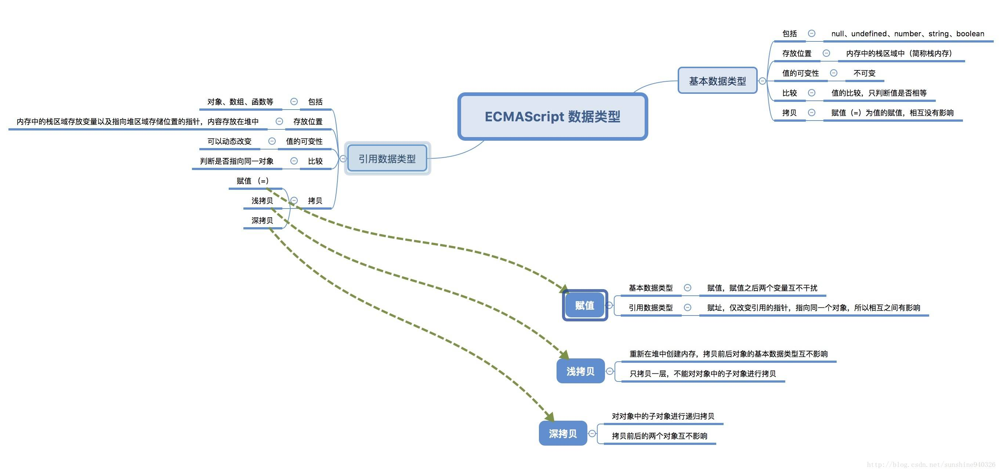

  
# 数据类型
基本数据类型
- undefined
- boolean
- number
- string
- null


## 基本数据类型值不可变
javascript中的原始值（undefined、null、布尔值、数字和字符串）与对象（包括数组和函数）有着根本区别。原始值是不可更改的：任何方法都无法更改（或“突变”）一个原始值。对数字和布尔值来说显然如此 —— 改变数字的值本身就说不通，而对字符串来说就不那么明显了，因为字符串看起来像由字符组成的数组，我们期望可以通过指定索引来假改字符串中的字符。实际上，javascript 是禁止这样做的。**字符串中所有的方法看上去返回了一个修改后的字符串，实际上返回的是一个新的字符串值。**
```
    var str = "abc";

    console.log(str[1]="f");    // f

    console.log(str);           // abc
```
## 深浅拷贝

### 浅拷贝
拷贝原对象的引用   
**如果数组元素是基本类型，就会拷贝一份，互不影响，而如果是对象或者数组，就会只拷贝对象和数组的引用，这样我们无论在新旧数组进行了修改，两者都会发生变化。**
```
    var obj1 = {
        'name' : 'zhangsan',
        'age' :  '18',
        'language' : [1,[2,3],[4,5]],
    };

    var obj2 = obj1;


    var obj3 = shallowCopy(obj1);
    function shallowCopy(src) {
        var dst = {};
        for (var prop in src) {
            if (src.hasOwnProperty(prop)) {
                dst[prop] = src[prop];
            }
        }
        return dst;
    }

    obj2.name = "lisi";
    obj3.age = "20";

    obj2.language[1] = ["二","三"];
    obj3.language[2] = ["四","五"];

    console.log(obj1);  
    //obj1 = {
    //    'name' : 'lisi',
    //    'age' :  '18',
    //    'language' : [1,["二","三"],["四","五"]],
    //};

    console.log(obj2);
    //obj2 = {
    //    'name' : 'lisi',
    //    'age' :  '18',
    //    'language' : [1,["二","三"],["四","五"]],
    //};

    console.log(obj3);
    //obj3 = {
    //    'name' : 'zhangsan',
    //    'age' :  '20',
    //    'language' : [1,["二","三"],["四","五"]],
    //};
```

### 浅拷贝的实现
1. 引用复制

```
var shallowCopy = function(obj){
    //只拷贝对象
    if(typeof obj !== 'object') return;
    //根据obj的类型判断是新建一个数组还是对象
    var newObj = obj instanceof Array ? [] : {};
    //遍历obj,并且判断是obj的属性才拷贝
    for(var key in obj){
        if(obj.hasOwnProperty(key)){
            newObj[key] = obj[key];
        }
    }
    return newObj;
}
```

2. Array的slice和concat方法

```
var array = [1, [1,2,3], {name:"array"}]; 
var array_concat = array.concat();
var array_slice = array.slice(0);
array_concat[1][0] = 5;  //改变array_concat中数组元素的值 
console.log(array[1]); //[5,2,3] 
console.log(array_slice[1]); //[5,2,3] 
array_slice[2].name = "array_slice"; //改变array_slice中对象元素的值 
console.log(array[2].name); //array_slice
console.log(array_concat[2].name); //array_slice
```
### 深拷贝
深拷贝也就是拷贝出一个新的实例，新的实例和原来的实例互不影响。  
**深拷贝是对对象以及对象的所有子对象进行拷贝。**

### 深拷贝的实现
1. JSON对象的parse和stringify   
    
   JSON对象parse方法可以将JSON字符串反序列化成JS对象，stringify方法可以将JS对象序列化成JSON字符串  
   这种方法不能拷贝函数

```
var arr = ['old', 1, true, ['old1', 'old2'], {old: 1}]

var new_arr = JSON.parse(JSON.stringify(arr));

console.log(new_arr);
```
在拷贝的时候判断一下属性值的类型，如果是对象，我们递归调用深拷贝函数
```
var deepCopy = function(obj){
    if(typeof obj !== 'object')return;
    var newObj = obj instanceof Array ? [] : {};
    for(var key in obj){
        if(obj.hasOwnProperty(key)){
            newObj[key] = typeof obj[key] === 'object' ? deepCopy(obj[key]) : obj[key];
        }
    }
    return newObj;
}
```