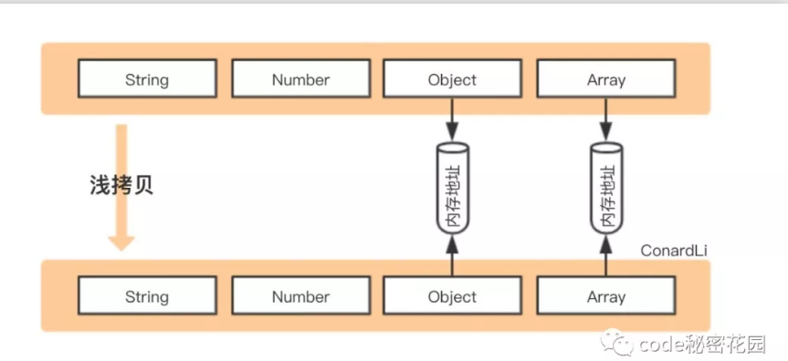
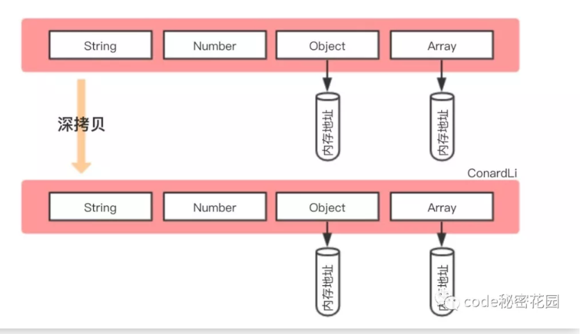

# 深拷贝和浅拷贝
浅拷贝：  
  

> 创建一个新对象，这个对象有着原始对象属性值的一份精准拷贝。如果属性是基本类型，拷贝的就是基本类型的值，如果属性是引用类型，拷贝的就是内存地址，所以如果其中一个对象改变了这个地址，就会影响到另一个对象。  

深拷贝：  
  
> 将一个对象从内存中完整的拷贝一份出来，从堆内存中开辟一个新的区域存放新对象，且修改新对象不会影响原对象

## 乞丐版
实现深拷贝
```
JSON.parse(JSON.stringify());
```

## 基本版本
浅拷贝
```
function clone(target){
    let cloneTarget = {};
    for(const key in target){
        cloneTarget[key] = target[key];
    }
    return cloneTarget;
};
```
如果是深拷贝，利用递归来解决不知道对象的层数是多少的情况  
- 如果是原始类型，无需继续拷贝，直接返回
- 如果是引用类型，创建一个新的对象，遍历需要克隆的对象，将需要克隆对象的属性执行深拷贝后依次添加到新对象上  

```
function clone(target){
    if(typeof target === 'object'){
        let cloneTarget = {};
        for(const key in target){
            cloneTarget[key] = clone(target[key]);
        }
        return cloneTarget;
    }else{
        return target;
    }
}
```

测试
```
const target = {
    field1:1,
    field2:undefined,
    field3:'ConargLi',
    field4:{
        child:'child',
        child2:{
            child2:'child2'
        }
    }
}
```

## 考虑数组
兼容数组
```
module.exports = function clone(target){
    if(typeof target === 'object'){
        let cloneTarget = Array.isArray(target) ? [] : {};
        for(const key in target){
            cloneTarget[key] = clone(target[key]);
        }
        return cloneTarget;
    }else{
        return target;
    }
}
```

测试
```
const target = {
    field1:1,
    field2:undefined,
    field3:'ConargLi',
    field4:[2,4,8]
}
```

## 循环引用
```
const target = {
    field1:1,
    field2:undefined,
    field3:'ConargLi',
    field4:[2,4,8]
};
target.target = target;
//因为递归进入死循环导致栈内存溢出
```
因为上面的对象存在循环引用的情况，即对象的属性间接或直接的引用了自身的情况  

解决循环引用问题，我们可以额外开辟一个存储空间，来存储当前对象和拷贝对象的对应关系，当需要拷贝当前对象时，先去存储空间中找，有没有拷贝过这个对象，如果有的话直接返回，如果没有的话继续拷贝  

- 检查map中有无克隆过的对象
- 有则直接返回
- 没有，将当前对象作为key,克隆对象作为value进行存储

```
function clone(target,map=new Map()){
    if(typeof target === 'object'){
        let cloneTarget = Array.isArray(target) ? [] : {};
        if(map.get(target)){
            return target;
        }
        map.set(target,cloneTarget);
        for(const key in target){
            cloneTarget[key] = clone(target[key],map);
        }
        return cloneTarget;
    }else{
        return target;
    }
}
```
set方法设置键名key对应的键值为value

## 性能优化
forin < for < while  

使用while来实现通用的forEach遍历  
```
function forEach(array,iteratee){
    let index = -1;
    const length = array.length;
    while(++index < length){
        iteratee(array[index],index);
    }
    return array;
}
```

改写clone,使用Object.keys取出所有的key进行遍历
```
function clone(target,map=new WeakMap()){
    if(typeof target === 'object'){
        const isArray = Array.isArray(target);
        let cloneTarget = isArray ? [] : {};

        if(map.get(target)){
            return target;
        }
        map.set(target,cloneTarget);

        const keys = isArray ? undefined : Object.keys(target);
        forEach(keys || target,(value,key)=>{
            if(keys){
                key = value;
            }
            cloneTarget[key] = clone(target[key],map);
        })

        return cloneTarget;
    }else{
        return target;
    }
}
```

## 其他数据类型
考虑function和null两种特殊类型
```
function isObject(target){
    const type = typeof target;
    return target !== null && (type === 'object' || type === 'function');
}

if(!isObject(target)){
    return target;
}

//...
```