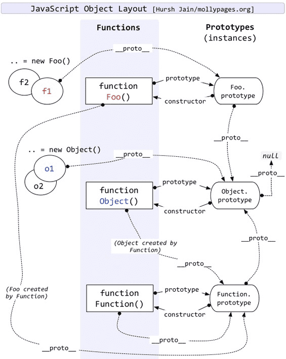

# typeof和instanceof原理
## typeof
JS中的值是由一个表示类型的标签和实际数据值表示的。  
对象的类型标签是0。由于null代表的是空指针(大多数平台下值为0x00)，因此，null的类型标签是0，typeof null也因此返回“object”。  

js在底层存储变量的时候，会在变量的机器码的低位1-3位存储其类型消息：  
- 1：整数
- 110：布尔
- 100：字符串
- 010：浮点值
- 000：对象
- null:所有机器码均为0
- undefined:用 −2^30 整数来表示

## instanceof
```
object instanceof constructor
```
用来检测constructor.prototype是否存在于参数object的原型链上

```
console.log(Object instanceof Object);//true 
console.log(Function instanceof Function);//true 
console.log(Number instanceof Number);//false 
console.log(String instanceof String);//false 

console.log(Function instanceof Object);//true 

console.log(Foo instanceof Function);//true 
console.log(Foo instanceof Foo);//false
```
为什么 Object 和 Function instanceof 自己等于 true，而其他类 instanceof 自己却又不等于 true 呢？  

  

将规范定义为JS:  
```
//L表示左表达式，R表达右表达式
function instance_of(L,R){
    var O = R.prototype;//取R的显式原型
    L = L.__proto__;//取L的隐式原型
    while(true){
        if(L === null){
            return false;
        }
        if(O === L){
            return true; //当O严格等于L时，返回true
        }
        L = L.__proto__;
    }
}
```
- Object instanceof Object  

```
//首先先区分左右侧表达式
ObjectL = Object,ObjectR = Object;

O = ObjectR.prototype = Object.prototype;
L = ObjectL.__proto__ = Function.prototype;

//第一次判断
O != L;

//循环查找L是否还有__proto__
L = Function.prototype.__proto__ = Object.prototype;

//第二次判断
O == L;
//返回true
```

- Function instanceof Function

```
FunctionL = Function,FunctionR = Function;

O = FunctionR.prototype = Function.prototype;
L = FunctionL.__proto__ = Function.prototype;

//第一次判断
O == L;
//返回true
```

- Foo instanceof Foo

```
FooL = Foo,FooR = Foo;

O = FooR.prototype = Foo.prototype;
L = FooL.__proto__ = Function.prototype;

//第一次判断
O != L;

//循环再次查找L是否还有__proto__
L = Function.prototype.__proto__ = Object.prototype;

//第二次判断
O != L;
//再次循环查找L是否还有__proto__
L = Object.prototype.__proto__ = null;

//第三次判断
L == null;
//返回false
```