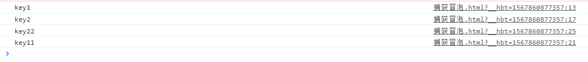

# 捕获和冒泡
```
<body>
  <input id="i"/>
</body>
```
```
document.body.addEventListener("mousedown",()=>{
    console.log("key1")
},true)

document.getElementById("i").addEventListener("mousedown",()=>{
    console.log("key2")
},true)

document.body.addEventListener("mousedown",()=>{
    console.log("key11")
},false)

document.getElementById("i").addEventListener("mousedown",()=>{
    console.log("key22")
},false)
```
监听body和body的子元素上鼠标按下事件，捕获和冒泡分别监听。最终产生的顺序是：  
  
## addEventListener三个参数
- 事件名称
- 事件处理函数
- 捕获还是冒泡

第三个参数默认值是false，表示在事件冒泡阶段调用事件处理函数；如果参数为true,则表示在事件捕获阶段调用处理函数。