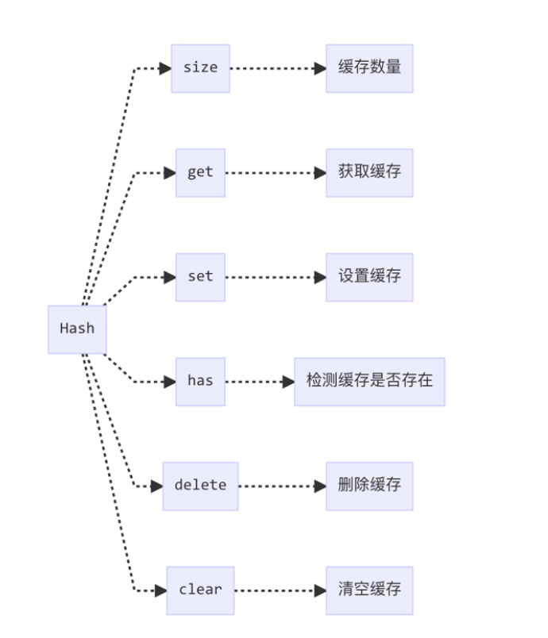

# hash缓存
一个离散的序列，根据key来存取数据  

```
new Hash([['test1', 1],['test2',2],['test3',3]])
```
```
{
  size: 3,
  __data__: {
    test1: 1,
    test2: 2,
    test3: 3
  }
}
```

    

```
const HASH_UNDEFINED = '__lodash_hash_undefined__';

class Hash{
  constructor(entries){
    let index = -1;
    const length = entries == null ? 0 : entries.length;

    this.clear();

    while(++index < length){
      const entry = entries[index];
      this.set(entry[0],entry[1]);
    }
  }

  clear(){
    this.__data__ = Object.create(null);
    this.size = 0;
  }

  delete(key){
    const result = this.has(key) && delete this.__data__[key];
    this.size -= result ? 1 : 0;
    return result;
  }

  get(key){
    const data = this.__data__;
    const result = data[key];
    return result === HASH_UNDEFINED ? undefined : result;
  }

  has(key){
    const data = this.__data__;
    return data[key] !== undefined;
  }

  set(key,value){
    const data = this.__data__;
    this.size += this.has(key) ? 0 : 1;
    data[key] = value === undefined ? HASH_UNDEFINED : value;
    return this;
  }
}

export default Hash;
```

> Object.create 的第一个参数为创建对象的原型对象，传入 null 的时候，返回的就是一个真空对象，即没有原型的对象，因此不会有原型属性的干扰，用来做缓存对象十分适合。  

在 has 中说到用 data[key] !== undefined 有一个坑，因为要缓存的值也可以是 undefined ，如果不做处理，肯定会导致判断错误。
lodash 的处理方式是将 undefined 的值转换成 HASH_UNDEFINED ，也即一开始便定义的 \__lodash_hash_undefined__ 字符串来储存。
所以在缓存中，是用字符串 \__lodash_hash_undefined__ 来替代 undefined 的。
set 在最后还将实例 this 返回，以支持链式操作。