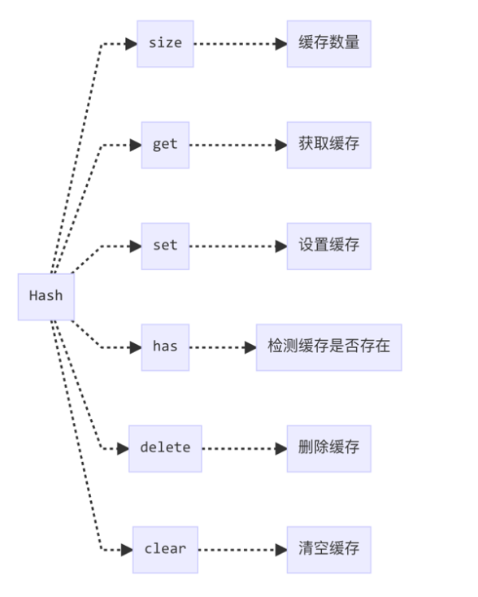

# List缓存
Hash 其实是用对象来做缓存，但是对象有一个局限，它的 key 只能是字符串或者 Symbol 类型，但是 Map 是支持各种类型的值来作为 key，因此 Hash 缓存无法完全模拟 Map 的行为，当遇到 key 为数组、对象等类型时，Hash 就无能为力了。  
因此，在不支持 Map 的环境下，lodash 实现了 ListCache 来模拟，ListCache 本质上是使用一个二维数组来储存数据。  

```
//调用方式
new ListCache([
  [{key: 'An Object Key'}, 1],
  [['An Array Key'],2],
  [function(){console.log('A Function Key')},3]
])

//返回结果
{
  size: 3,
  __data__: [
    [{key: 'An Object Key'}, 1],
    [['An Array Key'],2],
    [function(){console.log('A Function Key')},3]
  ]
}
```

## 接口设计
  

## 依赖
```
import assocIndexOf from './assocIndexOf.js'
```

## 源码
```
class ListCache{
  constructor(entries){
    let index = -1;
    const length = entries == null ? 0 : entries.length;

//初始化__data__和size
    this.clear();
    
    while(++index < length){
      const entry = entries[index];
      this.set(entry[0],entry[1]);
    }
  }


  clear(){
    this.__data__ = [];
    this.size = 0;
  }

  delete(key){
    const data = this.__data__;
    const index = assocIndexOf(data,key);

    if(index < 0){
      return false;
    }

    const lastIndex = data.length - 1;
    if(index == lastIndex){
      data.pop();
    }else{
      data.splice(index,1);
    }

    --this.size;
    return true;
  }

  get(key){
    const data = this.__data__;
    const index = assocIndexOf(data,key);
    return index < 0 ? undefined : data[index][1];
  }

  has(key){
    return assocIndexOf(this.__data__,key) > -1;
  }

  set(key,value){
    const data = this.__data__;
    const index = assocIndexOf(data,key);

    if(index < 0){
      ++this.size;
      data.push([key,value]);
    }else{
      data[index][1] = value;
    }
    return this;
  }
}
```