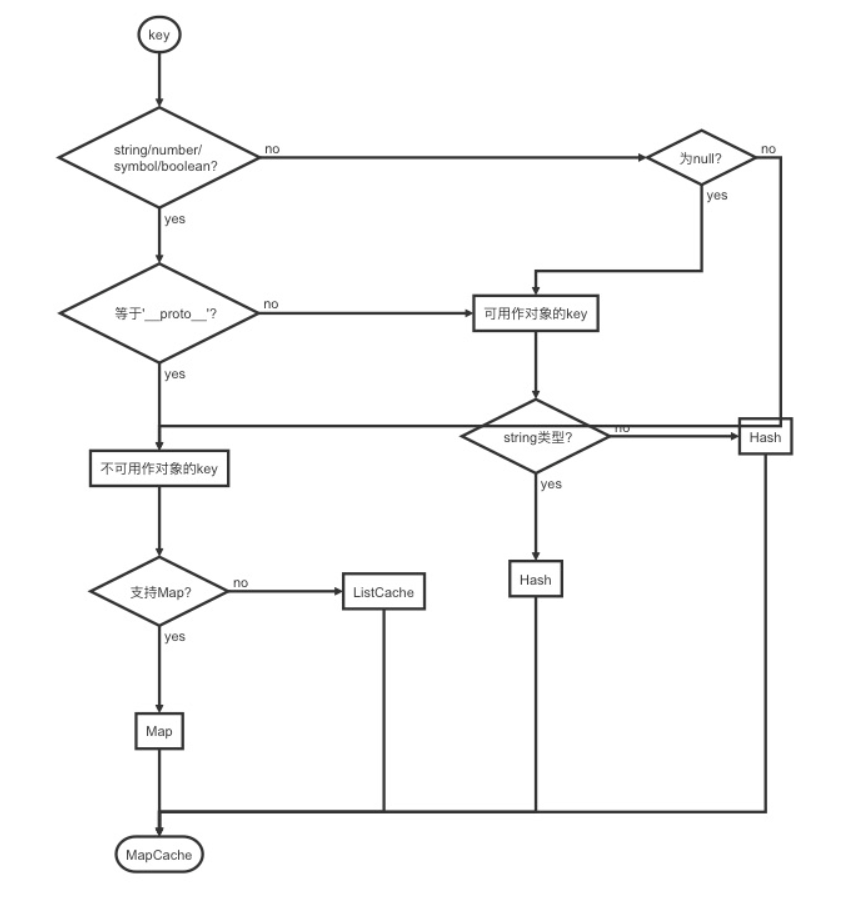
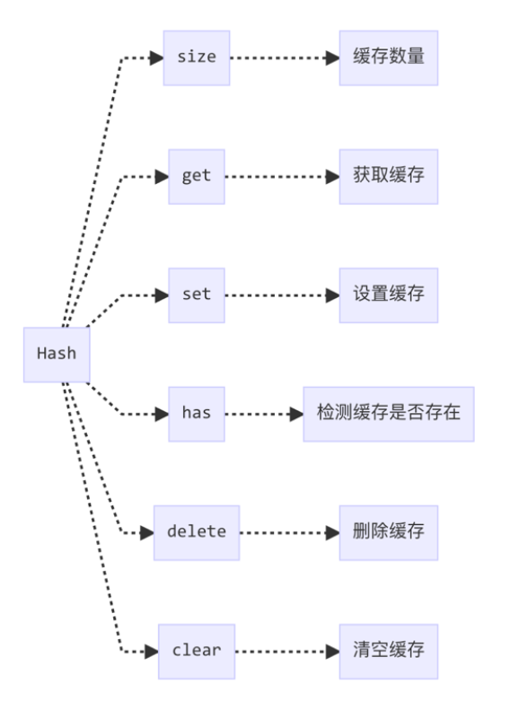

# 缓存方式的选择
**在数据量较大时，对象的存取比 Map 或者数组的性能要好。**
因此，ladash 在能够用 Hash 缓存时，都尽量使用 Hash 缓存，而能否使用 Hash 缓存的关键是 key 的类型。  

  

**不能使用__proto__的原因是，大部分JS引擎都以这个属性来保存对象的原型**

## 作用与用法
```
new MapCache([
  ['key', 'value'],
  [{key: 'An Object Key'}, 1],
  [Symbol(),2]
])
```
```
{
  size: 3,
  __data__: {
    string: {
      ... 
    },
    hash: {
      ...
    },
    map: {
      ...  
    }
  }
}
```

## 接口设计


## 依赖
```
import Hash from './Hash.js'
import ListCache from './ListCache.js'
```

## 源码
```
//获取对应缓存方式的实例
//如果使用的是 Hash 缓存，则类型为字符串时，返回 __data__ 中的 string 属性的值，否则返回 hash 属性的值。这两者都为 Hash 实例。
//否则返回 map 属性的值，这个可能是 Map 实例或者 ListCache 实例。
function getMapData({__data__},key){
    const data = __data__;
    return isKeyable(key) ? data[typeof key == 'string' ? 'string' : 'hash'] : data.map
}

//是否使用Hash
function isKeyable(value){
    const type = typeof value;
    return (type == 'string' || type == 'number' || type == 'symbol' || type == 'boolean') 
            ? (value !== '__proto__') : (value === null)
}

class MapCache{
    constructor(entries){
        let index = -1;
        const length = entries == null ? 0 : entries.length;

        this.clear();
        while(++index < length){
            const entry = entries[index];
            this.set(entry[0],entry[1]);
        }
    }

    clear(){
        this.size = 0;
        this.__data__ = {
            'hash': new Hash,
            'map': new (Map || ListCache),
            'string': new Hash
        }
    }

    delete(key){
        const result = getMapData(this,key)['delete'](key);
        this.size -= result ? 1 : 0;
        return result;
    }

    get(key){
        return getMapData(this,key).get(key);
    }

    has(key){
        return getMapData(this,key).get(key);
    }

    set(key,value){
        const data = getMapData(this,key);
        const size = data.size;

        data.set(key,value);
        this.size += data.size == size ? 0 : 1;
        return this;
    }
}
```